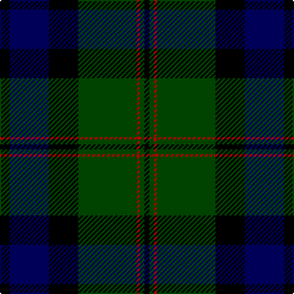

In pattern [KBKGRGK](/patterns/kbkgrgk/).

This was sourced from weddslist.  It is a [7 stripes tartan](/stripes/stripes7/).

Original link http://www.weddslist.com/cgi-bin/tartans/pg.pl?source=rb

## Thread count
K/8 DB32 K24 G48 R2 G4 K/4

## Palette
Each colour and its ΔE from the base-6 reference it is a variant of.

| Colour | Shade | Base | ΔE (OKLab) |
|---|---|---|---|
| DB | <code style="background-color:#000064;">#000064</code> `#000064` | B <code style="background-color:#2A418A;">#2A418A</code> | 0.18 |
| G | <code style="background-color:#004C00;">#004C00</code> `#004C00` | G <code style="background-color:#006100;">#006100</code> | 0.07 |
| K | <code style="background-color:#000000;">#000000</code> `#000000` | K <code style="background-color:#000000;">#000000</code> | 0.00 |
| R | <code style="background-color:#C80000;">#C80000</code> `#C80000` | R <code style="background-color:#CC0000;">#CC0000</code> | 0.01 |

# Sample pattern

## Nearest tartans

The nearest existing variants by ΔTartan distance.

1. [Dundas](/setts/s7/k8b32k24g48r2g4k4-b000052-g11450d-k000000-raa0000/) — ΔT 0.47
1. [Graham of Menteith](/setts/s6/g32b4g2k24ba24k2-b4367ae-ba000052-g11450d-k000000/) — ΔT 0.95
1. [Colqhoun VS](/setts/s7/b8k4b32y2k16g48r8-b000052-g11450d-k000000-raa0000-yaaaaaa/) — ΔT 1.02
1. [Colqhoun VS](/setts/s7/b4k2b16y1k8g24r4-b000052-g11450d-k000000-raa0000-yaaaaaa/) — ΔT 1.02
1. [Colquhoun VS](/setts/s7/b4k2b16w1k8g24r4-b000064-g004c00-k000000-rc80000-wd0d0d0/) — ΔT 1.07
1. [Sinclair Hunting](/setts/s7/g4r2g60k32y2b32r4-b000052-g11450d-k000000-raa0000-yaaaaaa/) — ΔT 1.09
1. [Sinclair Hunting](/setts/s7/g2r1g30k16y1b16r2-b000052-g11450d-k000000-raa0000-yaaaaaa/) — ΔT 1.09
1. [MacThomas](/setts/s9/b2b2r4b42k22g42r4g2g2-b000060-g004c00-k000000-rc80000/) — ΔT 1.10
1. [MacLaren](/setts/s7/b48k16g16r4g16k2y4-b000052-g11450d-k000000-raa0000-yaaaa00/) — ΔT 1.11
1. [MacLaren](/setts/s7/b24k8g8r2g8k1y2-b000052-g11450d-k000000-raa0000-yaaaa00/) — ΔT 1.11

## Neighbour map

Every grey dot is one of 15726 variants placed by the first two principal components of the ΔTartan feature space (44% of its variance). Red is this tartan; blue dots are its nearest — click one to open its page.

<svg viewBox="0 0 640 380" role="img" style="max-width:100%;height:auto;border:1px solid #e0e0e0;border-radius:4px;display:block" xmlns="http://www.w3.org/2000/svg"><image href="/nn/cloud.v1.png" width="640" height="380"/><a href="/setts/s7/k8b32k24g48r2g4k4-b000052-g11450d-k000000-raa0000/"><circle cx="284.0" cy="188.5" r="4" fill="#3465a4"><title>Dundas</title></circle></a><a href="/setts/s6/g32b4g2k24ba24k2-b4367ae-ba000052-g11450d-k000000/"><circle cx="238.2" cy="214.8" r="4" fill="#3465a4"><title>Graham of Menteith</title></circle></a><a href="/setts/s7/b8k4b32y2k16g48r8-b000052-g11450d-k000000-raa0000-yaaaaaa/"><circle cx="243.2" cy="166.2" r="4" fill="#3465a4"><title>Colqhoun VS</title></circle></a><a href="/setts/s7/b4k2b16y1k8g24r4-b000052-g11450d-k000000-raa0000-yaaaaaa/"><circle cx="243.2" cy="166.2" r="4" fill="#3465a4"><title>Colqhoun VS</title></circle></a><a href="/setts/s7/b4k2b16w1k8g24r4-b000064-g004c00-k000000-rc80000-wd0d0d0/"><circle cx="227.2" cy="159.2" r="4" fill="#3465a4"><title>Colquhoun VS</title></circle></a><a href="/setts/s7/g4r2g60k32y2b32r4-b000052-g11450d-k000000-raa0000-yaaaaaa/"><circle cx="287.4" cy="149.7" r="4" fill="#3465a4"><title>Sinclair Hunting</title></circle></a><a href="/setts/s7/g2r1g30k16y1b16r2-b000052-g11450d-k000000-raa0000-yaaaaaa/"><circle cx="287.4" cy="149.7" r="4" fill="#3465a4"><title>Sinclair Hunting</title></circle></a><a href="/setts/s9/b2b2r4b42k22g42r4g2g2-b000060-g004c00-k000000-rc80000/"><circle cx="253.3" cy="155.6" r="4" fill="#3465a4"><title>MacThomas</title></circle></a><a href="/setts/s7/b48k16g16r4g16k2y4-b000052-g11450d-k000000-raa0000-yaaaa00/"><circle cx="261.9" cy="164.3" r="4" fill="#3465a4"><title>MacLaren</title></circle></a><a href="/setts/s7/b24k8g8r2g8k1y2-b000052-g11450d-k000000-raa0000-yaaaa00/"><circle cx="261.9" cy="164.3" r="4" fill="#3465a4"><title>MacLaren</title></circle></a><circle cx="270.3" cy="183.0" r="5" fill="#c00000"/></svg>

ID: /setts/s7/k8b32k24g48r2g4k4-b000064-g004c00-k000000-rc80000/
