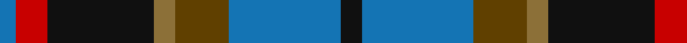
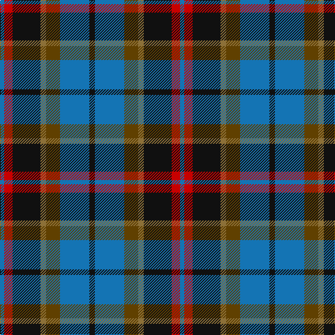

In pattern [BRKGGBK](/patterns/brkggbk/).

This was sourced from tartans-authority.  It is a [7 stripes tartan](/stripes/stripes7/).

Original link http://www.tartansauthority.com/tartan-ferret/display/2481/

## Thread count
B/6 R12 K40 LT8 T20 B42 K/8

## Palette
Each colour and its ΔE from the base-6 reference it is a variant of.

| Colour | Shade | Base | ΔE (OKLab) |
|---|---|---|---|
| B | <code style="background-color:#1474B4;">#1474B4</code> `#1474B4` | B <code style="background-color:#2A418A;">#2A418A</code> | 0.15 |
| K | <code style="background-color:#101010;">#101010</code> `#101010` | K <code style="background-color:#000000;">#000000</code> | 0.17 |
| LT | <code style="background-color:#8C7038;">#8C7038</code> `#8C7038` | G <code style="background-color:#006100;">#006100</code> | 0.18 |
| R | <code style="background-color:#C80000;">#C80000</code> `#C80000` | R <code style="background-color:#CC0000;">#CC0000</code> | 0.01 |
| T | <code style="background-color:#604000;">#604000</code> `#604000` | G <code style="background-color:#006100;">#006100</code> | 0.14 |

# Sample pattern

## Nearest tartans

The nearest existing variants by ΔTartan distance.

1. [MacPhail Hunting #2](/setts/s6/r8b48k24g28k8w6-b2c2c80-g006818-k101010-rc80000-wc0c0c0/) — ΔT 0.65
1. [Syme (Clan)](/setts/s6/k4g32w4k32b32r4-b1c1c50-g408060-k101010-rc80000-wf8f8f8/) — ΔT 0.66
1. [Leslie Hunting Clan Tartan Tartan Number: 1113. Earliest known date: 1810-15 Said to have been worn by George 14th Earl of Rothes who died in 1841. This sett is shown by Smibert (1850) and by W & A Smith (1850) but without the definition of 'Hunting'. This sett is very similar to Duncan, the difference lies in the broad black present in the Leslie Hunting which is green in the Duncan See products available Copyright © Blair Urquhart, Comrie, 2015](/setts/s6/r4b16k16w2g16k2-b2c2c80-g006818-k101010-rc80000-we0e0e0/) — ΔT 0.66
1. [Lopez-Gasparotto](/setts/s7/r8ra40k40b8k8b48y8-b2c2c80-k101010-rc80000-ra888888-ye8c000/) — ΔT 0.67
1. [Royal Highland Corporate Tartan Tartan Number: 2054. Earliest known date: March 1992 In 1808 the Highland Society of Scotland used the Universal or Black Watch tartan. This has been incorporated in the new design along with colours to represent the agricultural heritage and interests of the Society. This design includes changes that were made when the first version proved an exact match to the 'Wellington' tartan. The white is 'Barley white'. See products available Copyright © Blair Urquhart, Comrie, 2015](/setts/s8/y8g33k21b6k6b33r6b6-b2c2c80-g006818-k101010-rc80000-yb8b8b8/) — ΔT 0.68
1. [Gold Brothers](/setts/s6/b12g54b6k38ba54w6-b2c2c80-ba780078-g006818-k101010-wf8f8f8/) — ΔT 0.69
1. [Campbell of Cawdor Clan Tartan Tartan Number: 2. Earliest known date: 1798 Campbell of Cawdor is one of Wilson's variations based on the military sett. It was originally a numbered pattern, acquiring the name 'Argyle' in 1798 and 'Argylle' in 1819. It is not until W. and A. Smith's work of 1850 that the full title is given, 'Campbell of Cawdor'. This sett is authorized by the present Clan Chief, MacCailien Mor. See products available Copyright © Blair Urquhart, Comrie, 2015](/setts/s7/g4k2ga16k16b16k2r4-b2c2c80-g789484-ga006818-k101010-rc80000/) — ΔT 0.71
1. [Fruin Colquhoun (Commemorative?)](/setts/s7/r10g38w6k38b38k6b4-b2c2c80-g00643c-k101010-rc80000-we0e0e0/) — ΔT 0.71
1. [Colquhoun Clan Tartan Tartan Number: 274. Earliest known date: 1810-15 The Bonnie Banks and Braes of Loch Lomand were the setting for the interesting and sometimes violent history of the Colquhouns of Luss. Their tartan is well documented, appearing in the earliest collections, and certified by the Chief, with his seal and signature, in the archives of the Highland Society of London. (c.1816). The Clan tartan, in its present form, was woven by Wilson's of Bannockburn at the beginning of the 19th century and recorded in the firms pattern books dated 1819. Wilson often used purple in place of blue and produced proportionately equivalent patterns in different weights of cloth. Logan recorded a similar sett in 1831. The Vestiarium Scoticum shows a pattern with the white stripe next to the blue but this is regarded as an error. See products available Copyright © Blair Urquhart, Comrie, 2015](/setts/s7/r6g32w4k32b32k4b4-b2c2c80-g006818-k101010-rc80000-we0e0e0/) — ΔT 0.72
1. [Argyll](/setts/s7/b4k2g16k16ba16k2r4-b5c8ca8-ba2c2c80-g006818-k101010-rc80000/) — ΔT 0.73

## Neighbour map

Every grey dot is one of 15726 variants placed by the first two principal components of the ΔTartan feature space (44% of its variance). Red is this tartan; blue dots are its nearest — click one to open its page.

<svg viewBox="0 0 640 380" role="img" style="max-width:100%;height:auto;border:1px solid #e0e0e0;border-radius:4px;display:block" xmlns="http://www.w3.org/2000/svg"><image href="/nn/cloud.v1.png" width="640" height="380"/><a href="/setts/s6/r8b48k24g28k8w6-b2c2c80-g006818-k101010-rc80000-wc0c0c0/"><circle cx="168.7" cy="217.5" r="4" fill="#3465a4"><title>MacPhail Hunting #2</title></circle></a><a href="/setts/s6/k4g32w4k32b32r4-b1c1c50-g408060-k101010-rc80000-wf8f8f8/"><circle cx="144.2" cy="209.9" r="4" fill="#3465a4"><title>Syme (Clan)</title></circle></a><a href="/setts/s6/r4b16k16w2g16k2-b2c2c80-g006818-k101010-rc80000-we0e0e0/"><circle cx="135.1" cy="217.5" r="4" fill="#3465a4"><title>Leslie Hunting Clan Tartan Tartan Number: 1113. Earliest known date: 1810-15 Said to have been worn by George 14th Earl of Rothes who died in 1841. This sett is shown by Smibert (1850) and by W &amp; A Smith (1850) but without the definition of 'Hunting'. This sett is very similar to Duncan, the difference lies in the broad black present in the Leslie Hunting which is green in the Duncan See products available Copyright © Blair Urquhart, Comrie, 2015</title></circle></a><a href="/setts/s7/r8ra40k40b8k8b48y8-b2c2c80-k101010-rc80000-ra888888-ye8c000/"><circle cx="128.5" cy="208.0" r="4" fill="#3465a4"><title>Lopez-Gasparotto</title></circle></a><a href="/setts/s8/y8g33k21b6k6b33r6b6-b2c2c80-g006818-k101010-rc80000-yb8b8b8/"><circle cx="142.6" cy="214.5" r="4" fill="#3465a4"><title>Royal Highland Corporate Tartan Tartan Number: 2054. Earliest known date: March 1992 In 1808 the Highland Society of Scotland used the Universal or Black Watch tartan. This has been incorporated in the new design along with colours to represent the agricultural heritage and interests of the Society. This design includes changes that were made when the first version proved an exact match to the 'Wellington' tartan. The white is 'Barley white'. See products available Copyright © Blair Urquhart, Comrie, 2015</title></circle></a><a href="/setts/s6/b12g54b6k38ba54w6-b2c2c80-ba780078-g006818-k101010-wf8f8f8/"><circle cx="137.2" cy="204.6" r="4" fill="#3465a4"><title>Gold Brothers</title></circle></a><a href="/setts/s7/g4k2ga16k16b16k2r4-b2c2c80-g789484-ga006818-k101010-rc80000/"><circle cx="145.2" cy="211.9" r="4" fill="#3465a4"><title>Campbell of Cawdor Clan Tartan Tartan Number: 2. Earliest known date: 1798 Campbell of Cawdor is one of Wilson's variations based on the military sett. It was originally a numbered pattern, acquiring the name 'Argyle' in 1798 and 'Argylle' in 1819. It is not until W. and A. Smith's work of 1850 that the full title is given, 'Campbell of Cawdor'. This sett is authorized by the present Clan Chief, MacCailien Mor. See products available Copyright © Blair Urquhart, Comrie, 2015</title></circle></a><a href="/setts/s7/r10g38w6k38b38k6b4-b2c2c80-g00643c-k101010-rc80000-we0e0e0/"><circle cx="143.5" cy="199.7" r="4" fill="#3465a4"><title>Fruin Colquhoun (Commemorative?)</title></circle></a><a href="/setts/s7/r6g32w4k32b32k4b4-b2c2c80-g006818-k101010-rc80000-we0e0e0/"><circle cx="145.6" cy="202.4" r="4" fill="#3465a4"><title>Colquhoun Clan Tartan Tartan Number: 274. Earliest known date: 1810-15 The Bonnie Banks and Braes of Loch Lomand were the setting for the interesting and sometimes violent history of the Colquhouns of Luss. Their tartan is well documented, appearing in the earliest collections, and certified by the Chief, with his seal and signature, in the archives of the Highland Society of London. (c.1816). The Clan tartan, in its present form, was woven by Wilson's of Bannockburn at the beginning of the 19th century and recorded in the firms pattern books dated 1819. Wilson often used purple in place of blue and produced proportionately equivalent patterns in different weights of cloth. Logan recorded a similar sett in 1831. The Vestiarium Scoticum shows a pattern with the white stripe next to the blue but this is regarded as an error. See products available Copyright © Blair Urquhart, Comrie, 2015</title></circle></a><a href="/setts/s7/b4k2g16k16ba16k2r4-b5c8ca8-ba2c2c80-g006818-k101010-rc80000/"><circle cx="146.5" cy="212.7" r="4" fill="#3465a4"><title>Argyll</title></circle></a><circle cx="143.7" cy="210.9" r="5" fill="#c00000"/></svg>

ID: /setts/s7/k8b42g20ga8k40r12b6-b1474b4-g604000-ga8c7038-k101010-rc80000/
