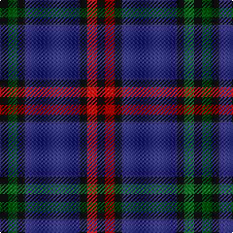

In pattern [KGKBKRK](/patterns/kgkbkrk/).

This was sourced from house-of-tartan.  It is a [7 stripes tartan](/stripes/stripes7/).

Original link http://www.house-of-tartan.scotland.net/house/TartanViewjs.asp?colr=Def&tnam=1082

## Thread count
K/8 G10 K8 DB56 K8 R10 K/8

## Palette
Each colour and its ΔE from the base-6 reference it is a variant of.

| Colour | Shade | Base | ΔE (OKLab) |
|---|---|---|---|
| DB | <code style="background-color:#2C2C80;">#2C2C80</code> `#2C2C80` | B <code style="background-color:#2C4084;">#2C4084</code> | 0.05 |
| G | <code style="background-color:#006818;">#006818</code> `#006818` | G <code style="background-color:#006400;">#006400</code> | 0.02 |
| K | <code style="background-color:#101010;">#101010</code> `#101010` | K <code style="background-color:#000000;">#000000</code> | 0.17 |
| R | <code style="background-color:#C80000;">#C80000</code> `#C80000` | R <code style="background-color:#C80000;">#C80000</code> | 0.00 |

# Sample pattern

## Nearest tartans

The nearest existing variants by ΔTartan distance.

1. [Eglinton](/setts/s7/k8g8k8b56k8r8k8-b1c0070-g006818-k101010-rc80000/) — ΔT 0.69
1. [Komissarov, Dmitry (Personal)](/setts/s7/b60ba60g8ba8g8ba10r12-b640044-ba000048-g808080-r880000/) — ΔT 1.03
1. [Murdoch Clebration (Personal)](/setts/s8/k42b16r8b4r4b46k8w4-b2c2c80-k101010-rc80000-we0e0e0/) — ΔT 1.09
1. [Daks, Muted blue](/setts/s8/r5b12ba4ra4ba22b3ba4r5-b304080-ba000050-r806050-ra906030/) — ΔT 1.09
1. [Hume or Home Clan Tartan Tartan Number: 125. Earliest known date: pre 2003 Alternate spelling for Home. See products available Copyright © Blair Urquhart, Comrie, 2015](/setts/s9/b6g6b40r4k4r4k40g6k6-b2c2c80-g006818-k101010-rc80000/) — ΔT 1.11
1. [Hume or Home](/setts/s9/b6g6b40r4k4r4k40g6k6-b2c4084-g005020-k101010-rdc0000/) — ΔT 1.15
1. [Auckland (Fashion)](/setts/s8/g6k6b4k32b4k4b48w4-b2c2c80-g003820-k101010-wc0c0c0/) — ΔT 1.18
1. [Slanj Dress (Corporate)](/setts/s8/k8b72k8b8k68ba6k6w8-b202060-ba3850c8-k101010-we0e0e0/) — ΔT 1.27
1. [Chinzei Keiai Junior High School](/setts/s9/b6ba6k32b4r4b32k6b4r4-b5c5c5c-ba780078-k101010-r888888/) — ΔT 1.28
1. [Scozia (Fashion)](/setts/s9/b6ba8b48ba12r6ba8g6ba16w6-b14283c-ba2c2c80-g006818-rc80000-we0e0e0/) — ΔT 1.29

## Neighbour map

Every grey dot is one of 15726 variants placed by the first two principal components of the ΔTartan feature space (44% of its variance). Red is this tartan; blue dots are its nearest — click one to open its page.

<svg viewBox="0 0 640 380" role="img" style="max-width:100%;height:auto;border:1px solid #e0e0e0;border-radius:4px;display:block" xmlns="http://www.w3.org/2000/svg"><image href="/nn/cloud.v1.png" width="640" height="380"/><a href="/setts/s7/k8g8k8b56k8r8k8-b1c0070-g006818-k101010-rc80000/"><circle cx="330.3" cy="221.7" r="4" fill="#3465a4"><title>Eglinton</title></circle></a><a href="/setts/s7/b60ba60g8ba8g8ba10r12-b640044-ba000048-g808080-r880000/"><circle cx="289.2" cy="221.4" r="4" fill="#3465a4"><title>Komissarov, Dmitry (Personal)</title></circle></a><a href="/setts/s8/k42b16r8b4r4b46k8w4-b2c2c80-k101010-rc80000-we0e0e0/"><circle cx="305.5" cy="194.8" r="4" fill="#3465a4"><title>Murdoch Clebration (Personal)</title></circle></a><a href="/setts/s8/r5b12ba4ra4ba22b3ba4r5-b304080-ba000050-r806050-ra906030/"><circle cx="277.2" cy="233.1" r="4" fill="#3465a4"><title>Daks, Muted blue</title></circle></a><a href="/setts/s9/b6g6b40r4k4r4k40g6k6-b2c2c80-g006818-k101010-rc80000/"><circle cx="284.4" cy="194.3" r="4" fill="#3465a4"><title>Hume or Home Clan Tartan Tartan Number: 125. Earliest known date: pre 2003 Alternate spelling for Home. See products available Copyright © Blair Urquhart, Comrie, 2015</title></circle></a><a href="/setts/s9/b6g6b40r4k4r4k40g6k6-b2c4084-g005020-k101010-rdc0000/"><circle cx="284.3" cy="194.3" r="4" fill="#3465a4"><title>Hume or Home</title></circle></a><a href="/setts/s8/g6k6b4k32b4k4b48w4-b2c2c80-g003820-k101010-wc0c0c0/"><circle cx="357.8" cy="198.5" r="4" fill="#3465a4"><title>Auckland (Fashion)</title></circle></a><a href="/setts/s8/k8b72k8b8k68ba6k6w8-b202060-ba3850c8-k101010-we0e0e0/"><circle cx="344.0" cy="196.5" r="4" fill="#3465a4"><title>Slanj Dress (Corporate)</title></circle></a><a href="/setts/s9/b6ba6k32b4r4b32k6b4r4-b5c5c5c-ba780078-k101010-r888888/"><circle cx="282.8" cy="199.9" r="4" fill="#3465a4"><title>Chinzei Keiai Junior High School</title></circle></a><a href="/setts/s9/b6ba8b48ba12r6ba8g6ba16w6-b14283c-ba2c2c80-g006818-rc80000-we0e0e0/"><circle cx="259.4" cy="194.3" r="4" fill="#3465a4"><title>Scozia (Fashion)</title></circle></a><circle cx="306.0" cy="218.7" r="5" fill="#c00000"/></svg>

ID: /setts/s7/k8g10k8b56k8r10k8-b2c2c80-g006818-k101010-rc80000/
