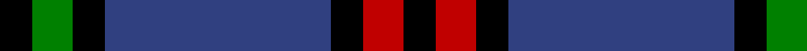
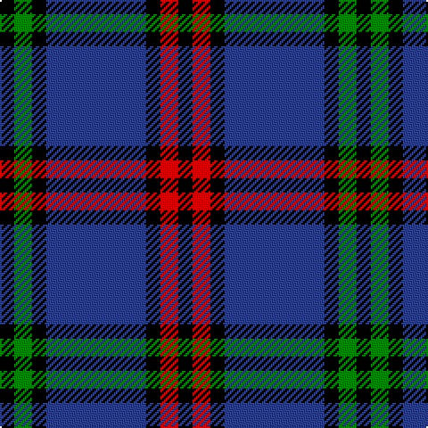

In pattern [KGKBKRK](/patterns/kgkbkrk/).

This was sourced from weddslist.  It is a [7 stripes tartan](/stripes/stripes7/).

Original link http://www.weddslist.com/cgi-bin/tartans/pg.pl?source=sts

## Thread count
K/8 G10 K8 B56 K8 R10 K/8

## Palette
Each colour and its ΔE from the base-6 reference it is a variant of.

| Colour | Shade | Base | ΔE (OKLab) |
|---|---|---|---|
| B | <code style="background-color:#304080;">#304080</code> `#304080` | B <code style="background-color:#2A418A;">#2A418A</code> | 0.02 |
| G | <code style="background-color:#008000;">#008000</code> `#008000` | G <code style="background-color:#006100;">#006100</code> | 0.10 |
| K | <code style="background-color:#000000;">#000000</code> `#000000` | K <code style="background-color:#000000;">#000000</code> | 0.00 |
| R | <code style="background-color:#C00000;">#C00000</code> `#C00000` | R <code style="background-color:#CC0000;">#CC0000</code> | 0.03 |

# Sample pattern

## Nearest tartans

The nearest existing variants by ΔTartan distance.

1. [Eglinton](/setts/s7/k6g6k6b32k6r6k6-b4367ae-g11450d-k000000-raa0000/) — ΔT 0.80
1. [Eglinton](/setts/s7/k3g3k3b16k3r3k3-b4367ae-g11450d-k000000-raa0000/) — ΔT 0.80
1. [Montgomery](/setts/s7/k4g5k4b28k4r5k4-b5a3094-g004c00-k000000-rc80000/) — ΔT 0.99
1. [Hume, or Home](/setts/s9/b6g6b40r4k4r4k40g6k6-b304080-g008000-k000000-rc00000/) — ΔT 1.17
1. [Eglinton](/setts/s7/k6g6k6b32k6r6k6-b5480b0-g008000-k000000-rc00000/) — ΔT 1.19
1. [St Andrews University Corporate Tartan Tartan Number: 2398. Earliest known date: pre 1998 Originally named St. Andrews International. Apparently a Gordon Paton MD, bought the company from North East Fife Enterprise Trust in 1997, the aim being to brand quality Scottish products for export worldwide. The company intended to set up a membership scheme but the company went into liquidation. The intended venue belonged to St Andrews University and it appears that the ownership of the tartan has fallen to the University and its name has been changed from 'International' to 'University' (Deirdre Kinloch Anderson, Aug 2004).No thread count given so this entry is based on an estimate from a small computer graphic. Has since been corrected to conform to the SRT (Scottish Register of Tartans) See products available Copyright © Blair Urquhart, Comrie, 2015](/setts/s10/b6g4k6g6b36y10k4y6b4k6-b202060-g006818-k101010-ye8c000/) — ΔT 1.22
1. [Montgomery](/setts/s7/k8g10k8b56k8r10k8-b6e5058-g11450d-k000000-raa0000/) — ΔT 1.23
1. [Montgomery](/setts/s7/k4g5k4b28k4r5k4-b6e5058-g11450d-k000000-raa0000/) — ΔT 1.23
1. [Australian Police](/setts/s8/k10w10k10b22k6g34k60b6-b2888c4-g808080-k101010-we0e0e0/) — ΔT 1.24
1. [Dunbog Primary School](/setts/s10/r24b6g10b32y4g4y4b32g10b6-b000048-g447438-rc80000-ye8c000/) — ΔT 1.27

## Neighbour map

Every grey dot is one of 15726 variants placed by the first two principal components of the ΔTartan feature space (44% of its variance). Red is this tartan; blue dots are its nearest — click one to open its page.

<svg viewBox="0 0 640 380" role="img" style="max-width:100%;height:auto;border:1px solid #e0e0e0;border-radius:4px;display:block" xmlns="http://www.w3.org/2000/svg"><image href="/nn/cloud.v1.png" width="640" height="380"/><a href="/setts/s7/k6g6k6b32k6r6k6-b4367ae-g11450d-k000000-raa0000/"><circle cx="209.2" cy="214.5" r="4" fill="#3465a4"><title>Eglinton</title></circle></a><a href="/setts/s7/k3g3k3b16k3r3k3-b4367ae-g11450d-k000000-raa0000/"><circle cx="209.2" cy="214.5" r="4" fill="#3465a4"><title>Eglinton</title></circle></a><a href="/setts/s7/k4g5k4b28k4r5k4-b5a3094-g004c00-k000000-rc80000/"><circle cx="265.9" cy="196.3" r="4" fill="#3465a4"><title>Montgomery</title></circle></a><a href="/setts/s9/b6g6b40r4k4r4k40g6k6-b304080-g008000-k000000-rc00000/"><circle cx="233.9" cy="174.9" r="4" fill="#3465a4"><title>Hume, or Home</title></circle></a><a href="/setts/s7/k6g6k6b32k6r6k6-b5480b0-g008000-k000000-rc00000/"><circle cx="198.2" cy="208.6" r="4" fill="#3465a4"><title>Eglinton</title></circle></a><a href="/setts/s10/b6g4k6g6b36y10k4y6b4k6-b202060-g006818-k101010-ye8c000/"><circle cx="243.2" cy="171.7" r="4" fill="#3465a4"><title>St Andrews University Corporate Tartan Tartan Number: 2398. Earliest known date: pre 1998 Originally named St. Andrews International. Apparently a Gordon Paton MD, bought the company from North East Fife Enterprise Trust in 1997, the aim being to brand quality Scottish products for export worldwide. The company intended to set up a membership scheme but the company went into liquidation. The intended venue belonged to St Andrews University and it appears that the ownership of the tartan has fallen to the University and its name has been changed from 'International' to 'University' (Deirdre Kinloch Anderson, Aug 2004).No thread count given so this entry is based on an estimate from a small computer graphic. Has since been corrected to conform to the SRT (Scottish Register of Tartans) See products available Copyright © Blair Urquhart, Comrie, 2015</title></circle></a><a href="/setts/s7/k8g10k8b56k8r10k8-b6e5058-g11450d-k000000-raa0000/"><circle cx="271.0" cy="198.1" r="4" fill="#3465a4"><title>Montgomery</title></circle></a><a href="/setts/s7/k4g5k4b28k4r5k4-b6e5058-g11450d-k000000-raa0000/"><circle cx="271.0" cy="198.1" r="4" fill="#3465a4"><title>Montgomery</title></circle></a><a href="/setts/s8/k10w10k10b22k6g34k60b6-b2888c4-g808080-k101010-we0e0e0/"><circle cx="255.2" cy="188.4" r="4" fill="#3465a4"><title>Australian Police</title></circle></a><a href="/setts/s10/r24b6g10b32y4g4y4b32g10b6-b000048-g447438-rc80000-ye8c000/"><circle cx="262.2" cy="193.8" r="4" fill="#3465a4"><title>Dunbog Primary School</title></circle></a><circle cx="260.6" cy="200.6" r="5" fill="#c00000"/></svg>

ID: /setts/s7/k8g10k8b56k8r10k8-b304080-g008000-k000000-rc00000/
