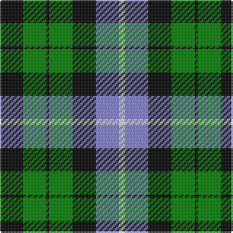

In pattern [KGKGKBW](/stripes/kgkgkbw/).

This was sourced from weddslist.  It is a [7 stripe tartan](/stripes/stripes7/).

Original link http://www.weddslist.com/cgi-bin/tartans/pg.pl?source=sts

## Also known as

This cloth is also recorded under:

- Unnamed, No 31

## Thread count
K/16 G16 K2 G16 K16 B16 LN/4

## Palette
Each colour and the base-6 reference it is a variant of.

| Colour | Shade | Base |
|---|---|---|
| B | <code style="background-color:#8080D0;">#8080D0</code> `oklch(63.4% 0.119 282.5)` <small>#8080D0</small> | B <code style="background-color:#2A418A;">#2A418A</code> |
| G | <code style="background-color:#008000;">#008000</code> `oklch(52.0% 0.177 142.5)` <small>#008000</small> | G <code style="background-color:#006100;">#006100</code> |
| K | <code style="background-color:#000000;">#000000</code> `oklch(0.0% 0.000 0.0)` <small>#000000</small> | K <code style="background-color:#000000;">#000000</code> |
| LN | <code style="background-color:#E0E0E0;">#E0E0E0</code> `oklch(90.7% 0.000 89.9)` <small>#E0E0E0</small> | W <code style="background-color:#F7F7F7;">#F7F7F7</code> |

# Sample pattern

## Nearest tartans

The nearest existing variants by ΔTartan distance, with this tartan at the top so the swatches line up against it.

ΔTartan

Tartan

Sett

—

<a href="/ttd/edit/#slug=k8g8k1g8k8b8w2~x2">Unnamed, No 31</a> <a class="nn-out" href="/setts/s7/k8g8k1g8k8b8w2~x2/" title="open its dictionary page">↗</a>

0.73

<a href="/ttd/edit/#slug=db4g6w1g6k6db6k2~x4">MacNeil of Colonsay</a> <a class="nn-out" href="/setts/s7/db4g6w1g6k6db6k2~x4/" title="open its dictionary page">↗</a>

0.76

<a href="/ttd/edit/#slug=k7g6w1g6k7db7k1~x4">MacLaggan</a> <a class="nn-out" href="/setts/s7/k7g6w1g6k7db7k1~x4/" title="open its dictionary page">↗</a>

0.78

<a href="/ttd/edit/#slug=db8g8db1g8k8db8ly2~x2">MacKay</a> <a class="nn-out" href="/setts/s7/db8g8db1g8k8db8ly2~x2/" title="open its dictionary page">↗</a>

0.79

<a href="/ttd/edit/#slug=k11g12k2g12k12p12w3~x2">Wilson's, No 97</a> <a class="nn-out" href="/setts/s7/k11g12k2g12k12p12w3~x2/" title="open its dictionary page">↗</a>

0.80

<a href="/ttd/edit/#slug=k12g12k2g12k12db12t3~x2">MacIntyre</a> <a class="nn-out" href="/setts/s7/k12g12k2g12k12db12t3~x2/" title="open its dictionary page">↗</a>

0.84

<a href="/ttd/edit/#slug=k6g6r1g6k6db6k1~x2">MacCallum</a> <a class="nn-out" href="/setts/s7/k6g6r1g6k6db6k1~x2/" title="open its dictionary page">↗</a>

0.85

<a href="/ttd/edit/#slug=k6g6w1g6k6p6k1~x4">Wilson's, No 64 or Abercrombie</a> <a class="nn-out" href="/setts/s7/k6g6w1g6k6p6k1~x4/" title="open its dictionary page">↗</a>

0.88

<a href="/ttd/edit/#slug=k6g6ly1g6k6p6k1~x4">Abercrombie, (Wilson's No 64)</a> <a class="nn-out" href="/setts/s7/k6g6ly1g6k6p6k1~x4/" title="open its dictionary page">↗</a>

0.93

<a href="/ttd/edit/#slug=b10k3b10k14r2g14k4~x2">Fletcher #2</a> <a class="nn-out" href="/setts/s7/b10k3b10k14r2g14k4~x2/" title="open its dictionary page">↗</a>

0.98

<a href="/ttd/edit/#slug=t3g6k6t4r1t1~x2">Wellington, or Waterloo</a> <a class="nn-out" href="/setts/s6/t3g6k6t4r1t1~x2/" title="open its dictionary page">↗</a>

## Neighbour map

Every grey dot is one of 14299 variants placed by the first two principal components of the ΔTartan feature space (44% of its variance). Red is this tartan; blue dots are its nearest — click one to open its page.

<svg viewBox="0 0 640 380" role="img" style="max-width:100%;height:auto;border:1px solid #e0e0e0;border-radius:4px;display:block" xmlns="http://www.w3.org/2000/svg"><image href="/nn/cloud.v1.png" width="640" height="380"/><a href="/setts/s7/db4g6w1g6k6db6k2~x4/"><circle cx="119.9" cy="261.1" r="4" fill="#3465a4"><title>MacNeil of Colonsay</title></circle></a><a href="/setts/s7/k7g6w1g6k7db7k1~x4/"><circle cx="152.5" cy="249.0" r="4" fill="#3465a4"><title>MacLaggan</title></circle></a><a href="/setts/s7/db8g8db1g8k8db8ly2~x2/"><circle cx="145.1" cy="248.0" r="4" fill="#3465a4"><title>MacKay</title></circle></a><a href="/setts/s7/k11g12k2g12k12p12w3~x2/"><circle cx="121.5" cy="252.4" r="4" fill="#3465a4"><title>Wilson's, No 97</title></circle></a><a href="/setts/s7/k12g12k2g12k12db12t3~x2/"><circle cx="130.6" cy="262.2" r="4" fill="#3465a4"><title>MacIntyre</title></circle></a><a href="/setts/s7/k6g6r1g6k6db6k1~x2/"><circle cx="141.3" cy="257.8" r="4" fill="#3465a4"><title>MacCallum</title></circle></a><a href="/setts/s7/k6g6w1g6k6p6k1~x4/"><circle cx="136.6" cy="250.1" r="4" fill="#3465a4"><title>Wilson's, No 64 or Abercrombie</title></circle></a><a href="/setts/s7/k6g6ly1g6k6p6k1~x4/"><circle cx="137.6" cy="250.4" r="4" fill="#3465a4"><title>Abercrombie, (Wilson's No 64)</title></circle></a><a href="/setts/s7/b10k3b10k14r2g14k4~x2/"><circle cx="131.8" cy="238.3" r="4" fill="#3465a4"><title>Fletcher #2</title></circle></a><a href="/setts/s6/t3g6k6t4r1t1~x2/"><circle cx="128.6" cy="243.8" r="4" fill="#3465a4"><title>Wellington, or Waterloo</title></circle></a><circle cx="128.6" cy="239.7" r="5" fill="#c00000"/></svg>

ID: /setts/s7/k8g8k1g8k8b8w2~x2/
