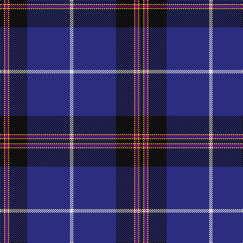

This page is one **sett** — a single exact thread-count. It belongs to the [tartan](/tartans/k8ly2dp6ly2k36db84w7/)
(the same proportion at any scale), whose colour order is pattern [KYBYKBW](/stripes/kybykbw/).

Sourced from tartans-authority.  It is a [7 stripe tartan](/stripes/stripes7/).

Original link http://www.tartansauthority.com/tartan-ferret/display/8530/

## Register references

External register numbers recorded for this tartan.

- Scottish Register of Tartans: [8530](https://www.tartanregister.gov.uk/tartanDetails?ref=8530)
- Scottish Tartans Authority (ITI): 8530

## Thread count
K/8 Y2 P6 Y2 K36 DB84 LN/7

## Palette

Palette: <strong>Tartan Register</strong>
<table><thead><tr><th>Colour</th><th>Threads</th><th>Shade</th><th>Base</th><th>OKLCh</th></tr></thead><tbody><tr><td>K/</td><td style="text-align:right;font-variant-numeric:tabular-nums">8</td><td><code style="background-color:#101010;">#101010</code> <small style="color:#888">#101010</small></td><td>K <code style="background-color:#000000;">#000000</code></td><td><small style="color:#888">oklch(17.3% 0.000 89.9)</small></td></tr><tr><td>Y</td><td style="text-align:right;font-variant-numeric:tabular-nums">2</td><td><code style="background-color:#FCCC00;">#FCCC00</code> <small style="color:#888">#FCCC00</small></td><td>Y <code style="background-color:#F2BF00;">#F2BF00</code></td><td><small style="color:#888">oklch(86.2% 0.176 91.5)</small></td></tr><tr><td>P</td><td style="text-align:right;font-variant-numeric:tabular-nums">6</td><td><code style="background-color:#780078;">#780078</code> <small style="color:#888">#780078</small></td><td>B <code style="background-color:#2A418A;">#2A418A</code></td><td><small style="color:#888">oklch(40.2% 0.185 328.4)</small></td></tr><tr><td>Y</td><td style="text-align:right;font-variant-numeric:tabular-nums">2</td><td><code style="background-color:#FCCC00;">#FCCC00</code> <small style="color:#888">#FCCC00</small></td><td>Y <code style="background-color:#F2BF00;">#F2BF00</code></td><td><small style="color:#888">oklch(86.2% 0.176 91.5)</small></td></tr><tr><td>K</td><td style="text-align:right;font-variant-numeric:tabular-nums">36</td><td><code style="background-color:#101010;">#101010</code> <small style="color:#888">#101010</small></td><td>K <code style="background-color:#000000;">#000000</code></td><td><small style="color:#888">oklch(17.3% 0.000 89.9)</small></td></tr><tr><td>DB</td><td style="text-align:right;font-variant-numeric:tabular-nums">84</td><td><code style="background-color:#2C2C80;">#2C2C80</code> <small style="color:#888">#2C2C80</small></td><td>B <code style="background-color:#2A418A;">#2A418A</code></td><td><small style="color:#888">oklch(35.0% 0.138 276.6)</small></td></tr><tr><td>LN/</td><td style="text-align:right;font-variant-numeric:tabular-nums">7</td><td><code style="background-color:#E0E0E0;">#E0E0E0</code> <small style="color:#888">#E0E0E0</small></td><td>W <code style="background-color:#F7F7F7;">#F7F7F7</code></td><td><small style="color:#888">oklch(90.7% 0.000 89.9)</small></td></tr></tbody></table>

# Sample pattern

## Nearest tartans

The nearest existing variants by ΔTartan distance, with this tartan at the top so the swatches line up against it.

ΔTartan

Tartan

Sett

—

<a href="/ttd/edit/#slug=k8ly2dp6ly2k36db84w7">Grahame Laurie Band (Corporate)</a> <a class="nn-out" href="/setts/s7/k8ly2dp6ly2k36db84w7/" title="open its dictionary page">↗</a>

0.76

<a href="/ttd/edit/#slug=db36k8g3r3g6k1lo2~x2">MacLaurin of Broich (Clan)</a> <a class="nn-out" href="/setts/s7/db36k8g3r3g6k1lo2~x2/" title="open its dictionary page">↗</a>

0.95

<a href="/ttd/edit/#slug=lb3k6lbi2k6db2k2db32k2n1~x2">Nocken (Personal)</a> <a class="nn-out" href="/setts/s9/lb3k6lbi2k6db2k2db32k2n1~x2/" title="open its dictionary page">↗</a>

1.01

<a href="/ttd/edit/#slug=k4w1t2w1k16db36t4~x2">NHS Grampian</a> <a class="nn-out" href="/setts/s7/k4w1t2w1k16db36t4~x2/" title="open its dictionary page">↗</a>

1.03

<a href="/ttd/edit/#slug=k4w1dp5w1k20db37w4db4~x2">Finnie (Personal)</a> <a class="nn-out" href="/setts/s8/k4w1dp5w1k20db37w4db4~x2/" title="open its dictionary page">↗</a>

1.04

<a href="/ttd/edit/#slug=t12t4r4t4ly2db56r18lb1db4db3~x2">Union Memorial Tartan</a> <a class="nn-out" href="/setts/s10/t12t4r4t4ly2db56r18lb1db4db3~x2/" title="open its dictionary page">↗</a>

1.05

<a href="/ttd/edit/#slug=g1db1k1db30k30w2db5ly1~x2">Binder Wedding (Personal)</a> <a class="nn-out" href="/setts/s8/g1db1k1db30k30w2db5ly1~x2/" title="open its dictionary page">↗</a>

1.11

<a href="/ttd/edit/#slug=g1b1k1b30k30w2b5lo1~x2">Binder Wedding (Personal)</a> <a class="nn-out" href="/setts/s8/g1b1k1b30k30w2b5lo1~x2/" title="open its dictionary page">↗</a>

1.12

<a href="/ttd/edit/#slug=w3db2ly1db2ly1db31k28r2k2~x2">Hill (Name)</a> <a class="nn-out" href="/setts/s9/w3db2ly1db2ly1db31k28r2k2~x2/" title="open its dictionary page">↗</a>

1.17

<a href="/ttd/edit/#slug=db54lb3k5lb1k2lb1k2g8r8lb2~x2">Racing Stewart</a> <a class="nn-out" href="/setts/s10/db54lb3k5lb1k2lb1k2g8r8lb2~x2/" title="open its dictionary page">↗</a>

1.21

<a href="/ttd/edit/#slug=dbi6w2g2w3dbi24r1db35r2~x2">Raith Rovers F.C.</a> <a class="nn-out" href="/setts/s8/dbi6w2g2w3dbi24r1db35r2~x2/" title="open its dictionary page">↗</a>

## Neighbour map

Every grey dot is one of 14359 variants placed by the first two principal components of the ΔTartan feature space (44% of its variance). Red is this tartan; blue dots are its nearest — click one to open its page.

<svg viewBox="0 0 640 380" role="img" style="max-width:100%;height:auto;border:1px solid #e0e0e0;border-radius:4px;display:block" xmlns="http://www.w3.org/2000/svg"><image href="/nn/cloud.v1.png" width="640" height="380"/><a href="/setts/s7/db36k8g3r3g6k1lo2~x2/"><circle cx="399.5" cy="132.9" r="4" fill="#3465a4"><title>MacLaurin of Broich (Clan)</title></circle></a><a href="/setts/s9/lb3k6lbi2k6db2k2db32k2n1~x2/"><circle cx="406.6" cy="120.6" r="4" fill="#3465a4"><title>Nocken (Personal)</title></circle></a><a href="/setts/s7/k4w1t2w1k16db36t4~x2/"><circle cx="395.1" cy="147.9" r="4" fill="#3465a4"><title>NHS Grampian</title></circle></a><a href="/setts/s8/k4w1dp5w1k20db37w4db4~x2/"><circle cx="364.9" cy="136.2" r="4" fill="#3465a4"><title>Finnie (Personal)</title></circle></a><a href="/setts/s10/t12t4r4t4ly2db56r18lb1db4db3~x2/"><circle cx="382.4" cy="84.1" r="4" fill="#3465a4"><title>Union Memorial Tartan</title></circle></a><a href="/setts/s8/g1db1k1db30k30w2db5ly1~x2/"><circle cx="358.0" cy="127.7" r="4" fill="#3465a4"><title>Binder Wedding (Personal)</title></circle></a><a href="/setts/s8/g1b1k1b30k30w2b5lo1~x2/"><circle cx="339.8" cy="117.6" r="4" fill="#3465a4"><title>Binder Wedding (Personal)</title></circle></a><a href="/setts/s9/w3db2ly1db2ly1db31k28r2k2~x2/"><circle cx="337.4" cy="114.0" r="4" fill="#3465a4"><title>Hill (Name)</title></circle></a><a href="/setts/s10/db54lb3k5lb1k2lb1k2g8r8lb2~x2/"><circle cx="415.4" cy="77.8" r="4" fill="#3465a4"><title>Racing Stewart</title></circle></a><a href="/setts/s8/dbi6w2g2w3dbi24r1db35r2~x2/"><circle cx="314.7" cy="122.6" r="4" fill="#3465a4"><title>Raith Rovers F.C.</title></circle></a><circle cx="386.6" cy="118.5" r="5" fill="#c00000"/></svg>

ID: /setts/s7/k8ly2dp6ly2k36db84w7/
