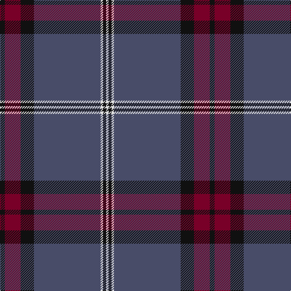

In pattern [KRKBWKW](/patterns/krkbwkw/).

This was sourced from register-of-tartans.  It is a [7 stripes tartan](/stripes/stripes7/).

Original link https://www.tartanregister.gov.uk/tartanDetails.aspx?ref=5554

## Attestations

This cloth appears in 3 source records; the oldest owns this page.

- 08/09/2007 — University of Edinburgh (register-of-tartans, [record](https://www.tartanregister.gov.uk/tartanDetails.aspx?ref=5554))
- pre 2008 — University of Edinburgh (Corporate) (tartans-authority, [record](http://www.tartansauthority.com/tartan-ferret/display/7516/))
- undated — University of Edinburgh Corporate Tartan Tartan Number: 7516. Earliest known date: 2008 Woven scarf sample from Lochcarron but this had been previously woven by another company. See products available Copyright © Blair Urquhart, Comrie, 2015 (house-of-tartan, [record](http://www.house-of-tartan.scotland.net/house/TartanViewjs.asp?colr=Def&tnam=7516))

## Thread count
K/8 DR26 K22 N110 LN4 K5 LN/4

## Palette
Each colour and its ΔE from the base-6 reference it is a variant of.

| Colour | Shade | Base | ΔE (OKLab) |
|---|---|---|---|
| DR | <code style="background-color:#780028;">#780028</code> `#780028` | R <code style="background-color:#CC0000;">#CC0000</code> | 0.19 |
| K | <code style="background-color:#101010;">#101010</code> `#101010` | K <code style="background-color:#000000;">#000000</code> | 0.17 |
| LN | <code style="background-color:#E0E0E0;">#E0E0E0</code> `#E0E0E0` | W <code style="background-color:#F7F7F7;">#F7F7F7</code> | 0.07 |
| N | <code style="background-color:#484C68;">#484C68</code> `#484C68` | B <code style="background-color:#2A418A;">#2A418A</code> | 0.08 |

# Sample pattern

## Nearest tartans

The nearest existing variants by ΔTartan distance.

1. [Edinburgh, The University of](/setts/s7/k8r26k22b110w4k5w4~b145064-k101010-r781c38-we0e0e0/) — ΔT 0.77
1. [Caledonian Mist](/setts/s7/b27k5ba2r1ba1w1ba5~b5c5c5c-ba780078-k101010-r888888-wfcfcfc~x4/) — ΔT 1.05
1. [Lion Brand Sportswear](/setts/s7/y4b1r15b42r6b4ya1~b142836-r800028-ya0a0a0-yac88c00~x2/) — ΔT 1.21
1. [Orkney Slate](/setts/s8/b8g74k8b42g11k2g16b4~b222222-g6a6a6a-k000000/) — ΔT 1.24
1. [Connecticut State Police PB (Cor.)](/setts/s6/b42ba2b2ba17y8ba4~b646464-ba00008c-yc88c00~x2/) — ΔT 1.29
1. [Lochnagar Dress (Fashion)](/setts/s10/g5k1g33b1g9k9b5k1r2k4~b440044-g686868-k101010-r880000~x2/) — ΔT 1.30
1. [Connecticut State Police Pipe Band](/setts/s6/k42b2k2b17ba8y4~b5c5c5c-ba00008c-k141414-yc88c00~x2/) — ΔT 1.31
1. [McBrayer Blue (Personal)](/setts/s8/b57k1r12b1g12r14b1r2~b2c2c80-g006818-k101010-rc80000~x2/) — ΔT 1.33
1. [MacLaurin of Brioch](/setts/s7/b36k10g3r3g6k1y2~b2c4084-g005020-k101010-rdc0000-ye8c000~x2/) — ΔT 1.33
1. [Melrose Newbigging Grey (Name)](/setts/s10/b1k6b35k6b2ba3b1k6b2w1~b5c5c5c-ba440044-k101010-we0e0e0~x2/) — ΔT 1.33

## Neighbour map

Every grey dot is one of 15726 variants placed by the first two principal components of the ΔTartan feature space (44% of its variance). Red is this tartan; blue dots are its nearest — click one to open its page.

<svg viewBox="0 0 640 380" role="img" style="max-width:100%;height:auto;border:1px solid #e0e0e0;border-radius:4px;display:block" xmlns="http://www.w3.org/2000/svg"><image href="/nn/cloud.v1.png" width="640" height="380"/><a href="/setts/s7/k8r26k22b110w4k5w4~b145064-k101010-r781c38-we0e0e0/"><circle cx="425.2" cy="156.6" r="4" fill="#3465a4"><title>Edinburgh, The University of</title></circle></a><a href="/setts/s7/b27k5ba2r1ba1w1ba5~b5c5c5c-ba780078-k101010-r888888-wfcfcfc~x4/"><circle cx="440.0" cy="133.6" r="4" fill="#3465a4"><title>Caledonian Mist</title></circle></a><a href="/setts/s7/y4b1r15b42r6b4ya1~b142836-r800028-ya0a0a0-yac88c00~x2/"><circle cx="494.6" cy="153.0" r="4" fill="#3465a4"><title>Lion Brand Sportswear</title></circle></a><a href="/setts/s8/b8g74k8b42g11k2g16b4~b222222-g6a6a6a-k000000/"><circle cx="430.5" cy="149.7" r="4" fill="#3465a4"><title>Orkney Slate</title></circle></a><a href="/setts/s6/b42ba2b2ba17y8ba4~b646464-ba00008c-yc88c00~x2/"><circle cx="379.1" cy="177.4" r="4" fill="#3465a4"><title>Connecticut State Police PB (Cor.)</title></circle></a><a href="/setts/s10/g5k1g33b1g9k9b5k1r2k4~b440044-g686868-k101010-r880000~x2/"><circle cx="466.8" cy="136.0" r="4" fill="#3465a4"><title>Lochnagar Dress (Fashion)</title></circle></a><a href="/setts/s6/k42b2k2b17ba8y4~b5c5c5c-ba00008c-k141414-yc88c00~x2/"><circle cx="386.0" cy="185.0" r="4" fill="#3465a4"><title>Connecticut State Police Pipe Band</title></circle></a><a href="/setts/s8/b57k1r12b1g12r14b1r2~b2c2c80-g006818-k101010-rc80000~x2/"><circle cx="431.7" cy="114.9" r="4" fill="#3465a4"><title>McBrayer Blue (Personal)</title></circle></a><a href="/setts/s7/b36k10g3r3g6k1y2~b2c4084-g005020-k101010-rdc0000-ye8c000~x2/"><circle cx="391.4" cy="132.1" r="4" fill="#3465a4"><title>MacLaurin of Brioch</title></circle></a><a href="/setts/s10/b1k6b35k6b2ba3b1k6b2w1~b5c5c5c-ba440044-k101010-we0e0e0~x2/"><circle cx="474.1" cy="124.6" r="4" fill="#3465a4"><title>Melrose Newbigging Grey (Name)</title></circle></a><circle cx="431.1" cy="152.6" r="5" fill="#c00000"/></svg>

ID: /setts/s7/k8r26k22b110w4k5w4~b484c68-k101010-r780028-we0e0e0/
