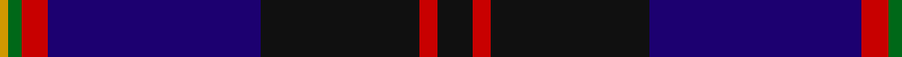

In pattern [KRKBRGY](/patterns/krkbrgy/).

This was sourced from register-of-tartans.  It is a [7 stripes tartan](/stripes/stripes7/).

Original link https://www.tartanregister.gov.uk/tartanDetails.aspx?ref=3602

## Attestations

This cloth appears in 2 source records; the oldest owns this page.

- 01/01/1994 — Royal Marines Condor (register-of-tartans, [record](https://www.tartanregister.gov.uk/tartanDetails.aspx?ref=3602))
- 1994 — Royal Marines Condor (Military) (tartans-authority, [record](http://www.tartansauthority.com/tartan-ferret/display/2330/))

## Thread count
DY/4 G6 R12 DB96 K72 R8 K/16

## Palette
Each colour and its ΔE from the base-6 reference it is a variant of.

| Colour | Shade | Base | ΔE (OKLab) |
|---|---|---|---|
| DB | <code style="background-color:#1C0070;">#1C0070</code> `#1C0070` | B <code style="background-color:#2A418A;">#2A418A</code> | 0.14 |
| DY | <code style="background-color:#D09800;">#D09800</code> `#D09800` | Y <code style="background-color:#F2BF00;">#F2BF00</code> | 0.12 |
| G | <code style="background-color:#006818;">#006818</code> `#006818` | G <code style="background-color:#006100;">#006100</code> | 0.02 |
| K | <code style="background-color:#101010;">#101010</code> `#101010` | K <code style="background-color:#000000;">#000000</code> | 0.17 |
| R | <code style="background-color:#C80000;">#C80000</code> `#C80000` | R <code style="background-color:#CC0000;">#CC0000</code> | 0.01 |

# Sample pattern

## Nearest tartans

The nearest existing variants by ΔTartan distance.

1. [Weir Clan Tartan Tartan Number: 327. Earliest known date: pre 2003 This sample comes from the MacGregor-Hastie collection which forms the basis of the cloth archive of the Scottish Tartans Society. Some of the samples, including this one, were unmarked. One can assume that the sample dates between 1930 and 1950. See products available Copyright © Blair Urquhart, Comrie, 2015](/setts/s8/k8y1k1b28k12g2k1ba2x2~b2c2c80-ba5c8ca8-g006818-k101010-ye8c000/) — ΔT 1.03
1. [Pipers' Trail (Corporate)](/setts/s6/y4b8ba4k53bb54w2~b1474b4-ba780078-bb2c2c80-k101010-we0e0e0-ybc8c00/) — ΔT 1.06
1. [Royal Marines Condor Regimental Tartan Tartan Number: 2330. Earliest known date: 1994 Designed by Jack Dalgety for Lt.Col. Wilsey of Royal Marines, Condor Depot. December 1994. Woven by D.C.Dalgleish of Selkirk. The design is basically the Angus tartan (#1179) which is the Scottish county in which Condor Depot is located with changes to the overcheck. Sample in STA Dalgety Collection. See products available Copyright © Blair Urquhart, Comrie, 2015](/setts/s12/k8r4k36b48r6g3y2g3r6b48k36r4x2~b1c0070-g006818-k101010-rc80000-yd09800/) — ΔT 1.14
1. [Hope-Weir/Weir](/setts/s8/k8y1k1b28k12g2k1ba2x2~b2c4084-ba3c82af-g005020-k101010-ye8c000/) — ΔT 1.19
1. [Fuller of Hopewell (Personal)](/setts/s7/k1w1k18b20w1r1y1x4~b2c2c80-k101010-rc80050-wf8f8f8-yec8048/) — ΔT 1.22
1. [Diaspora](/setts/s6/b3g1r22k12b28w3x2~b003478-g003800-k000034-r8c0000-wc8c8c8/) — ΔT 1.24
1. [Ferguson Unidentified](/setts/s7/b72k40g23r4g23k2w4x2~b5a008c-g005020-k101010-rdc0000-we0e0e0/) — ΔT 1.24
1. [Heirloom Dark Alba (Fashion)](/setts/s9/k4y2k34b10ya4b4ba4b23w3x2~b202060-ba780078-k101010-we0e0e0-ybc8c00-yaa0a0a0/) — ΔT 1.28
1. [Wcwm 9275-1395](/setts/s7/b6ba3b56k24g6r6g6~b1c0070-ba440044-g006818-k101010-re87878/) — ΔT 1.29
1. [Wcwm 1475-2](/setts/s9/r2b34k2w2k2ba30b3ba6r2x2~b1c0070-ba5c5c5c-k101010-r880000-wc0c0c0/) — ΔT 1.30

## Neighbour map

Every grey dot is one of 15726 variants placed by the first two principal components of the ΔTartan feature space (44% of its variance). Red is this tartan; blue dots are its nearest — click one to open its page.

<svg viewBox="0 0 640 380" role="img" style="max-width:100%;height:auto;border:1px solid #e0e0e0;border-radius:4px;display:block" xmlns="http://www.w3.org/2000/svg"><image href="/nn/cloud.v1.png" width="640" height="380"/><a href="/setts/s8/k8y1k1b28k12g2k1ba2x2~b2c2c80-ba5c8ca8-g006818-k101010-ye8c000/"><circle cx="368.8" cy="144.1" r="4" fill="#3465a4"><title>Weir Clan Tartan Tartan Number: 327. Earliest known date: pre 2003 This sample comes from the MacGregor-Hastie collection which forms the basis of the cloth archive of the Scottish Tartans Society. Some of the samples, including this one, were unmarked. One can assume that the sample dates between 1930 and 1950. See products available Copyright © Blair Urquhart, Comrie, 2015</title></circle></a><a href="/setts/s6/y4b8ba4k53bb54w2~b1474b4-ba780078-bb2c2c80-k101010-we0e0e0-ybc8c00/"><circle cx="292.3" cy="143.8" r="4" fill="#3465a4"><title>Pipers' Trail (Corporate)</title></circle></a><a href="/setts/s12/k8r4k36b48r6g3y2g3r6b48k36r4x2~b1c0070-g006818-k101010-rc80000-yd09800/"><circle cx="315.8" cy="141.6" r="4" fill="#3465a4"><title>Royal Marines Condor Regimental Tartan Tartan Number: 2330. Earliest known date: 1994 Designed by Jack Dalgety for Lt.Col. Wilsey of Royal Marines, Condor Depot. December 1994. Woven by D.C.Dalgleish of Selkirk. The design is basically the Angus tartan (#1179) which is the Scottish county in which Condor Depot is located with changes to the overcheck. Sample in STA Dalgety Collection. See products available Copyright © Blair Urquhart, Comrie, 2015</title></circle></a><a href="/setts/s8/k8y1k1b28k12g2k1ba2x2~b2c4084-ba3c82af-g005020-k101010-ye8c000/"><circle cx="367.9" cy="144.0" r="4" fill="#3465a4"><title>Hope-Weir/Weir</title></circle></a><a href="/setts/s7/k1w1k18b20w1r1y1x4~b2c2c80-k101010-rc80050-wf8f8f8-yec8048/"><circle cx="310.3" cy="142.6" r="4" fill="#3465a4"><title>Fuller of Hopewell (Personal)</title></circle></a><a href="/setts/s6/b3g1r22k12b28w3x2~b003478-g003800-k000034-r8c0000-wc8c8c8/"><circle cx="279.5" cy="162.6" r="4" fill="#3465a4"><title>Diaspora</title></circle></a><a href="/setts/s7/b72k40g23r4g23k2w4x2~b5a008c-g005020-k101010-rdc0000-we0e0e0/"><circle cx="278.8" cy="140.8" r="4" fill="#3465a4"><title>Ferguson Unidentified</title></circle></a><a href="/setts/s9/k4y2k34b10ya4b4ba4b23w3x2~b202060-ba780078-k101010-we0e0e0-ybc8c00-yaa0a0a0/"><circle cx="254.9" cy="141.0" r="4" fill="#3465a4"><title>Heirloom Dark Alba (Fashion)</title></circle></a><a href="/setts/s7/b6ba3b56k24g6r6g6~b1c0070-ba440044-g006818-k101010-re87878/"><circle cx="355.6" cy="166.7" r="4" fill="#3465a4"><title>Wcwm 9275-1395</title></circle></a><a href="/setts/s9/r2b34k2w2k2ba30b3ba6r2x2~b1c0070-ba5c5c5c-k101010-r880000-wc0c0c0/"><circle cx="315.1" cy="145.7" r="4" fill="#3465a4"><title>Wcwm 1475-2</title></circle></a><circle cx="318.0" cy="158.4" r="5" fill="#c00000"/></svg>

ID: /setts/s7/k8r4k36b48r6g3y2x2~b1c0070-g006818-k101010-rc80000-yd09800/
