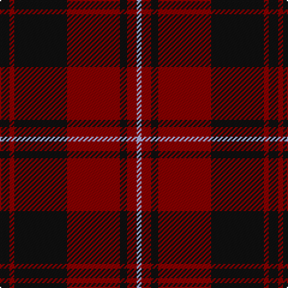

In pattern [KRKRKRW](/patterns/krkrkrw/).

This was sourced from register-of-tartans.  It is a [7 stripes tartan](/stripes/stripes7/).

Original link https://www.tartanregister.gov.uk/tartanDetails.aspx?ref=5223

## Attestations

This cloth appears in 2 source records; the oldest owns this page.

- 01/01/1860 — Menzies of Culdares (register-of-tartans, [record](https://www.tartanregister.gov.uk/tartanDetails.aspx?ref=5223))
- 1860 — Menzies of Culdares (Artefact) (tartans-authority, [record](http://www.tartansauthority.com/tartan-ferret/display/3467/))

## Thread count
K/8 DR4 K44 DR44 K6 DR8 LP/4

## Palette
Each colour and its ΔE from the base-6 reference it is a variant of.

| Colour | Shade | Base | ΔE (OKLab) |
|---|---|---|---|
| DR | <code style="background-color:#880000;">#880000</code> `#880000` | R <code style="background-color:#C80000;">#C80000</code> | 0.14 |
| K | <code style="background-color:#101010;">#101010</code> `#101010` | K <code style="background-color:#000000;">#000000</code> | 0.17 |
| LP | <code style="background-color:#A8ACE8;">#A8ACE8</code> `#A8ACE8` | W <code style="background-color:#F4F4F0;">#F4F4F0</code> | 0.22 |

# Sample pattern

ID: /setts/s7/k8r4k44r44k6r8w4-k101010-r880000-wa8ace8/
