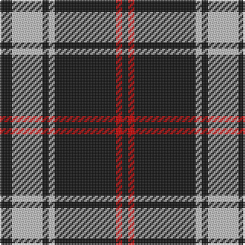

In pattern [KRKWKWK](/patterns/krkwkwk/).

This was sourced from register-of-tartans.  It is a [7 stripes tartan](/stripes/stripes7/).

Original link https://www.tartanregister.gov.uk/tartanDetails.aspx?ref=2250

## Attestations

This cloth appears in 2 source records; the oldest owns this page.

- 01/01/2002 — Lundy Reform (register-of-tartans, [record](https://www.tartanregister.gov.uk/tartanDetails.aspx?ref=2250))
- pre 2002 — Lundy Reform (Fashion) (tartans-authority, [record](http://www.tartansauthority.com/tartan-ferret/display/5515/))

## Thread count
K/8 N20 K4 N4 K40 R4 K/4

## Palette
Each colour and its ΔE from the base-6 reference it is a variant of.

| Colour | Shade | Base | ΔE (OKLab) |
|---|---|---|---|
| K | <code style="background-color:#101010;">#101010</code> `#101010` | K <code style="background-color:#000000;">#000000</code> | 0.17 |
| N | <code style="background-color:#C0C0C0;">#C0C0C0</code> `#C0C0C0` | W <code style="background-color:#F7F7F7;">#F7F7F7</code> | 0.17 |
| R | <code style="background-color:#C80000;">#C80000</code> `#C80000` | R <code style="background-color:#CC0000;">#CC0000</code> | 0.01 |

# Sample pattern

## Nearest tartans

The nearest existing variants by ΔTartan distance.

1. [Sligo Irish County Tartan Tartan Number: 2256. Earliest known date: 1995 One of a series of Irish District tartans designed by Polly Wittering of the House of Edgar, with colours reminiscent of the Country with soft warm colours dominating. See products available Copyright © Blair Urquhart, Comrie, 2015](/setts/s6/b100k8b24k46y8k8-b687c94-k000000-yd49c1c/) — ΔT 0.87
1. [Glen Coe Trade Tartan Tartan Number: 1243. Earliest known date: Modern Many new designs have been given district names to promote their Scottish connections. However, these names should not be confused with the District tartans which have earned their title through 'use and wont' and not a little history. See products available Copyright © Blair Urquhart, Comrie, 2015](/setts/s5/k74w18k6g18w6-g003820-k101010-we0e0e0/) — ΔT 0.98
1. [Northern Kentucky University](/setts/s7/w10k6y12k10w6k60y4-k101010-wffffff-yfccc00/) — ΔT 0.99
1. [Moffat (1984)](/setts/s7/k78r6k6r6k28r56ra6-k101010-r888888-rac80000/) — ΔT 1.00
1. [Glen Coe #1 (Fashion)](/setts/s5/k74w18k6g18w6-g006818-k101010-wfcfcfc/) — ΔT 1.04
1. [DDB Canada (Fashion)](/setts/s7/k2r4k14r22k36y4k2-k101010-r888888-ye8c000/) — ΔT 1.10
1. [Coppa Romana (Corporate)](/setts/s10/k34y4k4y4k18w22k4w22k40y4-k101010-wc0c0c0-yfccc00/) — ΔT 1.13
1. [West Point Regimental Tartan Tartan Number: 1130. Earliest known date: 1986 Wemyss means cave and probably originates from the caves beneath MacDuff castle. There is a long and interesting article on the family of Wemyss in William Anderson's 'The Scottish Nation' published by A Fullarton in 1874. See products available Copyright © Blair Urquhart, Comrie, 2015](/setts/s8/k78r6k6r6k24r60y6r6-k101010-r888888-ye8c000/) — ΔT 1.19
1. [West Point](/setts/s8/k78r6k6r6k24r60y6r6-k101010-r888888-yccc018/) — ΔT 1.20
1. [Coppa Romana (Switzerland)](/setts/s10/k34y4k4y4k18w22k4w22k40y4-k101010-wdfd9ca-yf9bc17/) — ΔT 1.21

## Neighbour map

Every grey dot is one of 15726 variants placed by the first two principal components of the ΔTartan feature space (44% of its variance). Red is this tartan; blue dots are its nearest — click one to open its page.

<svg viewBox="0 0 640 380" role="img" style="max-width:100%;height:auto;border:1px solid #e0e0e0;border-radius:4px;display:block" xmlns="http://www.w3.org/2000/svg"><image href="/nn/cloud.v1.png" width="640" height="380"/><a href="/setts/s6/b100k8b24k46y8k8-b687c94-k000000-yd49c1c/"><circle cx="368.7" cy="198.4" r="4" fill="#3465a4"><title>Sligo Irish County Tartan Tartan Number: 2256. Earliest known date: 1995 One of a series of Irish District tartans designed by Polly Wittering of the House of Edgar, with colours reminiscent of the Country with soft warm colours dominating. See products available Copyright © Blair Urquhart, Comrie, 2015</title></circle></a><a href="/setts/s5/k74w18k6g18w6-g003820-k101010-we0e0e0/"><circle cx="372.2" cy="208.0" r="4" fill="#3465a4"><title>Glen Coe Trade Tartan Tartan Number: 1243. Earliest known date: Modern Many new designs have been given district names to promote their Scottish connections. However, these names should not be confused with the District tartans which have earned their title through 'use and wont' and not a little history. See products available Copyright © Blair Urquhart, Comrie, 2015</title></circle></a><a href="/setts/s7/w10k6y12k10w6k60y4-k101010-wffffff-yfccc00/"><circle cx="404.6" cy="170.0" r="4" fill="#3465a4"><title>Northern Kentucky University</title></circle></a><a href="/setts/s7/k78r6k6r6k28r56ra6-k101010-r888888-rac80000/"><circle cx="371.5" cy="197.8" r="4" fill="#3465a4"><title>Moffat (1984)</title></circle></a><a href="/setts/s5/k74w18k6g18w6-g006818-k101010-wfcfcfc/"><circle cx="363.0" cy="203.5" r="4" fill="#3465a4"><title>Glen Coe #1 (Fashion)</title></circle></a><a href="/setts/s7/k2r4k14r22k36y4k2-k101010-r888888-ye8c000/"><circle cx="394.1" cy="187.5" r="4" fill="#3465a4"><title>DDB Canada (Fashion)</title></circle></a><a href="/setts/s10/k34y4k4y4k18w22k4w22k40y4-k101010-wc0c0c0-yfccc00/"><circle cx="326.1" cy="194.4" r="4" fill="#3465a4"><title>Coppa Romana (Corporate)</title></circle></a><a href="/setts/s8/k78r6k6r6k24r60y6r6-k101010-r888888-ye8c000/"><circle cx="349.2" cy="182.1" r="4" fill="#3465a4"><title>West Point Regimental Tartan Tartan Number: 1130. Earliest known date: 1986 Wemyss means cave and probably originates from the caves beneath MacDuff castle. There is a long and interesting article on the family of Wemyss in William Anderson's 'The Scottish Nation' published by A Fullarton in 1874. See products available Copyright © Blair Urquhart, Comrie, 2015</title></circle></a><a href="/setts/s8/k78r6k6r6k24r60y6r6-k101010-r888888-yccc018/"><circle cx="349.6" cy="182.5" r="4" fill="#3465a4"><title>West Point</title></circle></a><a href="/setts/s10/k34y4k4y4k18w22k4w22k40y4-k101010-wdfd9ca-yf9bc17/"><circle cx="322.4" cy="191.7" r="4" fill="#3465a4"><title>Coppa Romana (Switzerland)</title></circle></a><circle cx="376.4" cy="197.0" r="5" fill="#c00000"/></svg>

ID: /setts/s7/k8w20k4w4k40r4k4-k101010-rc80000-wc0c0c0/
