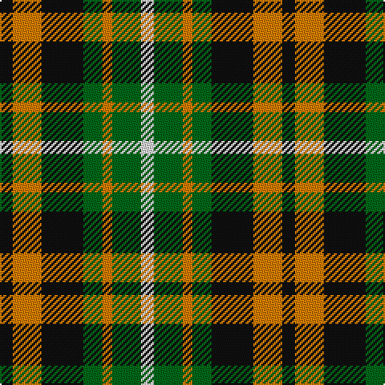

In pattern [KYKGYGW](/patterns/kykgygw/).

This was sourced from register-of-tartans.  It is a [7 stripes tartan](/stripes/stripes7/).

Original link https://www.tartanregister.gov.uk/tartanDetails.aspx?ref=3452

## Thread count
K/8 O18 K26 G12 O6 G18 LN/8

## Palette
Each colour and its ΔE from the base-6 reference it is a variant of.

| Colour | Shade | Base | ΔE (OKLab) |
|---|---|---|---|
| G | <code style="background-color:#006818;">#006818</code> `#006818` | G <code style="background-color:#006100;">#006100</code> | 0.02 |
| K | <code style="background-color:#101010;">#101010</code> `#101010` | K <code style="background-color:#000000;">#000000</code> | 0.17 |
| LN | <code style="background-color:#E0E0E0;">#E0E0E0</code> `#E0E0E0` | W <code style="background-color:#F7F7F7;">#F7F7F7</code> | 0.07 |
| O | <code style="background-color:#D87C00;">#D87C00</code> `#D87C00` | Y <code style="background-color:#F2BF00;">#F2BF00</code> | 0.17 |

# Sample pattern

## Nearest tartans

The nearest existing variants by ΔTartan distance.

1. [Ramsay, Red](/setts/s7/k8r18k26g12r6g18w8-g008000-k000000-rb05000-we0e0e0/) — ΔT 0.76
1. [Ramsay Hunting Family Tartan Tartan Number: 1198. Earliest known date: pre 2003 This sample comes from the MacGregor-Hastie collection which forms the basis of the cloth archive of the Scottish Tartans Society. Some of the samples, including this one, were unmarked. One can assume that the sample dates between 1930 and 1950. See products available Copyright © Blair Urquhart, Comrie, 2015](/setts/s7/k8g18k26ga12g6ga18w8-g604000-ga006818-k101010-we0e0e0/) — ΔT 1.04
1. [Unidentified, Pinafore](/setts/s7/g48k8g48k48b14r48b14-b5480b0-g008000-k000000-r900030/) — ΔT 1.04
1. [Martin Family Tartan Tartan Number: 1207. Earliest known date: 1977 In 1993 Kiltmaker & kilt historian Bob Martin explained that years ago when he first became interested in Scottish tartan (circa 1976) , he bought this J.P. Stevens (a weaver in Burlington North Carolina) fashion fabric from a local outlet in Greenville SC and made himself a kilt from it. He remembered the price being about $2/yd and he bought the last piece of 15yds. He wore the kilt to the Charleston Games and when Scotty Thompson asked him what it was, he replied "Martin" and SC immediately registered it with the Scottish Tartans Society and so it has remained to this day. The thread count is as given by Bob Martin -- he names the second colour as "purple" but says it is more like maroon or claret. However he suggests a more pleasing sett would have a narrower yellow stripe. See products available Copyright © Blair Urquhart, Comrie, 2015](/setts/s9/y8g16k6g6k6g6k16r21k5-g006818-k101010-r880000-ye8c000/) — ΔT 1.14
1. [Wilson's, No 214](/setts/s5/g16r12b4k4b12-b5480b0-g008000-k000000-rc00000/) — ΔT 1.17
1. [Stewart, Plaid](/setts/s7/r4g8b16r18g18k4r4-b304080-g008000-k000000-rc00000/) — ΔT 1.21
1. [Ferguson Dress variation](/setts/s10/w16k8w16k4w6k16g16r4g16k8-g004c00-k000000-rc40000-wc8c8c8/) — ΔT 1.26
1. [Martin](/setts/s9/y8g16k6g6k6g6k16r21k5-g008000-k000000-r800000-yf0c000/) — ΔT 1.27
1. [Timespan, (MacKay)](/setts/s5/g36r6k36r6ga36-g008000-ga808080-k000000-rc00000/) — ΔT 1.29
1. [James William Forrester of S. Carolina](/setts/s8/b32r28g32y6g32r28b32w6-b000050-g008000-rc00000-we0e0e0-yf0c000/) — ΔT 1.29

## Neighbour map

Every grey dot is one of 15726 variants placed by the first two principal components of the ΔTartan feature space (44% of its variance). Red is this tartan; blue dots are its nearest — click one to open its page.

<svg viewBox="0 0 640 380" role="img" style="max-width:100%;height:auto;border:1px solid #e0e0e0;border-radius:4px;display:block" xmlns="http://www.w3.org/2000/svg"><image href="/nn/cloud.v1.png" width="640" height="380"/><a href="/setts/s7/k8r18k26g12r6g18w8-g008000-k000000-rb05000-we0e0e0/"><circle cx="82.7" cy="254.2" r="4" fill="#3465a4"><title>Ramsay, Red</title></circle></a><a href="/setts/s7/k8g18k26ga12g6ga18w8-g604000-ga006818-k101010-we0e0e0/"><circle cx="115.3" cy="271.3" r="4" fill="#3465a4"><title>Ramsay Hunting Family Tartan Tartan Number: 1198. Earliest known date: pre 2003 This sample comes from the MacGregor-Hastie collection which forms the basis of the cloth archive of the Scottish Tartans Society. Some of the samples, including this one, were unmarked. One can assume that the sample dates between 1930 and 1950. See products available Copyright © Blair Urquhart, Comrie, 2015</title></circle></a><a href="/setts/s7/g48k8g48k48b14r48b14-b5480b0-g008000-k000000-r900030/"><circle cx="135.3" cy="241.9" r="4" fill="#3465a4"><title>Unidentified, Pinafore</title></circle></a><a href="/setts/s9/y8g16k6g6k6g6k16r21k5-g006818-k101010-r880000-ye8c000/"><circle cx="123.3" cy="248.1" r="4" fill="#3465a4"><title>Martin Family Tartan Tartan Number: 1207. Earliest known date: 1977 In 1993 Kiltmaker &amp; kilt historian Bob Martin explained that years ago when he first became interested in Scottish tartan (circa 1976) , he bought this J.P. Stevens (a weaver in Burlington North Carolina) fashion fabric from a local outlet in Greenville SC and made himself a kilt from it. He remembered the price being about $2/yd and he bought the last piece of 15yds. He wore the kilt to the Charleston Games and when Scotty Thompson asked him what it was, he replied &quot;Martin&quot; and SC immediately registered it with the Scottish Tartans Society and so it has remained to this day. The thread count is as given by Bob Martin -- he names the second colour as &quot;purple&quot; but says it is more like maroon or claret. However he suggests a more pleasing sett would have a narrower yellow stripe. See products available Copyright © Blair Urquhart, Comrie, 2015</title></circle></a><a href="/setts/s5/g16r12b4k4b12-b5480b0-g008000-k000000-rc00000/"><circle cx="107.9" cy="276.0" r="4" fill="#3465a4"><title>Wilson's, No 214</title></circle></a><a href="/setts/s7/r4g8b16r18g18k4r4-b304080-g008000-k000000-rc00000/"><circle cx="145.0" cy="246.3" r="4" fill="#3465a4"><title>Stewart, Plaid</title></circle></a><a href="/setts/s10/w16k8w16k4w6k16g16r4g16k8-g004c00-k000000-rc40000-wc8c8c8/"><circle cx="66.1" cy="242.2" r="4" fill="#3465a4"><title>Ferguson Dress variation</title></circle></a><a href="/setts/s9/y8g16k6g6k6g6k16r21k5-g008000-k000000-r800000-yf0c000/"><circle cx="95.9" cy="239.1" r="4" fill="#3465a4"><title>Martin</title></circle></a><a href="/setts/s5/g36r6k36r6ga36-g008000-ga808080-k000000-rc00000/"><circle cx="99.5" cy="245.5" r="4" fill="#3465a4"><title>Timespan, (MacKay)</title></circle></a><a href="/setts/s8/b32r28g32y6g32r28b32w6-b000050-g008000-rc00000-we0e0e0-yf0c000/"><circle cx="71.1" cy="234.0" r="4" fill="#3465a4"><title>James William Forrester of S. Carolina</title></circle></a><circle cx="94.0" cy="255.7" r="5" fill="#c00000"/></svg>

ID: /setts/s7/k8y18k26g12y6g18w8-g006818-k101010-we0e0e0-yd87c00/
