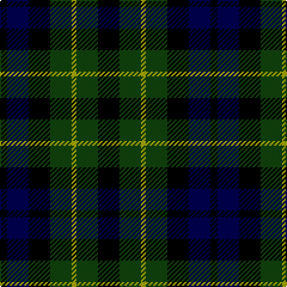

In pattern [KBKGYGK](/stripes/kbkgygk/).

This was sourced from weddslist.  It is a [7 stripe tartan](/stripes/stripes7/).

Original link http://www.weddslist.com/cgi-bin/tartans/pg.pl?source=tinsel

## Thread count
K/18 DG18 LG4 DG18 K18 DB18 K/6

## Palette
Each colour and the base-6 reference it is a variant of.

| Colour | Shade | Base |
|---|---|---|
| DB | <code style="background-color:#000052;">#000052</code> `oklch(19.8% 0.137 264.1)` <small>#000052</small> | B <code style="background-color:#2A418A;">#2A418A</code> |
| DG | <code style="background-color:#11450D;">#11450D</code> `oklch(34.4% 0.101 142.1)` <small>#11450D</small> | G <code style="background-color:#006100;">#006100</code> |
| K | <code style="background-color:#000000;">#000000</code> `oklch(0.0% 0.000 0.0)` <small>#000000</small> | K <code style="background-color:#000000;">#000000</code> |
| LG | <code style="background-color:#AAAA00;">#AAAA00</code> `oklch(71.4% 0.156 109.8)` <small>#AAAA00</small> | Y <code style="background-color:#F2BF00;">#F2BF00</code> |

# Sample pattern

## Nearest tartans

The nearest existing variants by ΔTartan distance.

1. [Graham of Montrose](/setts/s7/k4dg4lr1dg4k4db4k1~x2/) — ΔT 0.27
1. [Campbell Breadalbane](/setts/s7/k9dg9ly2dg9k9db9k3/) — ΔT 0.43
1. [Graham of Montrose](/setts/s7/k4dg4lb1dg4k4db4k1~x2/) — ΔT 0.51
1. [MacNiel of Colonsay](/setts/s7/db4dg6lr1dg6k6db6k2~x2/) — ΔT 0.88
1. [MacNeil of Colonsay](/setts/s7/db4dg6lb1dg6k6db6k2~x2/) — ΔT 0.92
1. [Campbell of Breadalbane (Clan)](/setts/s7/k9g9ly2g9k9db9k3~x2/) — ΔT 1.00
1. [Norwich No.064](/setts/s8/db12k16g14k5g14k16db12g4~x2/) — ΔT 1.18
1. [Graham of Montrose - 1850 (Clan)](/setts/s7/k9g9w2g9k9db9k3~x2/) — ΔT 1.27
1. [Denholm](/setts/s8/g8k7db8r2db8k7g8k2~x2/) — ΔT 1.31
1. [MacLaggan](/setts/s7/k13g12w2g12k13dp12k2~x2/) — ΔT 1.38

## Neighbour map

Every grey dot is one of 14299 variants placed by the first two principal components of the ΔTartan feature space (44% of its variance). Red is this tartan; blue dots are its nearest — click one to open its page.

<svg viewBox="0 0 640 380" role="img" style="max-width:100%;height:auto;border:1px solid #e0e0e0;border-radius:4px;display:block" xmlns="http://www.w3.org/2000/svg"><image href="/nn/cloud.v1.png" width="640" height="380"/><a href="/setts/s7/k4dg4lr1dg4k4db4k1~x2/"><circle cx="145.7" cy="297.3" r="4" fill="#3465a4"><title>Graham of Montrose</title></circle></a><a href="/setts/s7/k9dg9ly2dg9k9db9k3/"><circle cx="143.0" cy="291.2" r="4" fill="#3465a4"><title>Campbell Breadalbane</title></circle></a><a href="/setts/s7/k4dg4lb1dg4k4db4k1~x2/"><circle cx="134.4" cy="292.0" r="4" fill="#3465a4"><title>Graham of Montrose</title></circle></a><a href="/setts/s7/db4dg6lr1dg6k6db6k2~x2/"><circle cx="161.0" cy="286.0" r="4" fill="#3465a4"><title>MacNiel of Colonsay</title></circle></a><a href="/setts/s7/db4dg6lb1dg6k6db6k2~x2/"><circle cx="145.5" cy="278.6" r="4" fill="#3465a4"><title>MacNeil of Colonsay</title></circle></a><a href="/setts/s7/k9g9ly2g9k9db9k3~x2/"><circle cx="129.0" cy="281.7" r="4" fill="#3465a4"><title>Campbell of Breadalbane (Clan)</title></circle></a><a href="/setts/s8/db12k16g14k5g14k16db12g4~x2/"><circle cx="137.9" cy="306.8" r="4" fill="#3465a4"><title>Norwich No.064</title></circle></a><a href="/setts/s7/k9g9w2g9k9db9k3~x2/"><circle cx="148.3" cy="288.8" r="4" fill="#3465a4"><title>Graham of Montrose - 1850 (Clan)</title></circle></a><a href="/setts/s8/g8k7db8r2db8k7g8k2~x2/"><circle cx="87.1" cy="284.2" r="4" fill="#3465a4"><title>Denholm</title></circle></a><a href="/setts/s7/k13g12w2g12k13dp12k2~x2/"><circle cx="185.5" cy="266.3" r="4" fill="#3465a4"><title>MacLaggan</title></circle></a><circle cx="155.2" cy="297.3" r="5" fill="#c00000"/></svg>

ID: /setts/s7/k9dg9ly2dg9k9db9k3~x2/
