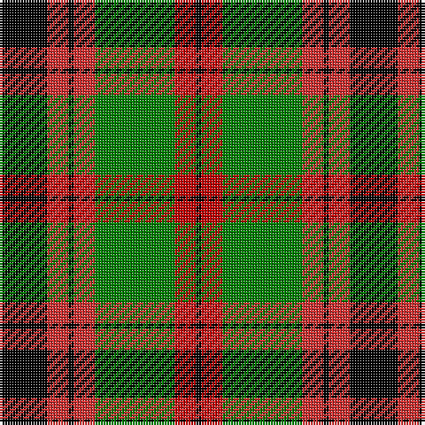

This page is one **sett** — a single exact thread-count. It belongs to the [tartan](/tartans/k9r4k1r4g15r4k1/)
(the same proportion at any scale), whose colour order is pattern [KRGRKRK](/stripes/krgrkrk/).

Sourced from weddslist.  It is a [7 stripe tartan](/stripes/stripes7/).

Original link http://www.weddslist.com/cgi-bin/tartans/pg.pl?source=sts

## Thread count
K/18 R8 K2 R8 G30 Ra8 K/2

## Palette

Palette: <strong>Ingles Buchan</strong> <small style="color:#888">(1 of 4 colours)</small>
<table><thead><tr><th>Colour</th><th>Threads</th><th>Shade</th><th>Base</th><th>OKLCh</th></tr></thead><tbody><tr><td>K/</td><td style="text-align:right;font-variant-numeric:tabular-nums">18</td><td><code style="background-color:#000000;">#000000</code> <small style="color:#888">#000000</small></td><td>K <code style="background-color:#000000;">#000000</code></td><td><small style="color:#888">oklch(0.0% 0.000 0.0)</small></td></tr><tr><td>R</td><td style="text-align:right;font-variant-numeric:tabular-nums">8</td><td><code style="background-color:#D03030;">#D03030</code> <small style="color:#888">#D03030</small></td><td>R <code style="background-color:#CC0000;">#CC0000</code></td><td><small style="color:#888">oklch(56.4% 0.196 26.2)</small></td></tr><tr><td>K</td><td style="text-align:right;font-variant-numeric:tabular-nums">2</td><td><code style="background-color:#000000;">#000000</code> <small style="color:#888">#000000</small></td><td>K <code style="background-color:#000000;">#000000</code></td><td><small style="color:#888">oklch(0.0% 0.000 0.0)</small></td></tr><tr><td>R</td><td style="text-align:right;font-variant-numeric:tabular-nums">8</td><td><code style="background-color:#D03030;">#D03030</code> <small style="color:#888">#D03030</small></td><td>R <code style="background-color:#CC0000;">#CC0000</code></td><td><small style="color:#888">oklch(56.4% 0.196 26.2)</small></td></tr><tr><td>G</td><td style="text-align:right;font-variant-numeric:tabular-nums">30</td><td><code style="background-color:#008000;">#008000</code> <small style="color:#888">#008000</small></td><td>G <code style="background-color:#006100;">#006100</code></td><td><small style="color:#888">oklch(52.0% 0.177 142.5)</small></td></tr><tr><td>Ra</td><td style="text-align:right;font-variant-numeric:tabular-nums">8</td><td><code style="background-color:#C00000;">#C00000</code> <small style="color:#888">#C00000</small></td><td>R <code style="background-color:#CC0000;">#CC0000</code></td><td><small style="color:#888">oklch(50.7% 0.208 29.2)</small></td></tr><tr><td>K/</td><td style="text-align:right;font-variant-numeric:tabular-nums">2</td><td><code style="background-color:#000000;">#000000</code> <small style="color:#888">#000000</small></td><td>K <code style="background-color:#000000;">#000000</code></td><td><small style="color:#888">oklch(0.0% 0.000 0.0)</small></td></tr></tbody></table>

# Sample pattern

## Nearest tartans

The nearest existing variants by ΔTartan distance, with this tartan at the top so the swatches line up against it.

ΔTartan

Tartan

Sett

—

<a href="/ttd/edit/#slug=k9r4k1r4g15r4k1~x2">Logan, Dark</a> <a class="nn-out" href="/setts/s7/k9r4k1r4g15r4k1~x2/" title="open its dictionary page">↗</a>

0.53

<a href="/ttd/edit/#slug=w2k1g16k12r12k1w2~x2">Prince Edward Island</a> <a class="nn-out" href="/setts/s7/w2k1g16k12r12k1w2~x2/" title="open its dictionary page">↗</a>

0.67

<a href="/ttd/edit/#slug=k44lo9k3lo8lo16lo15lo6k7~x2">Longford County Crest (Fashion)</a> <a class="nn-out" href="/setts/s8/k44lo9k3lo8lo16lo15lo6k7~x2/" title="open its dictionary page">↗</a>

0.90

<a href="/ttd/edit/#slug=g8r2g12k6g3db6r24k4~x2">Dickie</a> <a class="nn-out" href="/setts/s8/g8r2g12k6g3db6r24k4~x2/" title="open its dictionary page">↗</a>

0.91

<a href="/ttd/edit/#slug=w2k1dg16k12r12k1w2~x2">Prince Edward Island #2</a> <a class="nn-out" href="/setts/s7/w2k1dg16k12r12k1w2~x2/" title="open its dictionary page">↗</a>

0.93

<a href="/ttd/edit/#slug=g28t3g3k10r2k10r20ly4~x2">Garvock (2015)</a> <a class="nn-out" href="/setts/s8/g28t3g3k10r2k10r20ly4~x2/" title="open its dictionary page">↗</a>

0.96

<a href="/ttd/edit/#slug=k6r2g17r16k1t2~x2">Unidentified 12</a> <a class="nn-out" href="/setts/s6/k6r2g17r16k1t2~x2/" title="open its dictionary page">↗</a>

1.02

<a href="/ttd/edit/#slug=k3ly18g6r17k31g3~x2">MacMillan Variant (Unidentified)</a> <a class="nn-out" href="/setts/s6/k3ly18g6r17k31g3~x2/" title="open its dictionary page">↗</a>

1.09

<a href="/ttd/edit/#slug=g12dg1g1dg1g1k5r10k1r2~x2">Lindsay</a> <a class="nn-out" href="/setts/s9/g12dg1g1dg1g1k5r10k1r2~x2/" title="open its dictionary page">↗</a>

1.10

<a href="/ttd/edit/#slug=k2r7k6g12ly1g1k2~x4">Blackstock Hunting</a> <a class="nn-out" href="/setts/s7/k2r7k6g12ly1g1k2~x4/" title="open its dictionary page">↗</a>

1.10

<a href="/ttd/edit/#slug=g3r20g16k22lo6k3g2~x2">Wcwm 1062</a> <a class="nn-out" href="/setts/s7/g3r20g16k22lo6k3g2~x2/" title="open its dictionary page">↗</a>

## Neighbour map

Every grey dot is one of 14299 variants placed by the first two principal components of the ΔTartan feature space (44% of its variance). Red is this tartan; blue dots are its nearest — click one to open its page.

<svg viewBox="0 0 640 380" role="img" style="max-width:100%;height:auto;border:1px solid #e0e0e0;border-radius:4px;display:block" xmlns="http://www.w3.org/2000/svg"><image href="/nn/cloud.v1.png" width="640" height="380"/><a href="/setts/s7/w2k1g16k12r12k1w2~x2/"><circle cx="171.8" cy="161.6" r="4" fill="#3465a4"><title>Prince Edward Island</title></circle></a><a href="/setts/s8/k44lo9k3lo8lo16lo15lo6k7~x2/"><circle cx="212.7" cy="165.8" r="4" fill="#3465a4"><title>Longford County Crest (Fashion)</title></circle></a><a href="/setts/s8/g8r2g12k6g3db6r24k4~x2/"><circle cx="200.7" cy="180.3" r="4" fill="#3465a4"><title>Dickie</title></circle></a><a href="/setts/s7/w2k1dg16k12r12k1w2~x2/"><circle cx="191.5" cy="167.4" r="4" fill="#3465a4"><title>Prince Edward Island #2</title></circle></a><a href="/setts/s8/g28t3g3k10r2k10r20ly4~x2/"><circle cx="164.1" cy="148.9" r="4" fill="#3465a4"><title>Garvock (2015)</title></circle></a><a href="/setts/s6/k6r2g17r16k1t2~x2/"><circle cx="235.4" cy="170.5" r="4" fill="#3465a4"><title>Unidentified 12</title></circle></a><a href="/setts/s6/k3ly18g6r17k31g3~x2/"><circle cx="180.0" cy="190.4" r="4" fill="#3465a4"><title>MacMillan Variant (Unidentified)</title></circle></a><a href="/setts/s9/g12dg1g1dg1g1k5r10k1r2~x2/"><circle cx="219.3" cy="156.5" r="4" fill="#3465a4"><title>Lindsay</title></circle></a><a href="/setts/s7/k2r7k6g12ly1g1k2~x4/"><circle cx="229.5" cy="195.1" r="4" fill="#3465a4"><title>Blackstock Hunting</title></circle></a><a href="/setts/s7/g3r20g16k22lo6k3g2~x2/"><circle cx="179.7" cy="196.8" r="4" fill="#3465a4"><title>Wcwm 1062</title></circle></a><circle cx="189.7" cy="172.6" r="5" fill="#c00000"/></svg>

ID: /setts/s7/k9r4k1r4g15r4k1~x2/
