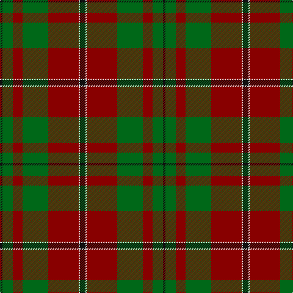

In pattern [KGRGRWK](/patterns/kgrgrwk/).

This was sourced from tartans-authority.  It is a [7 stripes tartan](/stripes/stripes7/).

Original link http://www.tartansauthority.com/tartan-ferret/display/6917/

## Thread count
K/4 G17 DR16 G42 DR50 LN2 K/9

## Palette
Each colour and its ΔE from the base-6 reference it is a variant of.

| Colour | Shade | Base | ΔE (OKLab) |
|---|---|---|---|
| DR | <code style="background-color:#880000;">#880000</code> `#880000` | R <code style="background-color:#C80000;">#C80000</code> | 0.14 |
| G | <code style="background-color:#006818;">#006818</code> `#006818` | G <code style="background-color:#006400;">#006400</code> | 0.02 |
| K | <code style="background-color:#101010;">#101010</code> `#101010` | K <code style="background-color:#000000;">#000000</code> | 0.17 |
| LN | <code style="background-color:#E0E0E0;">#E0E0E0</code> `#E0E0E0` | W <code style="background-color:#F4F4F0;">#F4F4F0</code> | 0.06 |

# Sample pattern

## Nearest tartans

The nearest existing variants by ΔTartan distance.

1. [Cumming SM](/setts/s8/r6g18y2g18r6g12r36k4-g11450d-k000000-raa0000-yaaaaaa/) — ΔT 0.88
1. [Oriel #1 (District)](/setts/s9/r24b4r6g40k8g40r60k4r2-b2c2c80-g006818-k101010-rc80000/) — ΔT 1.18
1. [Christmas](/setts/s5/y4g34ga8r30g2-g0e3923-ga207449-rbb001a-ye3b235/) — ΔT 1.20
1. [Finnlaggan](/setts/s6/g14w2g36b12r36g4-b304080-g003000-rc00000-we0e0e0/) — ΔT 1.20
1. [Midpac Tissue (non woven)](/setts/s8/r10k4g2k4r10k4g36y6-g285800-k101010-rc80000-ybc8c00/) — ΔT 1.22
1. [Comyn or MacAulay Tartan Tartan Number: 1157. Earliest known date: 1850 This sett closely resembles the 'Vestiarium' version, but is in fact the one given by Logan as MacAuley and illustrated by MacIan in 'The Clans of the Scottish Highlands', 1847. The Smith brothers said that the sett had the approval of the head of the family og Cumming. See products available Copyright © Blair Urquhart, Comrie, 2015](/setts/s8/r6g18w2g18r6g12r36k4-g006818-k101010-rc80000-we0e0e0/) — ΔT 1.23
1. [Cumming #2](/setts/s8/r6g18w2g18r6g12r36k4-g006818-k101010-rc80000-wfcfcfc/) — ΔT 1.29
1. [Abernethy (Colerain USA) (Personal)](/setts/s7/y2b28r56g28r2g28y2-b2c2c80-g006818-rc80000-ydc943c/) — ΔT 1.31
1. [MacAulay](/setts/s6/k4r32g12r6g16y2-g11450d-k000000-raa0000-yaaaaaa/) — ΔT 1.33
1. [MacAulay](/setts/s6/k2r16g6r3g8y1-g11450d-k000000-raa0000-yaaaaaa/) — ΔT 1.33

## Neighbour map

Every grey dot is one of 15726 variants placed by the first two principal components of the ΔTartan feature space (44% of its variance). Red is this tartan; blue dots are its nearest — click one to open its page.

<svg viewBox="0 0 640 380" role="img" style="max-width:100%;height:auto;border:1px solid #e0e0e0;border-radius:4px;display:block" xmlns="http://www.w3.org/2000/svg"><image href="/nn/cloud.v1.png" width="640" height="380"/><a href="/setts/s8/r6g18y2g18r6g12r36k4-g11450d-k000000-raa0000-yaaaaaa/"><circle cx="330.3" cy="187.8" r="4" fill="#3465a4"><title>Cumming SM</title></circle></a><a href="/setts/s9/r24b4r6g40k8g40r60k4r2-b2c2c80-g006818-k101010-rc80000/"><circle cx="343.7" cy="144.9" r="4" fill="#3465a4"><title>Oriel #1 (District)</title></circle></a><a href="/setts/s5/y4g34ga8r30g2-g0e3923-ga207449-rbb001a-ye3b235/"><circle cx="300.9" cy="198.7" r="4" fill="#3465a4"><title>Christmas</title></circle></a><a href="/setts/s6/g14w2g36b12r36g4-b304080-g003000-rc00000-we0e0e0/"><circle cx="314.8" cy="196.2" r="4" fill="#3465a4"><title>Finnlaggan</title></circle></a><a href="/setts/s8/r10k4g2k4r10k4g36y6-g285800-k101010-rc80000-ybc8c00/"><circle cx="306.9" cy="161.8" r="4" fill="#3465a4"><title>Midpac Tissue (non woven)</title></circle></a><a href="/setts/s8/r6g18w2g18r6g12r36k4-g006818-k101010-rc80000-we0e0e0/"><circle cx="315.8" cy="178.3" r="4" fill="#3465a4"><title>Comyn or MacAulay Tartan Tartan Number: 1157. Earliest known date: 1850 This sett closely resembles the 'Vestiarium' version, but is in fact the one given by Logan as MacAuley and illustrated by MacIan in 'The Clans of the Scottish Highlands', 1847. The Smith brothers said that the sett had the approval of the head of the family og Cumming. See products available Copyright © Blair Urquhart, Comrie, 2015</title></circle></a><a href="/setts/s8/r6g18w2g18r6g12r36k4-g006818-k101010-rc80000-wfcfcfc/"><circle cx="312.8" cy="177.0" r="4" fill="#3465a4"><title>Cumming #2</title></circle></a><a href="/setts/s7/y2b28r56g28r2g28y2-b2c2c80-g006818-rc80000-ydc943c/"><circle cx="276.5" cy="160.2" r="4" fill="#3465a4"><title>Abernethy (Colerain USA) (Personal)</title></circle></a><a href="/setts/s6/k4r32g12r6g16y2-g11450d-k000000-raa0000-yaaaaaa/"><circle cx="342.8" cy="196.6" r="4" fill="#3465a4"><title>MacAulay</title></circle></a><a href="/setts/s6/k2r16g6r3g8y1-g11450d-k000000-raa0000-yaaaaaa/"><circle cx="342.8" cy="196.6" r="4" fill="#3465a4"><title>MacAulay</title></circle></a><circle cx="337.8" cy="181.8" r="5" fill="#c00000"/></svg>

ID: /setts/s7/k9w2r50g42r16g17k4-g006818-k101010-r880000-we0e0e0/
