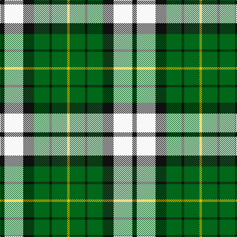

In pattern [KWKGKGY](/patterns/kwkgkgy/).

This was sourced from register-of-tartans.  It is a [7 stripes tartan](/stripes/stripes7/).

Original link https://www.tartanregister.gov.uk/tartanDetails.aspx?ref=2071

## Attestations

This cloth appears in 2 source records; the oldest owns this page.

- 01/01/2003 — Lawsons' Whisky (register-of-tartans, [record](https://www.tartanregister.gov.uk/tartanDetails.aspx?ref=2071))
- pre 2003 — Lawsons' Whisky (Corporate) (tartans-authority, [record](http://www.tartansauthority.com/tartan-ferret/display/5957/))

## Register references

External register numbers recorded for this tartan.

- Scottish Register of Tartans: [2071](https://www.tartanregister.gov.uk/tartanDetails.aspx?ref=2071)
- Scottish Tartans Authority (ITI): 5957

## Thread count
K/9 W38 K22 G31 K5 G31 Y/5

## Palette
Each colour and its ΔE from the base-6 reference it is a variant of.

| Colour | Shade | Base | ΔE (OKLab) |
|---|---|---|---|
| G | <code style="background-color:#006818;">#006818</code> `#006818` | G <code style="background-color:#006100;">#006100</code> | 0.02 |
| K | <code style="background-color:#101010;">#101010</code> `#101010` | K <code style="background-color:#000000;">#000000</code> | 0.17 |
| W | <code style="background-color:#F8F8F8;">#F8F8F8</code> `#F8F8F8` | W <code style="background-color:#F7F7F7;">#F7F7F7</code> | 0.00 |
| Y | <code style="background-color:#E8C000;">#E8C000</code> `#E8C000` | Y <code style="background-color:#F2BF00;">#F2BF00</code> | 0.02 |

# Sample pattern

## Nearest tartans

The nearest existing variants by ΔTartan distance.

1. [Lawson, William 2002](/setts/s7/k4w19k11g15k3g16y3~g003c14-k101010-we0e0e0-ye8c000~x2/) — ΔT 0.87
1. [MacKay, Dress (Corporate)](/setts/s6/k4g14k14g2w14b3~b1474b4-g006818-k101010-we0e0e0~x2/) — ΔT 1.07
1. [Unnamed (Hip Flask)](/setts/s8/g14r5g14w5k2r5k2w9~g003c14-k101010-ra52b05-we0e0e0~x4/) — ΔT 1.14
1. [McCabe (2016)](/setts/s6/b8y1g5y12r1g2~b000080-g003820-rdc0000-yfff000~x6/) — ΔT 1.23
1. [Cape Breton](/setts/s7/y5k5g17k6ga24k6y3~g008000-ga808080-k000000-yf0c000~x2/) — ΔT 1.24
1. [Unnamed 9](/setts/s9/w16g2k5r2k10g11y2g11k2~g008000-k000000-rc00000-we0e0e0-yf0c000~x2/) — ΔT 1.27
1. [Cape Breton (yellow stripes)](/setts/s7/y6k6g30k8w18k6y3~g789484-k000000-wc0c0c0-ye8c000~x2/) — ΔT 1.30
1. [MacKay Dress](/setts/s6/b4w23g2k23g23k4~b1474b4-g006818-k101010-we0e0e0~x2/) — ΔT 1.32
1. [MacIntosh, dress](/setts/s6/r3w8b4g14r4b2~b304080-g008000-rc00000-we0e0e0~x2/) — ΔT 1.33
1. [Black and White Golf](/setts/s7/y9k32g6w20y3w9k5~g008b00-k101010-wffffff-yd9b666~x2/) — ΔT 1.35

## Neighbour map

Every grey dot is one of 15726 variants placed by the first two principal components of the ΔTartan feature space (44% of its variance). Red is this tartan; blue dots are its nearest — click one to open its page.

<svg viewBox="0 0 640 380" role="img" style="max-width:100%;height:auto;border:1px solid #e0e0e0;border-radius:4px;display:block" xmlns="http://www.w3.org/2000/svg"><image href="/nn/cloud.v1.png" width="640" height="380"/><a href="/setts/s7/k4w19k11g15k3g16y3~g003c14-k101010-we0e0e0-ye8c000~x2/"><circle cx="145.4" cy="227.0" r="4" fill="#3465a4"><title>Lawson, William 2002</title></circle></a><a href="/setts/s6/k4g14k14g2w14b3~b1474b4-g006818-k101010-we0e0e0~x2/"><circle cx="116.9" cy="224.7" r="4" fill="#3465a4"><title>MacKay, Dress (Corporate)</title></circle></a><a href="/setts/s8/g14r5g14w5k2r5k2w9~g003c14-k101010-ra52b05-we0e0e0~x4/"><circle cx="186.8" cy="215.2" r="4" fill="#3465a4"><title>Unnamed (Hip Flask)</title></circle></a><a href="/setts/s6/b8y1g5y12r1g2~b000080-g003820-rdc0000-yfff000~x6/"><circle cx="185.4" cy="179.9" r="4" fill="#3465a4"><title>McCabe (2016)</title></circle></a><a href="/setts/s7/y5k5g17k6ga24k6y3~g008000-ga808080-k000000-yf0c000~x2/"><circle cx="129.5" cy="201.8" r="4" fill="#3465a4"><title>Cape Breton</title></circle></a><a href="/setts/s9/w16g2k5r2k10g11y2g11k2~g008000-k000000-rc00000-we0e0e0-yf0c000~x2/"><circle cx="109.5" cy="175.1" r="4" fill="#3465a4"><title>Unnamed 9</title></circle></a><a href="/setts/s7/y6k6g30k8w18k6y3~g789484-k000000-wc0c0c0-ye8c000~x2/"><circle cx="145.2" cy="182.8" r="4" fill="#3465a4"><title>Cape Breton (yellow stripes)</title></circle></a><a href="/setts/s6/b4w23g2k23g23k4~b1474b4-g006818-k101010-we0e0e0~x2/"><circle cx="141.0" cy="197.0" r="4" fill="#3465a4"><title>MacKay Dress</title></circle></a><a href="/setts/s6/r3w8b4g14r4b2~b304080-g008000-rc00000-we0e0e0~x2/"><circle cx="148.8" cy="217.6" r="4" fill="#3465a4"><title>MacIntosh, dress</title></circle></a><a href="/setts/s7/y9k32g6w20y3w9k5~g008b00-k101010-wffffff-yd9b666~x2/"><circle cx="175.3" cy="178.6" r="4" fill="#3465a4"><title>Black and White Golf</title></circle></a><circle cx="148.4" cy="215.2" r="5" fill="#c00000"/></svg>

ID: /setts/s7/k9w38k22g31k5g31y5~g006818-k101010-wf8f8f8-ye8c000/
