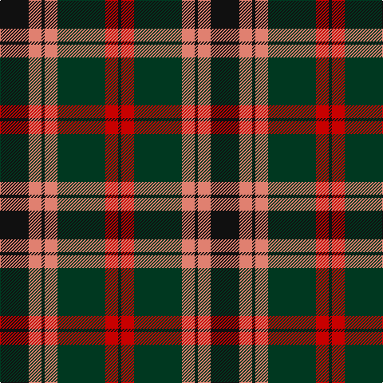

In pattern [KRGYKYK](/patterns/krgykyk/).

This was sourced from tartans-authority.  It is a [7 stripes tartan](/stripes/stripes7/).

Original link http://www.tartansauthority.com/tartan-ferret/display/1150/

## Thread count
K/36 LR16 K4 LR16 DG60 R16 K/4

## Palette
Each colour and its ΔE from the base-6 reference it is a variant of.

| Colour | Shade | Base | ΔE (OKLab) |
|---|---|---|---|
| DG | <code style="background-color:#003820;">#003820</code> `#003820` | G <code style="background-color:#006100;">#006100</code> | 0.15 |
| K | <code style="background-color:#101010;">#101010</code> `#101010` | K <code style="background-color:#000000;">#000000</code> | 0.17 |
| LR | <code style="background-color:#E08070;">#E08070</code> `#E08070` | Y <code style="background-color:#F2BF00;">#F2BF00</code> | 0.19 |
| R | <code style="background-color:#C80000;">#C80000</code> `#C80000` | R <code style="background-color:#CC0000;">#CC0000</code> | 0.01 |

# Sample pattern

## Nearest tartans

The nearest existing variants by ΔTartan distance.

1. [United Distillers](/setts/s6/r2b14r1k14r14y2x2~b680028-k101010-r948860-ye8c000/) — ΔT 0.77
1. [Prince Edward Island #2](/setts/s7/w2k1g16k12r12k1w2x2~g005020-k101010-rdc0000-we0e0e0/) — ΔT 0.78
1. [Cook (Name)](/setts/s7/g12ga6g6r15k1r1k2x2~g003820-ga048888-k101010-rc80000/) — ΔT 0.86
1. [Private SA Club](/setts/s8/k3r8k3r8y19r7b36r3x2~b14283c-k101010-r880000-yd8a028/) — ΔT 0.87
1. [Dickie](/setts/s8/g8r2g12k6g3b6r24k4x2~b00008c-g146400-k000000-rc82800/) — ΔT 0.88
1. [Prince Edward Island District Tartan Tartan Number: 1815. Earliest known date: 1960-70 The warmth and glow of the fertile soil, The green field and tree, The yellow and the brown of Autumn, The white of surf or a summer snow, Rust, green, yellow and white, Yes! That's our Island Tartan. See products available Copyright © Blair Urquhart, Comrie, 2015](/setts/s7/w2k1g16k12r12k1w2x2~g006818-k101010-rc80000-we0e0e0/) — ΔT 0.90
1. [MacMillan - 2002 (Black - Unofficial](/setts/s6/g3k31r17g6y18k3x2~g004810-k101010-r880000-ybc8c00/) — ΔT 0.91
1. [Wcwm 1062](/setts/s7/g3r20g16k22y6k3g2x2~g006818-k101010-rc80000-yd09800/) — ΔT 0.94
1. [Blackstock Hunting](/setts/s7/k2r7k6g12y1g1k2x4~g006818-k101010-rc80000-ye8c000/) — ΔT 0.97
1. [Logan #3](/setts/s7/b9y4b1y4g15r4b1x4~b440044-g00801c-rc8002c-ye08070/) — ΔT 1.00

## Neighbour map

Every grey dot is one of 15726 variants placed by the first two principal components of the ΔTartan feature space (44% of its variance). Red is this tartan; blue dots are its nearest — click one to open its page.

<svg viewBox="0 0 640 380" role="img" style="max-width:100%;height:auto;border:1px solid #e0e0e0;border-radius:4px;display:block" xmlns="http://www.w3.org/2000/svg"><image href="/nn/cloud.v1.png" width="640" height="380"/><a href="/setts/s6/r2b14r1k14r14y2x2~b680028-k101010-r948860-ye8c000/"><circle cx="202.6" cy="194.2" r="4" fill="#3465a4"><title>United Distillers</title></circle></a><a href="/setts/s7/w2k1g16k12r12k1w2x2~g005020-k101010-rdc0000-we0e0e0/"><circle cx="189.1" cy="168.7" r="4" fill="#3465a4"><title>Prince Edward Island #2</title></circle></a><a href="/setts/s7/g12ga6g6r15k1r1k2x2~g003820-ga048888-k101010-rc80000/"><circle cx="251.6" cy="190.4" r="4" fill="#3465a4"><title>Cook (Name)</title></circle></a><a href="/setts/s8/k3r8k3r8y19r7b36r3x2~b14283c-k101010-r880000-yd8a028/"><circle cx="227.7" cy="173.5" r="4" fill="#3465a4"><title>Private SA Club</title></circle></a><a href="/setts/s8/g8r2g12k6g3b6r24k4x2~b00008c-g146400-k000000-rc82800/"><circle cx="198.6" cy="182.2" r="4" fill="#3465a4"><title>Dickie</title></circle></a><a href="/setts/s7/w2k1g16k12r12k1w2x2~g006818-k101010-rc80000-we0e0e0/"><circle cx="187.9" cy="169.2" r="4" fill="#3465a4"><title>Prince Edward Island District Tartan Tartan Number: 1815. Earliest known date: 1960-70 The warmth and glow of the fertile soil, The green field and tree, The yellow and the brown of Autumn, The white of surf or a summer snow, Rust, green, yellow and white, Yes! That's our Island Tartan. See products available Copyright © Blair Urquhart, Comrie, 2015</title></circle></a><a href="/setts/s6/g3k31r17g6y18k3x2~g004810-k101010-r880000-ybc8c00/"><circle cx="216.2" cy="211.2" r="4" fill="#3465a4"><title>MacMillan - 2002 (Black - Unofficial</title></circle></a><a href="/setts/s7/g3r20g16k22y6k3g2x2~g006818-k101010-rc80000-yd09800/"><circle cx="177.6" cy="197.1" r="4" fill="#3465a4"><title>Wcwm 1062</title></circle></a><a href="/setts/s7/k2r7k6g12y1g1k2x4~g006818-k101010-rc80000-ye8c000/"><circle cx="227.2" cy="195.1" r="4" fill="#3465a4"><title>Blackstock Hunting</title></circle></a><a href="/setts/s7/b9y4b1y4g15r4b1x4~b440044-g00801c-rc8002c-ye08070/"><circle cx="209.1" cy="177.1" r="4" fill="#3465a4"><title>Logan #3</title></circle></a><circle cx="213.0" cy="185.0" r="5" fill="#c00000"/></svg>

ID: /setts/s7/k9y4k1y4g15r4k1x4~g003820-k101010-rc80000-ye08070/
