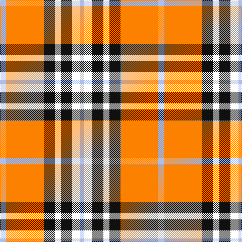

**Bands:** [WWKWKYW](/stripes/wwkwkyw/) · **Stripes:** [LB W K W K LO LB](/stripes/stripes7/) LB W K W K LO LB

This was sourced from register-of-tartans.  It is a [7 band tartan](/bands/bands7/).

Original link https://www.tartanregister.gov.uk/tartanDetails.aspx?ref=10105

## Register references

External register numbers recorded for this tartan.

- Scottish Register of Tartans: [10105](https://www.tartanregister.gov.uk/tartanDetails.aspx?ref=10105)

## Thread count
LP/12 O75 K22 W12 K22 W16 LP/8

## Palette
Each colour and its ΔE from the base-6 reference it is a variant of.

| Colour | Shade | Base | ΔE (OKLab) |
|---|---|---|---|
| K | <code style="background-color:#101010;">#101010</code> `#101010` | K <code style="background-color:#000000;">#000000</code> | 0.17 |
| LP | <code style="background-color:#ADBEE9;">#ADBEE9</code> `#ADBEE9` | W <code style="background-color:#F7F7F7;">#F7F7F7</code> | 0.18 |
| O | <code style="background-color:#FC8100;">#FC8100</code> `#FC8100` | Y <code style="background-color:#F2BF00;">#F2BF00</code> | 0.14 |
| W | <code style="background-color:#FFFFFF;">#FFFFFF</code> `#FFFFFF` | W <code style="background-color:#F7F7F7;">#F7F7F7</code> | 0.02 |

# Sample pattern

## Nearest tartans

The nearest existing variants by ΔTartan distance.

1. [Orange Fanaticos (Corporate)](/setts/s7/t12lo75k22w12k22w16t8/) — ΔT 0.77
1. [Sidney, (Nova Scotia)](/setts/s8/lo16y2lo11y6k4w2k4y16~x2/) — ΔT 1.06
1. [Thomson, Camel (Fashion)](/setts/s6/r4ly30k6w13k13w3~x2/) — ΔT 1.10
1. [Cameron, Hose](/setts/s7/k1r8g1r1w8r1k1~x6/) — ΔT 1.13
1. [Wallace Dress, Red (Dance)](/setts/s5/k3r28k10w28t3~x2/) — ΔT 1.17
1. [Thomson Camel](/setts/s6/r4lo30k6w13k13w3~x2/) — ΔT 1.19
1. [Karibu](/setts/s9/g12w1r1w4r1w1r8ly2r1~x4/) — ΔT 1.19
1. [MacRae, Dress Red (Dance)](/setts/s11/t1r3k2w1r8w1k2w9k1w3t1~x6/) — ΔT 1.21
1. [MacPherson Dress Burgundy (Dance)](/setts/s7/w4k2w25r21w3r8ly3~x2/) — ΔT 1.33
1. [MacKintosh Dress (Dance)](/setts/s6/g3r9dg18dp8w33r3~x2/) — ΔT 1.33

## Neighbour map

Every grey dot is one of 14313 variants placed by the first two principal components of the ΔTartan feature space (44% of its variance). Red is this tartan; blue dots are its nearest — click one to open its page.

<svg viewBox="0 0 640 380" role="img" style="max-width:100%;height:auto;border:1px solid #e0e0e0;border-radius:4px;display:block" xmlns="http://www.w3.org/2000/svg"><image href="/nn/cloud.v1.png" width="640" height="380"/><a href="/setts/s7/t12lo75k22w12k22w16t8/"><circle cx="198.9" cy="172.2" r="4" fill="#3465a4"><title>Orange Fanaticos (Corporate)</title></circle></a><a href="/setts/s8/lo16y2lo11y6k4w2k4y16~x2/"><circle cx="199.8" cy="187.4" r="4" fill="#3465a4"><title>Sidney, (Nova Scotia)</title></circle></a><a href="/setts/s6/r4ly30k6w13k13w3~x2/"><circle cx="186.1" cy="183.5" r="4" fill="#3465a4"><title>Thomson, Camel (Fashion)</title></circle></a><a href="/setts/s7/k1r8g1r1w8r1k1~x6/"><circle cx="236.9" cy="156.6" r="4" fill="#3465a4"><title>Cameron, Hose</title></circle></a><a href="/setts/s5/k3r28k10w28t3~x2/"><circle cx="183.8" cy="186.1" r="4" fill="#3465a4"><title>Wallace Dress, Red (Dance)</title></circle></a><a href="/setts/s6/r4lo30k6w13k13w3~x2/"><circle cx="190.7" cy="187.0" r="4" fill="#3465a4"><title>Thomson Camel</title></circle></a><a href="/setts/s9/g12w1r1w4r1w1r8ly2r1~x4/"><circle cx="204.1" cy="140.2" r="4" fill="#3465a4"><title>Karibu</title></circle></a><a href="/setts/s11/t1r3k2w1r8w1k2w9k1w3t1~x6/"><circle cx="185.3" cy="137.3" r="4" fill="#3465a4"><title>MacRae, Dress Red (Dance)</title></circle></a><a href="/setts/s7/w4k2w25r21w3r8ly3~x2/"><circle cx="265.4" cy="152.9" r="4" fill="#3465a4"><title>MacPherson Dress Burgundy (Dance)</title></circle></a><a href="/setts/s6/g3r9dg18dp8w33r3~x2/"><circle cx="176.5" cy="158.1" r="4" fill="#3465a4"><title>MacKintosh Dress (Dance)</title></circle></a><circle cx="189.3" cy="160.9" r="5" fill="#c00000"/></svg>

ID: /setts/s7/lb12lo75k22w12k22w16lb8/
