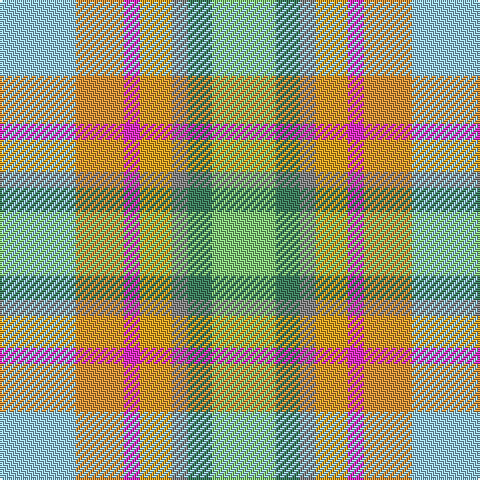

**Bands:** [WYRYRGY](/stripes/wyryrgy/) · **Stripes:** [LB LO M LO O G LG](/stripes/stripes7/) LB LO M LO O G LG

This was sourced from register-of-tartans.  It is a [7 band tartan](/bands/bands7/).

Original link https://www.tartanregister.gov.uk/tartanDetails.aspx?ref=11267

## Register references

External register numbers recorded for this tartan.

- Scottish Register of Tartans: [11267](https://www.tartanregister.gov.uk/tartanDetails.aspx?ref=11267)

## Thread count
LB/38 O24 LR8 Y16 N8 G12 LG/32

## Palette
Each colour and its ΔE from the base-6 reference it is a variant of.

| Colour | Shade | Base | ΔE (OKLab) |
|---|---|---|---|
| G | <code style="background-color:#408060;">#408060</code> `#408060` | G <code style="background-color:#006100;">#006100</code> | 0.14 |
| LB | <code style="background-color:#98C8E8;">#98C8E8</code> `#98C8E8` | W <code style="background-color:#F7F7F7;">#F7F7F7</code> | 0.18 |
| LG | <code style="background-color:#86C87C;">#86C87C</code> `#86C87C` | Y <code style="background-color:#F2BF00;">#F2BF00</code> | 0.15 |
| LR | <code style="background-color:#EC34C4;">#EC34C4</code> `#EC34C4` | R <code style="background-color:#CC0000;">#CC0000</code> | 0.24 |
| N | <code style="background-color:#888888;">#888888</code> `#888888` | R <code style="background-color:#CC0000;">#CC0000</code> | 0.24 |
| O | <code style="background-color:#DC943C;">#DC943C</code> `#DC943C` | Y <code style="background-color:#F2BF00;">#F2BF00</code> | 0.12 |
| Y | <code style="background-color:#E0A126;">#E0A126</code> `#E0A126` | Y <code style="background-color:#F2BF00;">#F2BF00</code> | 0.08 |

# Sample pattern

## Nearest tartans

The nearest existing variants by ΔTartan distance.

1. [Aberdeenshire Home Colours](/setts/s7/t19lo12r4ly8o4g6g16~x2/) — ΔT 1.24
1. [Takashimaya Dm Rose](/setts/s8/lb4ly2o16y16ly9w11lb2m4~x2/) — ΔT 1.54
1. [Heriot Bay Local (Quadra Island, British Columbia)](/setts/s6/lb5w1t3g4lr2t5~x8/) — ΔT 2.21
1. [Ribbons of Hope](/setts/s10/lp3w3lp8r5r10w4r12g4g6w3~x2/) — ΔT 2.25
1. [Devon, Green (District)](/setts/s7/o5y4lr1y4dy4dg4ly1~x4/) — ΔT 2.39
1. [Bouguet, Adrian (Personal)](/setts/s11/lb14t9lb14lr4dg3lb3dg3lr4t14lr2w3~x2/) — ΔT 2.52
1. [Teallach](/setts/s9/ly4r24dy19w3y23y13dy3n13dy3~x2/) — ΔT 2.58
1. [Teallach Family Tartan Tartan Number: 832. Earliest known date: pre 2003 The tartan of the present chairman of the Scottish Tartans Society, Dr Gordon Teall of Teallach. See products available Copyright © Blair Urquhart, Comrie, 2015](/setts/s9/ly4r24dy19w3y23o13dy3n13dy3~x2/) — ΔT 2.59
1. [Teallach (Personal)](/setts/s9/lo4o24dy19w3y23n13dy3o13dy3~x2/) — ΔT 2.64
1. [Curd (2013)](/setts/s8/r1g1ly1t9ly3w3lr9t1~x4/) — ΔT 2.66

## Neighbour map

Every grey dot is one of 14313 variants placed by the first two principal components of the ΔTartan feature space (44% of its variance). Red is this tartan; blue dots are its nearest — click one to open its page.

<svg viewBox="0 0 640 380" role="img" style="max-width:100%;height:auto;border:1px solid #e0e0e0;border-radius:4px;display:block" xmlns="http://www.w3.org/2000/svg"><image href="/nn/cloud.v1.png" width="640" height="380"/><a href="/setts/s7/t19lo12r4ly8o4g6g16~x2/"><circle cx="53.0" cy="220.4" r="4" fill="#3465a4"><title>Aberdeenshire Home Colours</title></circle></a><a href="/setts/s8/lb4ly2o16y16ly9w11lb2m4~x2/"><circle cx="110.5" cy="198.2" r="4" fill="#3465a4"><title>Takashimaya Dm Rose</title></circle></a><a href="/setts/s6/lb5w1t3g4lr2t5~x8/"><circle cx="33.5" cy="244.6" r="4" fill="#3465a4"><title>Heriot Bay Local (Quadra Island, British Columbia)</title></circle></a><a href="/setts/s10/lp3w3lp8r5r10w4r12g4g6w3~x2/"><circle cx="14.0" cy="194.2" r="4" fill="#3465a4"><title>Ribbons of Hope</title></circle></a><a href="/setts/s7/o5y4lr1y4dy4dg4ly1~x4/"><circle cx="113.1" cy="262.2" r="4" fill="#3465a4"><title>Devon, Green (District)</title></circle></a><a href="/setts/s11/lb14t9lb14lr4dg3lb3dg3lr4t14lr2w3~x2/"><circle cx="153.2" cy="186.5" r="4" fill="#3465a4"><title>Bouguet, Adrian (Personal)</title></circle></a><a href="/setts/s9/ly4r24dy19w3y23y13dy3n13dy3~x2/"><circle cx="93.6" cy="181.5" r="4" fill="#3465a4"><title>Teallach</title></circle></a><a href="/setts/s9/ly4r24dy19w3y23o13dy3n13dy3~x2/"><circle cx="93.6" cy="180.7" r="4" fill="#3465a4"><title>Teallach Family Tartan Tartan Number: 832. Earliest known date: pre 2003 The tartan of the present chairman of the Scottish Tartans Society, Dr Gordon Teall of Teallach. See products available Copyright © Blair Urquhart, Comrie, 2015</title></circle></a><a href="/setts/s9/lo4o24dy19w3y23n13dy3o13dy3~x2/"><circle cx="126.3" cy="202.6" r="4" fill="#3465a4"><title>Teallach (Personal)</title></circle></a><a href="/setts/s8/r1g1ly1t9ly3w3lr9t1~x4/"><circle cx="165.1" cy="162.4" r="4" fill="#3465a4"><title>Curd (2013)</title></circle></a><circle cx="67.2" cy="223.5" r="5" fill="#c00000"/></svg>

ID: /setts/s7/lb19lo12m4lo8o4g6lg16~x2/
