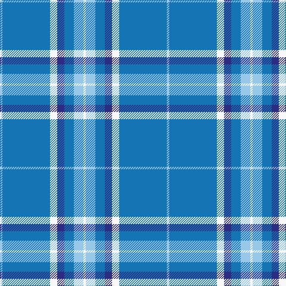

**Bands:** [WBWBBWW](/stripes/wbwbbww/) · **Stripes:** [LB B W DB B LB W](/stripes/stripes7/) LB B W DB B LB W

This was sourced from register-of-tartans.  It is a [7 band tartan](/bands/bands7/).

Original link https://www.tartanregister.gov.uk/tartanDetails.aspx?ref=3909

## Attestations

This cloth appears in 2 source records; the oldest owns this page.

- 01/01/2004 — Starr (register-of-tartans, [record](https://www.tartanregister.gov.uk/tartanDetails.aspx?ref=3909))
- pre 2004 — Starr (Name) (tartans-authority, [record](http://www.tartansauthority.com/tartan-ferret/display/6373/))

## Register references

External register numbers recorded for this tartan.

- Scottish Register of Tartans: [3909](https://www.tartanregister.gov.uk/tartanDetails.aspx?ref=3909)
- Scottish Tartans Authority (ITI): 6373

## Thread count
LB/4 B80 W12 DB12 B16 LB16 W/4

## Palette
Each colour and its ΔE from the base-6 reference it is a variant of.

| Colour | Shade | Base | ΔE (OKLab) |
|---|---|---|---|
| B | <code style="background-color:#1474B4;">#1474B4</code> `#1474B4` | B <code style="background-color:#2A418A;">#2A418A</code> | 0.15 |
| DB | <code style="background-color:#2C2C80;">#2C2C80</code> `#2C2C80` | B <code style="background-color:#2A418A;">#2A418A</code> | 0.06 |
| LB | <code style="background-color:#98C8E8;">#98C8E8</code> `#98C8E8` | W <code style="background-color:#F7F7F7;">#F7F7F7</code> | 0.18 |
| W | <code style="background-color:#F8F8F8;">#F8F8F8</code> `#F8F8F8` | W <code style="background-color:#F7F7F7;">#F7F7F7</code> | 0.00 |

# Sample pattern

## Nearest tartans

The nearest existing variants by ΔTartan distance.

1. [Lauder Primary School (Corporate)](/setts/s6/r2t21r2db6ly1r1~x4/) — ΔT 1.17
1. [MacLintock #2](/setts/s7/n3b2w10b2n6b26k2~x2/) — ΔT 1.43
1. [Leblant-Macqueron (Personal)](/setts/s7/lb5dy6w2g7w2b44w2~x2/) — ΔT 1.44
1. [Glen Innes (Australia)](/setts/s8/t142db12db24w7db5w5db5r10/) — ΔT 1.50
1. [Murray of Elibank](/setts/s7/b64k3g14k4b4k12lo4~x2/) — ΔT 1.51
1. [Goil Dress](/setts/s11/t42db10lo2db2lb2db2t10lb6db2lb3t2~x2/) — ΔT 1.52
1. [Supporter.com](/setts/s7/b120g9r7ly12g33ly33b26/) — ΔT 1.56
1. [Carlisle Family (Name)](/setts/s7/b33lo6r3lo6k3lo15b32~x4/) — ΔT 1.63
1. [Dominion (Fashion)](/setts/s7/lg6r1lg17db3lg3db8lg1~x2/) — ΔT 1.65
1. [Saltire (Fashion)](/setts/s10/db10b6lb6w4lb3b6db20b46db2lb2~x2/) — ΔT 1.66

## Neighbour map

Every grey dot is one of 14313 variants placed by the first two principal components of the ΔTartan feature space (44% of its variance). Red is this tartan; blue dots are its nearest — click one to open its page.

<svg viewBox="0 0 640 380" role="img" style="max-width:100%;height:auto;border:1px solid #e0e0e0;border-radius:4px;display:block" xmlns="http://www.w3.org/2000/svg"><image href="/nn/cloud.v1.png" width="640" height="380"/><a href="/setts/s6/r2t21r2db6ly1r1~x4/"><circle cx="414.6" cy="165.2" r="4" fill="#3465a4"><title>Lauder Primary School (Corporate)</title></circle></a><a href="/setts/s7/n3b2w10b2n6b26k2~x2/"><circle cx="316.1" cy="169.6" r="4" fill="#3465a4"><title>MacLintock #2</title></circle></a><a href="/setts/s7/lb5dy6w2g7w2b44w2~x2/"><circle cx="399.8" cy="138.2" r="4" fill="#3465a4"><title>Leblant-Macqueron (Personal)</title></circle></a><a href="/setts/s8/t142db12db24w7db5w5db5r10/"><circle cx="418.0" cy="106.3" r="4" fill="#3465a4"><title>Glen Innes (Australia)</title></circle></a><a href="/setts/s7/b64k3g14k4b4k12lo4~x2/"><circle cx="413.9" cy="161.9" r="4" fill="#3465a4"><title>Murray of Elibank</title></circle></a><a href="/setts/s11/t42db10lo2db2lb2db2t10lb6db2lb3t2~x2/"><circle cx="410.9" cy="124.1" r="4" fill="#3465a4"><title>Goil Dress</title></circle></a><a href="/setts/s7/b120g9r7ly12g33ly33b26/"><circle cx="341.4" cy="166.1" r="4" fill="#3465a4"><title>Supporter.com</title></circle></a><a href="/setts/s7/b33lo6r3lo6k3lo15b32~x4/"><circle cx="361.0" cy="194.7" r="4" fill="#3465a4"><title>Carlisle Family (Name)</title></circle></a><a href="/setts/s7/lg6r1lg17db3lg3db8lg1~x2/"><circle cx="454.1" cy="208.0" r="4" fill="#3465a4"><title>Dominion (Fashion)</title></circle></a><a href="/setts/s10/db10b6lb6w4lb3b6db20b46db2lb2~x2/"><circle cx="356.4" cy="150.6" r="4" fill="#3465a4"><title>Saltire (Fashion)</title></circle></a><circle cx="404.1" cy="162.6" r="5" fill="#c00000"/></svg>

ID: /setts/s7/lb1b20w3db3b4lb4w1~x4/
