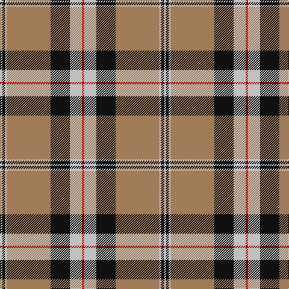

**Bands:** [RWKRWKW](/stripes/rwkrwkw/) · **Stripes:** [R LB K O LB K LB](/stripes/stripes7/) R LB K O LB K LB

This was sourced from register-of-tartans.  It is a [7 band tartan](/bands/bands7/).

Original link https://www.tartanregister.gov.uk/tartanDetails.aspx?ref=2937

## Attestations

This cloth appears in 2 source records; the oldest owns this page.

- 01/01/1985 — Merrick, Camel (register-of-tartans, [record](https://www.tartanregister.gov.uk/tartanDetails.aspx?ref=2937))
- 1985 — Merrick, Camel (Fashion) (tartans-authority, [record](http://www.tartansauthority.com/tartan-ferret/display/1688/))

## Register references

External register numbers recorded for this tartan.

- Scottish Register of Tartans: [2937](https://www.tartanregister.gov.uk/tartanDetails.aspx?ref=2937)
- Scottish Tartans Authority (ITI): 1688
- Scottish Tartans World Register: 1688

## Thread count
N/4 K4 N4 LT72 K32 N20 R/4

## Palette
Each colour and its ΔE from the base-6 reference it is a variant of.

| Colour | Shade | Base | ΔE (OKLab) |
|---|---|---|---|
| K | <code style="background-color:#101010;">#101010</code> `#101010` | K <code style="background-color:#000000;">#000000</code> | 0.17 |
| LT | <code style="background-color:#A07C58;">#A07C58</code> `#A07C58` | R <code style="background-color:#CC0000;">#CC0000</code> | 0.19 |
| N | <code style="background-color:#C0C0C0;">#C0C0C0</code> `#C0C0C0` | W <code style="background-color:#F7F7F7;">#F7F7F7</code> | 0.17 |
| R | <code style="background-color:#C80000;">#C80000</code> `#C80000` | R <code style="background-color:#CC0000;">#CC0000</code> | 0.01 |

# Sample pattern

## Nearest tartans

The nearest existing variants by ΔTartan distance.

1. [Unidentified (ex Tony Murray)](/setts/s7/lb2k2lb2lo36k15lb10r2~x2/) — ΔT 0.43
1. [Braemar or Blair Atholl](/setts/s8/do2w2k6do3k2o14k1o1~x4/) — ΔT 0.96
1. [Thomson Camel (Jedburgh Mill)](/setts/s6/r4k2lb10k10y28k3~x2/) — ΔT 0.97
1. [Tiree Grey](/setts/s6/lb3k3lb3k3o15r1~x4/) — ΔT 1.00
1. [Blair Atholl (Fashion)](/setts/s8/do2lr2k6do3k2o14k1o1~x4/) — ΔT 1.05
1. [Hannay Dress (Dance)](/setts/s10/k9lr4k2lr4k2lr29k9lr4lg14ly2~x2/) — ΔT 1.09
1. [Fort William (Fashion)](/setts/s11/o10lb2lg3lb2do24lb4do4o34do2lb3do2~x2/) — ΔT 1.15
1. [Pittsburgh St Andrew's Society](/setts/s8/lo1t1r1lo15k15lo1r1t1~x4/) — ΔT 1.19
1. [Merric Dark Camel.. Trade Tartan Tartan Number: 1688. Earliest known date: 1985 School colours. See products available Copyright © Blair Urquhart, Comrie, 2015](/setts/s7/r2w8k14dy25w2k2w2~x2/) — ΔT 1.21
1. [Virginia Commonwealth University](/setts/s7/k30w2lr4lo10w9k3lr5~x2/) — ΔT 1.22

## Neighbour map

Every grey dot is one of 14313 variants placed by the first two principal components of the ΔTartan feature space (44% of its variance). Red is this tartan; blue dots are its nearest — click one to open its page.

<svg viewBox="0 0 640 380" role="img" style="max-width:100%;height:auto;border:1px solid #e0e0e0;border-radius:4px;display:block" xmlns="http://www.w3.org/2000/svg"><image href="/nn/cloud.v1.png" width="640" height="380"/><a href="/setts/s7/lb2k2lb2lo36k15lb10r2~x2/"><circle cx="292.6" cy="137.9" r="4" fill="#3465a4"><title>Unidentified (ex Tony Murray)</title></circle></a><a href="/setts/s8/do2w2k6do3k2o14k1o1~x4/"><circle cx="256.7" cy="154.7" r="4" fill="#3465a4"><title>Braemar or Blair Atholl</title></circle></a><a href="/setts/s6/r4k2lb10k10y28k3~x2/"><circle cx="261.4" cy="177.0" r="4" fill="#3465a4"><title>Thomson Camel (Jedburgh Mill)</title></circle></a><a href="/setts/s6/lb3k3lb3k3o15r1~x4/"><circle cx="291.7" cy="171.0" r="4" fill="#3465a4"><title>Tiree Grey</title></circle></a><a href="/setts/s8/do2lr2k6do3k2o14k1o1~x4/"><circle cx="268.2" cy="161.2" r="4" fill="#3465a4"><title>Blair Atholl (Fashion)</title></circle></a><a href="/setts/s10/k9lr4k2lr4k2lr29k9lr4lg14ly2~x2/"><circle cx="268.3" cy="139.2" r="4" fill="#3465a4"><title>Hannay Dress (Dance)</title></circle></a><a href="/setts/s11/o10lb2lg3lb2do24lb4do4o34do2lb3do2~x2/"><circle cx="298.8" cy="127.2" r="4" fill="#3465a4"><title>Fort William (Fashion)</title></circle></a><a href="/setts/s8/lo1t1r1lo15k15lo1r1t1~x4/"><circle cx="284.3" cy="129.2" r="4" fill="#3465a4"><title>Pittsburgh St Andrew's Society</title></circle></a><a href="/setts/s7/r2w8k14dy25w2k2w2~x2/"><circle cx="234.3" cy="163.0" r="4" fill="#3465a4"><title>Merric Dark Camel.. Trade Tartan Tartan Number: 1688. Earliest known date: 1985 School colours. See products available Copyright © Blair Urquhart, Comrie, 2015</title></circle></a><a href="/setts/s7/k30w2lr4lo10w9k3lr5~x2/"><circle cx="248.3" cy="152.6" r="4" fill="#3465a4"><title>Virginia Commonwealth University</title></circle></a><circle cx="295.7" cy="142.9" r="5" fill="#c00000"/></svg>

ID: /setts/s7/lb1k1lb1o18k8lb5r1~x4/
