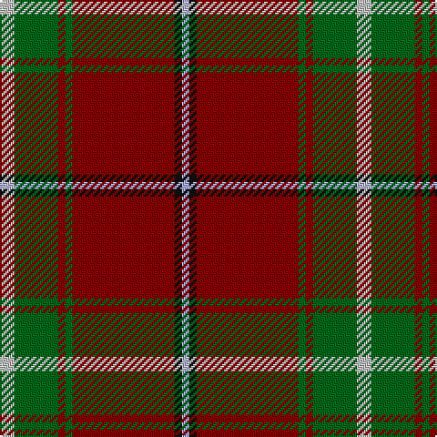

This page is one **sett** — a single exact thread-count. It belongs to the [tartan](/tartans/lb2g6r1g1r14k1lbi1/)
(the same proportion at any scale), whose colour order is pattern [WGRGRKW](/stripes/wgrgrkw/).

Sourced from register-of-tartans.  It is a [7 stripe tartan](/stripes/stripes7/).

Original link https://www.tartanregister.gov.uk/tartanDetails.aspx?ref=5185

## Register references

External register numbers recorded for this tartan.

- Scottish Register of Tartans: [5185](https://www.tartanregister.gov.uk/tartanDetails.aspx?ref=5185)
- Scottish Tartans Authority (ITI): 3493

## Thread count
N/8 G24 DR4 G4 DR56 K4 LP/4

## Palette

Palette: <strong>Tartan Register</strong>
<table><thead><tr><th>Colour</th><th>Threads</th><th>Shade</th><th>Base</th><th>OKLCh</th></tr></thead><tbody><tr><td>N/</td><td style="text-align:right;font-variant-numeric:tabular-nums">8</td><td><code style="background-color:#C0C0C0;">#C0C0C0</code> <small style="color:#888">#C0C0C0</small></td><td>W <code style="background-color:#F7F7F7;">#F7F7F7</code></td><td><small style="color:#888">oklch(80.8% 0.000 89.9)</small></td></tr><tr><td>G</td><td style="text-align:right;font-variant-numeric:tabular-nums">24</td><td><code style="background-color:#006818;">#006818</code> <small style="color:#888">#006818</small></td><td>G <code style="background-color:#006100;">#006100</code></td><td><small style="color:#888">oklch(45.0% 0.142 145.0)</small></td></tr><tr><td>DR</td><td style="text-align:right;font-variant-numeric:tabular-nums">4</td><td><code style="background-color:#880000;">#880000</code> <small style="color:#888">#880000</small></td><td>R <code style="background-color:#CC0000;">#CC0000</code></td><td><small style="color:#888">oklch(39.4% 0.162 29.2)</small></td></tr><tr><td>G</td><td style="text-align:right;font-variant-numeric:tabular-nums">4</td><td><code style="background-color:#006818;">#006818</code> <small style="color:#888">#006818</small></td><td>G <code style="background-color:#006100;">#006100</code></td><td><small style="color:#888">oklch(45.0% 0.142 145.0)</small></td></tr><tr><td>DR</td><td style="text-align:right;font-variant-numeric:tabular-nums">56</td><td><code style="background-color:#880000;">#880000</code> <small style="color:#888">#880000</small></td><td>R <code style="background-color:#CC0000;">#CC0000</code></td><td><small style="color:#888">oklch(39.4% 0.162 29.2)</small></td></tr><tr><td>K</td><td style="text-align:right;font-variant-numeric:tabular-nums">4</td><td><code style="background-color:#101010;">#101010</code> <small style="color:#888">#101010</small></td><td>K <code style="background-color:#000000;">#000000</code></td><td><small style="color:#888">oklch(17.3% 0.000 89.9)</small></td></tr><tr><td>LP/</td><td style="text-align:right;font-variant-numeric:tabular-nums">4</td><td><code style="background-color:#A8ACE8;">#A8ACE8</code> <small style="color:#888">#A8ACE8</small></td><td>W <code style="background-color:#F7F7F7;">#F7F7F7</code></td><td><small style="color:#888">oklch(76.3% 0.086 281.2)</small></td></tr></tbody></table>

# Sample pattern

## Nearest tartans

The nearest existing variants by ΔTartan distance, with this tartan at the top so the swatches line up against it.

ΔTartan

Tartan

Sett

—

<a href="/ttd/edit/#slug=lb2g6r1g1r14k1lbi1~x4">MacMaster (USA) #1</a> <a class="nn-out" href="/setts/s7/lb2g6r1g1r14k1lbi1~x4/" title="open its dictionary page">↗</a>

0.96

<a href="/ttd/edit/#slug=db4dr2db2w2dr9o27r4~x3">Unidentified 35</a> <a class="nn-out" href="/setts/s7/db4dr2db2w2dr9o27r4~x3/" title="open its dictionary page">↗</a>

1.07

<a href="/ttd/edit/#slug=lo3y40db12lo3k2lb4k2lo3~x2">Tunes of Glory (Film)</a> <a class="nn-out" href="/setts/s8/lo3y40db12lo3k2lb4k2lo3~x2/" title="open its dictionary page">↗</a>

1.10

<a href="/ttd/edit/#slug=r96db16dg34g48r18k6r9">MacDuff</a> <a class="nn-out" href="/setts/s7/r96db16dg34g48r18k6r9/" title="open its dictionary page">↗</a>

1.15

<a href="/ttd/edit/#slug=k2r1g8r3g3r14ly1r1w2~x2">Melieres, Michel (Personal)</a> <a class="nn-out" href="/setts/s9/k2r1g8r3g3r14ly1r1w2~x2/" title="open its dictionary page">↗</a>

1.19

<a href="/ttd/edit/#slug=r24lb1k3lb1g14r8k3dp3lb2~x4">Leach (1995)</a> <a class="nn-out" href="/setts/s9/r24lb1k3lb1g14r8k3dp3lb2~x4/" title="open its dictionary page">↗</a>

1.23

<a href="/ttd/edit/#slug=r4g15db8g4r48g4db8g4ly3~x2">Cruikshank (Name)</a> <a class="nn-out" href="/setts/s9/r4g15db8g4r48g4db8g4ly3~x2/" title="open its dictionary page">↗</a>

1.23

<a href="/ttd/edit/#slug=r25db7r3g13t1k2~x4">MacPhail</a> <a class="nn-out" href="/setts/s6/r25db7r3g13t1k2~x4/" title="open its dictionary page">↗</a>

1.24

<a href="/ttd/edit/#slug=r1o1dg6o15dy2o1dy6w1~x4">Connacht #2</a> <a class="nn-out" href="/setts/s8/r1o1dg6o15dy2o1dy6w1~x4/" title="open its dictionary page">↗</a>

1.25

<a href="/ttd/edit/#slug=r6w1r24db6g2k1g2k1g12r1~x2">Chisholm</a> <a class="nn-out" href="/setts/s10/r6w1r24db6g2k1g2k1g12r1~x2/" title="open its dictionary page">↗</a>

1.26

<a href="/ttd/edit/#slug=r3g16r4k6r28g2lo3~x2">McInally (Name)</a> <a class="nn-out" href="/setts/s7/r3g16r4k6r28g2lo3~x2/" title="open its dictionary page">↗</a>

## Neighbour map

Every grey dot is one of 14359 variants placed by the first two principal components of the ΔTartan feature space (44% of its variance). Red is this tartan; blue dots are its nearest — click one to open its page.

<svg viewBox="0 0 640 380" role="img" style="max-width:100%;height:auto;border:1px solid #e0e0e0;border-radius:4px;display:block" xmlns="http://www.w3.org/2000/svg"><image href="/nn/cloud.v1.png" width="640" height="380"/><a href="/setts/s7/db4dr2db2w2dr9o27r4~x3/"><circle cx="323.9" cy="161.1" r="4" fill="#3465a4"><title>Unidentified 35</title></circle></a><a href="/setts/s8/lo3y40db12lo3k2lb4k2lo3~x2/"><circle cx="356.0" cy="126.3" r="4" fill="#3465a4"><title>Tunes of Glory (Film)</title></circle></a><a href="/setts/s7/r96db16dg34g48r18k6r9/"><circle cx="292.7" cy="160.0" r="4" fill="#3465a4"><title>MacDuff</title></circle></a><a href="/setts/s9/k2r1g8r3g3r14ly1r1w2~x2/"><circle cx="298.9" cy="135.7" r="4" fill="#3465a4"><title>Melieres, Michel (Personal)</title></circle></a><a href="/setts/s9/r24lb1k3lb1g14r8k3dp3lb2~x4/"><circle cx="329.8" cy="129.9" r="4" fill="#3465a4"><title>Leach (1995)</title></circle></a><a href="/setts/s9/r4g15db8g4r48g4db8g4ly3~x2/"><circle cx="333.2" cy="141.3" r="4" fill="#3465a4"><title>Cruikshank (Name)</title></circle></a><a href="/setts/s6/r25db7r3g13t1k2~x4/"><circle cx="327.3" cy="143.1" r="4" fill="#3465a4"><title>MacPhail</title></circle></a><a href="/setts/s8/r1o1dg6o15dy2o1dy6w1~x4/"><circle cx="283.6" cy="143.8" r="4" fill="#3465a4"><title>Connacht #2</title></circle></a><a href="/setts/s10/r6w1r24db6g2k1g2k1g12r1~x2/"><circle cx="334.4" cy="104.7" r="4" fill="#3465a4"><title>Chisholm</title></circle></a><a href="/setts/s7/r3g16r4k6r28g2lo3~x2/"><circle cx="344.4" cy="171.9" r="4" fill="#3465a4"><title>McInally (Name)</title></circle></a><circle cx="342.7" cy="150.2" r="5" fill="#c00000"/></svg>

ID: /setts/s7/lb2g6r1g1r14k1lbi1~x4/
