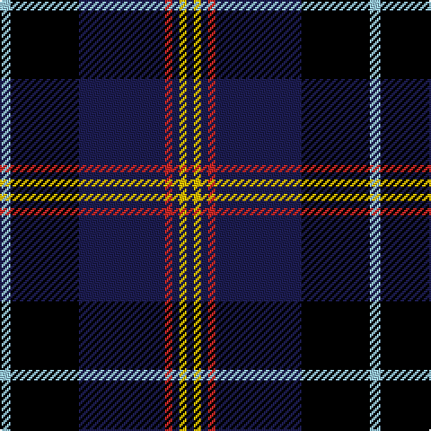

In pattern [BYBRBKW](/stripes/bybrbkw/).

This was sourced from register-of-tartans.  It is a [7 stripe tartan](/stripes/stripes7/).

Original link https://www.tartanregister.gov.uk/tartanDetails.aspx?ref=11316

## Register references

External register numbers recorded for this tartan.

- Scottish Register of Tartans: [11316](https://www.tartanregister.gov.uk/tartanDetails.aspx?ref=11316)

## Thread count
LB/6 K38 DB48 R4 DB4 Y4 DB/4

## Palette
Each colour and the base-6 reference it is a variant of.

| Colour | Shade | Base |
|---|---|---|
| DB | <code style="background-color:#1C1C50;">#1C1C50</code> `oklch(26.2% 0.093 277.9)` <small>#1C1C50</small> | B <code style="background-color:#2A418A;">#2A418A</code> |
| K | <code style="background-color:#000000;">#000000</code> `oklch(0.0% 0.000 0.0)` <small>#000000</small> | K <code style="background-color:#000000;">#000000</code> |
| LB | <code style="background-color:#98C8E8;">#98C8E8</code> `oklch(81.0% 0.068 237.9)` <small>#98C8E8</small> | W <code style="background-color:#F7F7F7;">#F7F7F7</code> |
| R | <code style="background-color:#C82828;">#C82828</code> `oklch(54.2% 0.196 26.8)` <small>#C82828</small> | R <code style="background-color:#CC0000;">#CC0000</code> |
| Y | <code style="background-color:#FCC000;">#FCC000</code> `oklch(83.9% 0.172 85.7)` <small>#FCC000</small> | Y <code style="background-color:#F2BF00;">#F2BF00</code> |

# Sample pattern

## Nearest tartans

The nearest existing variants by ΔTartan distance, with this tartan at the top so the swatches line up against it.

ΔTartan

Tartan

Sett

—

<a href="/ttd/edit/#slug=lb3k19db24r2db2ly2db2~x2">Mensa</a> <a class="nn-out" href="/setts/s7/lb3k19db24r2db2ly2db2~x2/" title="open its dictionary page">↗</a>

1.15

<a href="/ttd/edit/#slug=k2db22g4k7y2k2w2db2~x2">Glasgow, University of</a> <a class="nn-out" href="/setts/s8/k2db22g4k7y2k2w2db2~x2/" title="open its dictionary page">↗</a>

1.29

<a href="/ttd/edit/#slug=lo2w1db6w1ly2k17ly1~x2">East Tennessee State University</a> <a class="nn-out" href="/setts/s7/lo2w1db6w1ly2k17ly1~x2/" title="open its dictionary page">↗</a>

1.29

<a href="/ttd/edit/#slug=r4k9dg9k40r2k2w2~x2">Genet, Edmond Charles 'Citizen' (Personal)</a> <a class="nn-out" href="/setts/s7/r4k9dg9k40r2k2w2~x2/" title="open its dictionary page">↗</a>

1.31

<a href="/ttd/edit/#slug=k5r3k27k37r5g2ly2~x2">Royal Marines Condor</a> <a class="nn-out" href="/setts/s7/k5r3k27k37r5g2ly2~x2/" title="open its dictionary page">↗</a>

1.35

<a href="/ttd/edit/#slug=r12lo6k88db45k6db6ly6">City of Rome Pipe Band (Corporate)</a> <a class="nn-out" href="/setts/s7/r12lo6k88db45k6db6ly6/" title="open its dictionary page">↗</a>

1.36

<a href="/ttd/edit/#slug=k4r5k4db28k4g5k4~x2">Montgomerie of Eglinton</a> <a class="nn-out" href="/setts/s7/k4r5k4db28k4g5k4~x2/" title="open its dictionary page">↗</a>

1.36

<a href="/ttd/edit/#slug=k3g3k20r2k2r2db20g3db3~x2">Hume, or Home</a> <a class="nn-out" href="/setts/s9/k3g3k20r2k2r2db20g3db3~x2/" title="open its dictionary page">↗</a>

1.39

<a href="/ttd/edit/#slug=k62db15dp15o20ly5db5k15~x2">Black Raven</a> <a class="nn-out" href="/setts/s7/k62db15dp15o20ly5db5k15~x2/" title="open its dictionary page">↗</a>

1.44

<a href="/ttd/edit/#slug=k8r3b4g4b48k48g4k4ly3b8">Kingsbarns Golf Links</a> <a class="nn-out" href="/setts/s10/k8r3b4g4b48k48g4k4ly3b8/" title="open its dictionary page">↗</a>

1.45

<a href="/ttd/edit/#slug=k33ly4w3db33r2dg2~x2">Atlantic Police Academy</a> <a class="nn-out" href="/setts/s6/k33ly4w3db33r2dg2~x2/" title="open its dictionary page">↗</a>

## Neighbour map

Every grey dot is one of 14299 variants placed by the first two principal components of the ΔTartan feature space (44% of its variance). Red is this tartan; blue dots are its nearest — click one to open its page.

<svg viewBox="0 0 640 380" role="img" style="max-width:100%;height:auto;border:1px solid #e0e0e0;border-radius:4px;display:block" xmlns="http://www.w3.org/2000/svg"><image href="/nn/cloud.v1.png" width="640" height="380"/><a href="/setts/s8/k2db22g4k7y2k2w2db2~x2/"><circle cx="276.3" cy="154.5" r="4" fill="#3465a4"><title>Glasgow, University of</title></circle></a><a href="/setts/s7/lo2w1db6w1ly2k17ly1~x2/"><circle cx="283.2" cy="132.5" r="4" fill="#3465a4"><title>East Tennessee State University</title></circle></a><a href="/setts/s7/r4k9dg9k40r2k2w2~x2/"><circle cx="358.5" cy="146.8" r="4" fill="#3465a4"><title>Genet, Edmond Charles 'Citizen' (Personal)</title></circle></a><a href="/setts/s7/k5r3k27k37r5g2ly2~x2/"><circle cx="286.5" cy="164.1" r="4" fill="#3465a4"><title>Royal Marines Condor</title></circle></a><a href="/setts/s7/r12lo6k88db45k6db6ly6/"><circle cx="336.7" cy="167.2" r="4" fill="#3465a4"><title>City of Rome Pipe Band (Corporate)</title></circle></a><a href="/setts/s7/k4r5k4db28k4g5k4~x2/"><circle cx="263.8" cy="202.0" r="4" fill="#3465a4"><title>Montgomerie of Eglinton</title></circle></a><a href="/setts/s9/k3g3k20r2k2r2db20g3db3~x2/"><circle cx="238.4" cy="176.7" r="4" fill="#3465a4"><title>Hume, or Home</title></circle></a><a href="/setts/s7/k62db15dp15o20ly5db5k15~x2/"><circle cx="290.0" cy="185.8" r="4" fill="#3465a4"><title>Black Raven</title></circle></a><a href="/setts/s10/k8r3b4g4b48k48g4k4ly3b8/"><circle cx="253.9" cy="129.4" r="4" fill="#3465a4"><title>Kingsbarns Golf Links</title></circle></a><a href="/setts/s6/k33ly4w3db33r2dg2~x2/"><circle cx="239.9" cy="151.6" r="4" fill="#3465a4"><title>Atlantic Police Academy</title></circle></a><circle cx="278.0" cy="165.4" r="5" fill="#c00000"/></svg>

ID: /setts/s7/lb3k19db24r2db2ly2db2~x2/
