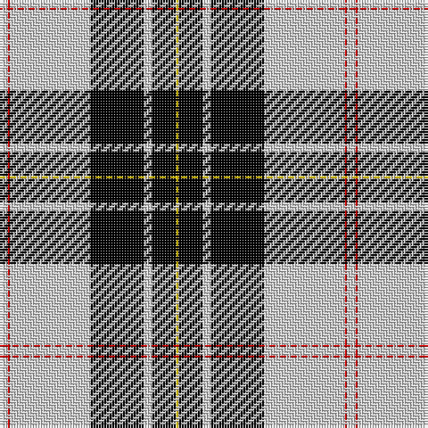

This page is one **sett** — a single exact thread-count. It belongs to the [tartan](/tartans/lb3r1lb30k20lb3k9ly1/)
(the same proportion at any scale), whose colour order is pattern [WRWKWKY](/stripes/wrwkwky/).

Sourced from weddslist.  It is a [7 stripe tartan](/stripes/stripes7/).

Original link http://www.weddslist.com/cgi-bin/tartans/pg.pl?source=rb

## Thread count
N/3 R1 N30 K20 N3 K9 Y/1

## Palette

Palette: <strong>Tartan Register</strong> <small style="color:#888">(2 of 4 colours)</small>
<table><thead><tr><th>Colour</th><th>Threads</th><th>Shade</th><th>Base</th><th>OKLCh</th></tr></thead><tbody><tr><td>N/</td><td style="text-align:right;font-variant-numeric:tabular-nums">3</td><td><code style="background-color:#D0D0D0;">#D0D0D0</code> <small style="color:#888">#D0D0D0</small></td><td>W <code style="background-color:#F7F7F7;">#F7F7F7</code></td><td><small style="color:#888">oklch(85.8% 0.000 89.9)</small></td></tr><tr><td>R</td><td style="text-align:right;font-variant-numeric:tabular-nums">1</td><td><code style="background-color:#C80000;">#C80000</code> <small style="color:#888">#C80000</small></td><td>R <code style="background-color:#CC0000;">#CC0000</code></td><td><small style="color:#888">oklch(52.3% 0.215 29.2)</small></td></tr><tr><td>N</td><td style="text-align:right;font-variant-numeric:tabular-nums">30</td><td><code style="background-color:#D0D0D0;">#D0D0D0</code> <small style="color:#888">#D0D0D0</small></td><td>W <code style="background-color:#F7F7F7;">#F7F7F7</code></td><td><small style="color:#888">oklch(85.8% 0.000 89.9)</small></td></tr><tr><td>K</td><td style="text-align:right;font-variant-numeric:tabular-nums">20</td><td><code style="background-color:#000000;">#000000</code> <small style="color:#888">#000000</small></td><td>K <code style="background-color:#000000;">#000000</code></td><td><small style="color:#888">oklch(0.0% 0.000 0.0)</small></td></tr><tr><td>N</td><td style="text-align:right;font-variant-numeric:tabular-nums">3</td><td><code style="background-color:#D0D0D0;">#D0D0D0</code> <small style="color:#888">#D0D0D0</small></td><td>W <code style="background-color:#F7F7F7;">#F7F7F7</code></td><td><small style="color:#888">oklch(85.8% 0.000 89.9)</small></td></tr><tr><td>K</td><td style="text-align:right;font-variant-numeric:tabular-nums">9</td><td><code style="background-color:#000000;">#000000</code> <small style="color:#888">#000000</small></td><td>K <code style="background-color:#000000;">#000000</code></td><td><small style="color:#888">oklch(0.0% 0.000 0.0)</small></td></tr><tr><td>Y/</td><td style="text-align:right;font-variant-numeric:tabular-nums">1</td><td><code style="background-color:#FFC800;">#FFC800</code> <small style="color:#888">#FFC800</small></td><td>Y <code style="background-color:#F2BF00;">#F2BF00</code></td><td><small style="color:#888">oklch(85.7% 0.175 88.5)</small></td></tr></tbody></table>

# Sample pattern

## Nearest tartans

The nearest existing variants by ΔTartan distance, with this tartan at the top so the swatches line up against it.

ΔTartan

Tartan

Sett

—

<a href="/ttd/edit/#slug=lb3r1lb30k20lb3k9ly1">MacPherson Dress</a> <a class="nn-out" href="/setts/s7/lb3r1lb30k20lb3k9ly1/" title="open its dictionary page">↗</a>

0.59

<a href="/ttd/edit/#slug=lr3r1lr30k20lr3k9ly1~x2">MacPherson Dress</a> <a class="nn-out" href="/setts/s7/lr3r1lr30k20lr3k9ly1~x2/" title="open its dictionary page">↗</a>

0.59

<a href="/ttd/edit/#slug=lr3r1lr30k20lr3k9ly1">MacPherson Dress</a> <a class="nn-out" href="/setts/s7/lr3r1lr30k20lr3k9ly1/" title="open its dictionary page">↗</a>

0.78

<a href="/ttd/edit/#slug=w4k30r1k1r3w12ly3~x2">Richecourt, Baron of (Personal)</a> <a class="nn-out" href="/setts/s7/w4k30r1k1r3w12ly3~x2/" title="open its dictionary page">↗</a>

0.86

<a href="/ttd/edit/#slug=w3r1w30k20w3k9ly1~x2">MacPherson Dress (1842)</a> <a class="nn-out" href="/setts/s7/w3r1w30k20w3k9ly1~x2/" title="open its dictionary page">↗</a>

1.03

<a href="/ttd/edit/#slug=w36k8w36k95w4k4r6">Gretna Football Club (Corporate)</a> <a class="nn-out" href="/setts/s7/w36k8w36k95w4k4r6/" title="open its dictionary page">↗</a>

1.09

<a href="/ttd/edit/#slug=w8k1db2k4ly2k2ly2k24w8k2~x2">Newcastle</a> <a class="nn-out" href="/setts/s10/w8k1db2k4ly2k2ly2k24w8k2~x2/" title="open its dictionary page">↗</a>

1.13

<a href="/ttd/edit/#slug=k62w10ly10k4w18k4lo3w4">Colbert Check (Fashion)</a> <a class="nn-out" href="/setts/s8/k62w10ly10k4w18k4lo3w4/" title="open its dictionary page">↗</a>

1.16

<a href="/ttd/edit/#slug=k4o4w35o1k36o4k2~x2">Gleneagles</a> <a class="nn-out" href="/setts/s7/k4o4w35o1k36o4k2~x2/" title="open its dictionary page">↗</a>

1.21

<a href="/ttd/edit/#slug=r4w19dg2w8dg2w8k38w4~x2">St. Piran Dress</a> <a class="nn-out" href="/setts/s8/r4w19dg2w8dg2w8k38w4~x2/" title="open its dictionary page">↗</a>

1.25

<a href="/ttd/edit/#slug=k4y4w35y1k36y4k2~x2">Gleneagles, Hotel</a> <a class="nn-out" href="/setts/s7/k4y4w35y1k36y4k2~x2/" title="open its dictionary page">↗</a>

## Neighbour map

Every grey dot is one of 14299 variants placed by the first two principal components of the ΔTartan feature space (44% of its variance). Red is this tartan; blue dots are its nearest — click one to open its page.

<svg viewBox="0 0 640 380" role="img" style="max-width:100%;height:auto;border:1px solid #e0e0e0;border-radius:4px;display:block" xmlns="http://www.w3.org/2000/svg"><image href="/nn/cloud.v1.png" width="640" height="380"/><a href="/setts/s7/lr3r1lr30k20lr3k9ly1~x2/"><circle cx="329.3" cy="131.5" r="4" fill="#3465a4"><title>MacPherson Dress</title></circle></a><a href="/setts/s7/lr3r1lr30k20lr3k9ly1/"><circle cx="329.3" cy="131.5" r="4" fill="#3465a4"><title>MacPherson Dress</title></circle></a><a href="/setts/s7/w4k30r1k1r3w12ly3~x2/"><circle cx="329.8" cy="112.6" r="4" fill="#3465a4"><title>Richecourt, Baron of (Personal)</title></circle></a><a href="/setts/s7/w3r1w30k20w3k9ly1~x2/"><circle cx="322.5" cy="120.7" r="4" fill="#3465a4"><title>MacPherson Dress (1842)</title></circle></a><a href="/setts/s7/w36k8w36k95w4k4r6/"><circle cx="346.4" cy="144.0" r="4" fill="#3465a4"><title>Gretna Football Club (Corporate)</title></circle></a><a href="/setts/s10/w8k1db2k4ly2k2ly2k24w8k2~x2/"><circle cx="331.6" cy="115.5" r="4" fill="#3465a4"><title>Newcastle</title></circle></a><a href="/setts/s8/k62w10ly10k4w18k4lo3w4/"><circle cx="339.6" cy="123.5" r="4" fill="#3465a4"><title>Colbert Check (Fashion)</title></circle></a><a href="/setts/s7/k4o4w35o1k36o4k2~x2/"><circle cx="312.7" cy="124.9" r="4" fill="#3465a4"><title>Gleneagles</title></circle></a><a href="/setts/s8/r4w19dg2w8dg2w8k38w4~x2/"><circle cx="257.8" cy="131.7" r="4" fill="#3465a4"><title>St. Piran Dress</title></circle></a><a href="/setts/s7/k4y4w35y1k36y4k2~x2/"><circle cx="315.1" cy="128.3" r="4" fill="#3465a4"><title>Gleneagles, Hotel</title></circle></a><circle cx="322.7" cy="125.3" r="5" fill="#c00000"/></svg>

ID: /setts/s7/lb3r1lb30k20lb3k9ly1/
