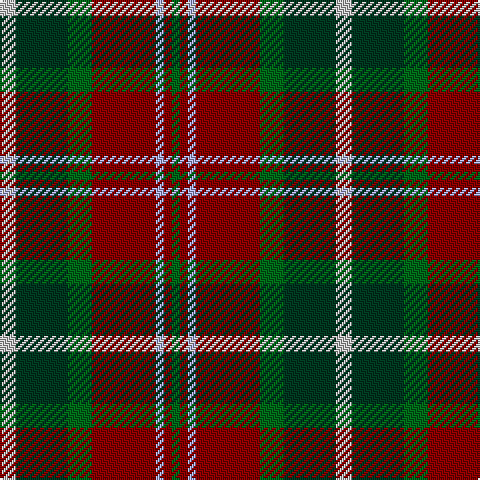

In pattern [GRWRGGW](/stripes/grwrggw/).

This was sourced from tartans-authority.  It is a [7 stripe tartan](/stripes/stripes7/).

Original link http://www.tartansauthority.com/tartan-ferret/display/2315/

## Thread count
N/8 DG26 G12 DR32 LP4 DR4 G/4

## Palette
Each colour and the base-6 reference it is a variant of.

| Colour | Shade | Base |
|---|---|---|
| DG | <code style="background-color:#003820;">#003820</code> `oklch(30.0% 0.070 158.3)` <small>#003820</small> | G <code style="background-color:#006100;">#006100</code> |
| DR | <code style="background-color:#880000;">#880000</code> `oklch(39.4% 0.162 29.2)` <small>#880000</small> | R <code style="background-color:#CC0000;">#CC0000</code> |
| G | <code style="background-color:#006818;">#006818</code> `oklch(45.0% 0.142 145.0)` <small>#006818</small> | G <code style="background-color:#006100;">#006100</code> |
| LP | <code style="background-color:#A8ACE8;">#A8ACE8</code> `oklch(76.3% 0.086 281.2)` <small>#A8ACE8</small> | W <code style="background-color:#F7F7F7;">#F7F7F7</code> |
| N | <code style="background-color:#C0C0C0;">#C0C0C0</code> `oklch(80.8% 0.000 89.9)` <small>#C0C0C0</small> | W <code style="background-color:#F7F7F7;">#F7F7F7</code> |

# Sample pattern

## Nearest tartans

The nearest existing variants by ΔTartan distance.

1. [Sikh (Corporate)](/setts/s8/o30k4o3k4o3g20dt20ly4~x2/) — ΔT 0.59
1. [Craik of Assington (Personal)](/setts/s8/db4r11db1g8r2g4k1lo2~x4/) — ΔT 0.70
1. [Sikh](/setts/s8/o56k12o7k12o7g50db50ly10/) — ΔT 0.76
1. [Caledonian Brewery Corporate Tartan Tartan Number: 2315. Earliest known date: pre 1997 Designed by Kinloch Anderson Ltd to commemorate the opening of the new Caledonian Brewery Malting Building. See products available Copyright © Blair Urquhart, Comrie, 2015](/setts/s7/lb4k13g6r16lb2r2g2~x2/) — ΔT 0.82
1. [Graham of Montrose Red](/setts/s9/lb1k1r10g10k5lb5r10k1lb1~x4/) — ΔT 1.04
1. [Sawyer](/setts/s8/r2lb1r8k4db1g10lr1g2~x4/) — ΔT 1.07
1. [Eyre (Personal)](/setts/s6/r3db12r4g18r6k2~x2/) — ΔT 1.08
1. [Craik, of Assington](/setts/s8/db4r11db1g8r2g4k1ly2~x4/) — ΔT 1.10
1. [Barbour Corporate Tartan Tartan Number: 2489. Earliest known date: 1998 For the linings of Barbour's famous wax jackets. Tartan designed by Kinloch Anderson of Edinburgh. See products available Copyright © Blair Urquhart, Comrie, 2015](/setts/s7/y4ly2y21do11w2k20r3~x2/) — ΔT 1.11
1. [Thompson's Fancy Personal Tartan Tartan Number: 286. Earliest known date: pre 2003 Designed for his own use. See products available Copyright © Blair Urquhart, Comrie, 2015](/setts/s6/r2dy8db2t4k4t1~x6/) — ΔT 1.12

## Neighbour map

Every grey dot is one of 14299 variants placed by the first two principal components of the ΔTartan feature space (44% of its variance). Red is this tartan; blue dots are its nearest — click one to open its page.

<svg viewBox="0 0 640 380" role="img" style="max-width:100%;height:auto;border:1px solid #e0e0e0;border-radius:4px;display:block" xmlns="http://www.w3.org/2000/svg"><image href="/nn/cloud.v1.png" width="640" height="380"/><a href="/setts/s8/o30k4o3k4o3g20dt20ly4~x2/"><circle cx="195.5" cy="175.2" r="4" fill="#3465a4"><title>Sikh (Corporate)</title></circle></a><a href="/setts/s8/db4r11db1g8r2g4k1lo2~x4/"><circle cx="209.3" cy="186.8" r="4" fill="#3465a4"><title>Craik of Assington (Personal)</title></circle></a><a href="/setts/s8/o56k12o7k12o7g50db50ly10/"><circle cx="142.6" cy="188.6" r="4" fill="#3465a4"><title>Sikh</title></circle></a><a href="/setts/s7/lb4k13g6r16lb2r2g2~x2/"><circle cx="172.2" cy="188.2" r="4" fill="#3465a4"><title>Caledonian Brewery Corporate Tartan Tartan Number: 2315. Earliest known date: pre 1997 Designed by Kinloch Anderson Ltd to commemorate the opening of the new Caledonian Brewery Malting Building. See products available Copyright © Blair Urquhart, Comrie, 2015</title></circle></a><a href="/setts/s9/lb1k1r10g10k5lb5r10k1lb1~x4/"><circle cx="198.9" cy="172.2" r="4" fill="#3465a4"><title>Graham of Montrose Red</title></circle></a><a href="/setts/s8/r2lb1r8k4db1g10lr1g2~x4/"><circle cx="191.2" cy="163.0" r="4" fill="#3465a4"><title>Sawyer</title></circle></a><a href="/setts/s6/r3db12r4g18r6k2~x2/"><circle cx="215.7" cy="223.8" r="4" fill="#3465a4"><title>Eyre (Personal)</title></circle></a><a href="/setts/s8/db4r11db1g8r2g4k1ly2~x4/"><circle cx="188.5" cy="170.1" r="4" fill="#3465a4"><title>Craik, of Assington</title></circle></a><a href="/setts/s7/y4ly2y21do11w2k20r3~x2/"><circle cx="176.3" cy="168.6" r="4" fill="#3465a4"><title>Barbour Corporate Tartan Tartan Number: 2489. Earliest known date: 1998 For the linings of Barbour's famous wax jackets. Tartan designed by Kinloch Anderson of Edinburgh. See products available Copyright © Blair Urquhart, Comrie, 2015</title></circle></a><a href="/setts/s6/r2dy8db2t4k4t1~x6/"><circle cx="163.3" cy="225.3" r="4" fill="#3465a4"><title>Thompson's Fancy Personal Tartan Tartan Number: 286. Earliest known date: pre 2003 Designed for his own use. See products available Copyright © Blair Urquhart, Comrie, 2015</title></circle></a><circle cx="185.4" cy="197.1" r="5" fill="#c00000"/></svg>

ID: /setts/s7/lb4dg13g6r16lb2r2g2~x2/
