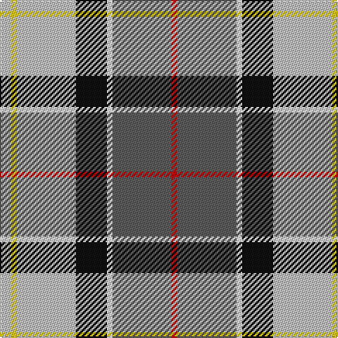

**Bands:** [RBWKWYW](/stripes/rbwkwyw/) · **Stripes:** [R N W K LB LY LB](/stripes/stripes7/) R N W K LB LY LB

This was sourced from tartans-authority.  It is a [7 band tartan](/bands/bands7/).

Original link http://www.tartansauthority.com/tartan-ferret/display/8734/

## Thread count
Na/8 Y4 Na42 K22 W4 N42 R/4

## Palette
Each colour and its ΔE from the base-6 reference it is a variant of.

| Colour | Shade | Base | ΔE (OKLab) |
|---|---|---|---|
| K | <code style="background-color:#101010;">#101010</code> `#101010` | K <code style="background-color:#000000;">#000000</code> | 0.17 |
| N | <code style="background-color:#5C5C5C;">#5C5C5C</code> `#5C5C5C` | B <code style="background-color:#2A418A;">#2A418A</code> | 0.15 |
| Na | <code style="background-color:#C0C0C0;">#C0C0C0</code> `#C0C0C0` | W <code style="background-color:#F7F7F7;">#F7F7F7</code> | 0.17 |
| R | <code style="background-color:#C80000;">#C80000</code> `#C80000` | R <code style="background-color:#CC0000;">#CC0000</code> | 0.01 |
| W | <code style="background-color:#FCFCFC;">#FCFCFC</code> `#FCFCFC` | W <code style="background-color:#F7F7F7;">#F7F7F7</code> | 0.01 |
| Y | <code style="background-color:#FCCC00;">#FCCC00</code> `#FCCC00` | Y <code style="background-color:#F2BF00;">#F2BF00</code> | 0.04 |

# Sample pattern

## Nearest tartans

The nearest existing variants by ΔTartan distance.

1. [Montessori School of Denver](/setts/s6/g25r9b3ly7w3dp11/) — ΔT 0.95
1. [Pengelly, The Cornish](/setts/s7/w5k26ly4lb24dp8k3r4~x2/) — ΔT 1.00
1. [Wallace Memorial Centenary](/setts/s7/lb2lg19k2dt15g2r20lg2~x2/) — ΔT 1.04
1. [Tombow 140th Anniversary, The](/setts/s7/g4ly7o9ly9db20w2db2~x2/) — ΔT 1.05
1. [MacLaren Dress](/setts/s8/db2w12k8g8r2g8k1lo2~x2/) — ΔT 1.09
1. [Traill (Personal)](/setts/s7/r16ly2dy7ly2t24k2g2~x2/) — ΔT 1.13
1. [Taylor Dress #2](/setts/s9/dg9k2r4dg14w3lp3w23dg5ly3~x2/) — ΔT 1.16
1. [Crofters (Personal)](/setts/s7/db20r2g9w6ly4k2g8~x2/) — ΔT 1.17
1. [Ball](/setts/s6/lo13b8r5k3w2g1~x4/) — ΔT 1.19
1. [Ohio](/setts/s9/db16w6r8db3ly1g1b3db1g9~x2/) — ΔT 1.19

## Neighbour map

Every grey dot is one of 14313 variants placed by the first two principal components of the ΔTartan feature space (44% of its variance). Red is this tartan; blue dots are its nearest — click one to open its page.

<svg viewBox="0 0 640 380" role="img" style="max-width:100%;height:auto;border:1px solid #e0e0e0;border-radius:4px;display:block" xmlns="http://www.w3.org/2000/svg"><image href="/nn/cloud.v1.png" width="640" height="380"/><a href="/setts/s6/g25r9b3ly7w3dp11/"><circle cx="127.1" cy="167.9" r="4" fill="#3465a4"><title>Montessori School of Denver</title></circle></a><a href="/setts/s7/w5k26ly4lb24dp8k3r4~x2/"><circle cx="118.7" cy="146.7" r="4" fill="#3465a4"><title>Pengelly, The Cornish</title></circle></a><a href="/setts/s7/lb2lg19k2dt15g2r20lg2~x2/"><circle cx="139.1" cy="152.6" r="4" fill="#3465a4"><title>Wallace Memorial Centenary</title></circle></a><a href="/setts/s7/g4ly7o9ly9db20w2db2~x2/"><circle cx="156.2" cy="170.7" r="4" fill="#3465a4"><title>Tombow 140th Anniversary, The</title></circle></a><a href="/setts/s8/db2w12k8g8r2g8k1lo2~x2/"><circle cx="98.1" cy="144.7" r="4" fill="#3465a4"><title>MacLaren Dress</title></circle></a><a href="/setts/s7/r16ly2dy7ly2t24k2g2~x2/"><circle cx="203.6" cy="141.2" r="4" fill="#3465a4"><title>Traill (Personal)</title></circle></a><a href="/setts/s9/dg9k2r4dg14w3lp3w23dg5ly3~x2/"><circle cx="159.6" cy="128.3" r="4" fill="#3465a4"><title>Taylor Dress #2</title></circle></a><a href="/setts/s7/db20r2g9w6ly4k2g8~x2/"><circle cx="130.6" cy="163.7" r="4" fill="#3465a4"><title>Crofters (Personal)</title></circle></a><a href="/setts/s6/lo13b8r5k3w2g1~x4/"><circle cx="151.2" cy="151.4" r="4" fill="#3465a4"><title>Ball</title></circle></a><a href="/setts/s9/db16w6r8db3ly1g1b3db1g9~x2/"><circle cx="164.8" cy="129.5" r="4" fill="#3465a4"><title>Ohio</title></circle></a><circle cx="148.9" cy="143.4" r="5" fill="#c00000"/></svg>

ID: /setts/s7/lb4ly2lb21k11w2n21r2~x2/
