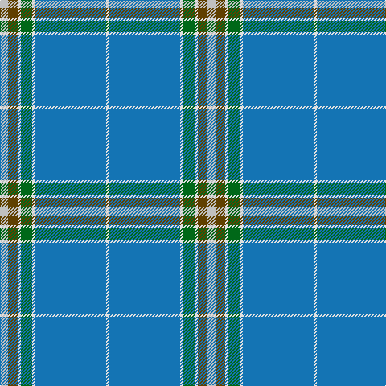

This page is one **sett** — a single exact thread-count. It belongs to the [tartan](/tartans/lb5dy6w2g7w2b44w2/)
(the same proportion at any scale), whose colour order is pattern [WBWGWGW](/stripes/wbwgwgw/).

Sourced from tartans-authority.  It is a [7 stripe tartan](/stripes/stripes7/).

Original link http://www.tartansauthority.com/tartan-ferret/display/10609/

## Register references

External register numbers recorded for this tartan.

- Scottish Register of Tartans: [10609](https://www.tartanregister.gov.uk/tartanDetails?ref=10609)
- Scottish Tartans Authority (ITI): 10609

## Thread count
N/10 T12 LN4 G14 LN4 B88 LN/4

## Palette

Palette: <strong>Tartan Register</strong>
<table><thead><tr><th>Colour</th><th>Threads</th><th>Shade</th><th>Base</th><th>OKLCh</th></tr></thead><tbody><tr><td>N/</td><td style="text-align:right;font-variant-numeric:tabular-nums">10</td><td><code style="background-color:#C0C0C0;">#C0C0C0</code> <small style="color:#888">#C0C0C0</small></td><td>W <code style="background-color:#F7F7F7;">#F7F7F7</code></td><td><small style="color:#888">oklch(80.8% 0.000 89.9)</small></td></tr><tr><td>T</td><td style="text-align:right;font-variant-numeric:tabular-nums">12</td><td><code style="background-color:#604000;">#604000</code> <small style="color:#888">#604000</small></td><td>G <code style="background-color:#006100;">#006100</code></td><td><small style="color:#888">oklch(39.8% 0.083 76.8)</small></td></tr><tr><td>LN</td><td style="text-align:right;font-variant-numeric:tabular-nums">4</td><td><code style="background-color:#E0E0E0;">#E0E0E0</code> <small style="color:#888">#E0E0E0</small></td><td>W <code style="background-color:#F7F7F7;">#F7F7F7</code></td><td><small style="color:#888">oklch(90.7% 0.000 89.9)</small></td></tr><tr><td>G</td><td style="text-align:right;font-variant-numeric:tabular-nums">14</td><td><code style="background-color:#006818;">#006818</code> <small style="color:#888">#006818</small></td><td>G <code style="background-color:#006100;">#006100</code></td><td><small style="color:#888">oklch(45.0% 0.142 145.0)</small></td></tr><tr><td>LN</td><td style="text-align:right;font-variant-numeric:tabular-nums">4</td><td><code style="background-color:#E0E0E0;">#E0E0E0</code> <small style="color:#888">#E0E0E0</small></td><td>W <code style="background-color:#F7F7F7;">#F7F7F7</code></td><td><small style="color:#888">oklch(90.7% 0.000 89.9)</small></td></tr><tr><td>B</td><td style="text-align:right;font-variant-numeric:tabular-nums">88</td><td><code style="background-color:#1474B4;">#1474B4</code> <small style="color:#888">#1474B4</small></td><td>B <code style="background-color:#2A418A;">#2A418A</code></td><td><small style="color:#888">oklch(54.0% 0.129 245.1)</small></td></tr><tr><td>LN/</td><td style="text-align:right;font-variant-numeric:tabular-nums">4</td><td><code style="background-color:#E0E0E0;">#E0E0E0</code> <small style="color:#888">#E0E0E0</small></td><td>W <code style="background-color:#F7F7F7;">#F7F7F7</code></td><td><small style="color:#888">oklch(90.7% 0.000 89.9)</small></td></tr></tbody></table>

# Sample pattern

## Nearest tartans

The nearest existing variants by ΔTartan distance, with this tartan at the top so the swatches line up against it.

ΔTartan

Tartan

Sett

—

<a href="/ttd/edit/#slug=lb5dy6w2g7w2b44w2~x2">Leblant-Macqueron (Personal)</a> <a class="nn-out" href="/setts/s7/lb5dy6w2g7w2b44w2~x2/" title="open its dictionary page">↗</a>

1.15

<a href="/ttd/edit/#slug=k2w1o8r1t28r2~x2">Norris Hunting</a> <a class="nn-out" href="/setts/s6/k2w1o8r1t28r2~x2/" title="open its dictionary page">↗</a>

1.28

<a href="/ttd/edit/#slug=k2w1g5r1t18r2~x2">Norris (1998) (Name)</a> <a class="nn-out" href="/setts/s6/k2w1g5r1t18r2~x2/" title="open its dictionary page">↗</a>

1.29

<a href="/ttd/edit/#slug=b64k3g14k4b4k12lo4~x2">Murray of Elibank</a> <a class="nn-out" href="/setts/s7/b64k3g14k4b4k12lo4~x2/" title="open its dictionary page">↗</a>

1.32

<a href="/ttd/edit/#slug=r2t21r2db6ly1r1~x4">Lauder Primary School (Corporate)</a> <a class="nn-out" href="/setts/s6/r2t21r2db6ly1r1~x4/" title="open its dictionary page">↗</a>

1.37

<a href="/ttd/edit/#slug=k2n36g12w3r2~x2">Cleland</a> <a class="nn-out" href="/setts/s5/k2n36g12w3r2~x2/" title="open its dictionary page">↗</a>

1.40

<a href="/ttd/edit/#slug=lg25r1g1n9w4~x2">Tailor Ishida, Kobe</a> <a class="nn-out" href="/setts/s5/lg25r1g1n9w4~x2/" title="open its dictionary page">↗</a>

1.42

<a href="/ttd/edit/#slug=lg25r1ly1n9w4~x2">Tailor Ishida, Kobe</a> <a class="nn-out" href="/setts/s5/lg25r1ly1n9w4~x2/" title="open its dictionary page">↗</a>

1.42

<a href="/ttd/edit/#slug=b106r3b4r6b8k28g8lb4g12k8">Parr</a> <a class="nn-out" href="/setts/s10/b106r3b4r6b8k28g8lb4g12k8/" title="open its dictionary page">↗</a>

1.43

<a href="/ttd/edit/#slug=t72r16k5ly2dt16~x2">Thomas, Jean Marc (Personal)</a> <a class="nn-out" href="/setts/s5/t72r16k5ly2dt16~x2/" title="open its dictionary page">↗</a>

1.44

<a href="/ttd/edit/#slug=w1lb4b4db3w3b20lb1~x4">Starr</a> <a class="nn-out" href="/setts/s7/w1lb4b4db3w3b20lb1~x4/" title="open its dictionary page">↗</a>

## Neighbour map

Every grey dot is one of 14359 variants placed by the first two principal components of the ΔTartan feature space (44% of its variance). Red is this tartan; blue dots are its nearest — click one to open its page.

<svg viewBox="0 0 640 380" role="img" style="max-width:100%;height:auto;border:1px solid #e0e0e0;border-radius:4px;display:block" xmlns="http://www.w3.org/2000/svg"><image href="/nn/cloud.v1.png" width="640" height="380"/><a href="/setts/s6/k2w1o8r1t28r2~x2/"><circle cx="453.3" cy="152.0" r="4" fill="#3465a4"><title>Norris Hunting</title></circle></a><a href="/setts/s6/k2w1g5r1t18r2~x2/"><circle cx="367.5" cy="156.6" r="4" fill="#3465a4"><title>Norris (1998) (Name)</title></circle></a><a href="/setts/s7/b64k3g14k4b4k12lo4~x2/"><circle cx="413.1" cy="162.1" r="4" fill="#3465a4"><title>Murray of Elibank</title></circle></a><a href="/setts/s6/r2t21r2db6ly1r1~x4/"><circle cx="413.6" cy="165.4" r="4" fill="#3465a4"><title>Lauder Primary School (Corporate)</title></circle></a><a href="/setts/s5/k2n36g12w3r2~x2/"><circle cx="406.0" cy="177.9" r="4" fill="#3465a4"><title>Cleland</title></circle></a><a href="/setts/s5/lg25r1g1n9w4~x2/"><circle cx="391.7" cy="163.5" r="4" fill="#3465a4"><title>Tailor Ishida, Kobe</title></circle></a><a href="/setts/s5/lg25r1ly1n9w4~x2/"><circle cx="390.2" cy="161.8" r="4" fill="#3465a4"><title>Tailor Ishida, Kobe</title></circle></a><a href="/setts/s10/b106r3b4r6b8k28g8lb4g12k8/"><circle cx="402.4" cy="98.5" r="4" fill="#3465a4"><title>Parr</title></circle></a><a href="/setts/s5/t72r16k5ly2dt16~x2/"><circle cx="410.6" cy="146.2" r="4" fill="#3465a4"><title>Thomas, Jean Marc (Personal)</title></circle></a><a href="/setts/s7/w1lb4b4db3w3b20lb1~x4/"><circle cx="403.0" cy="162.8" r="4" fill="#3465a4"><title>Starr</title></circle></a><circle cx="398.8" cy="138.3" r="5" fill="#c00000"/></svg>

ID: /setts/s7/lb5dy6w2g7w2b44w2~x2/
