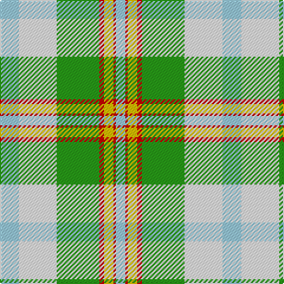

In pattern [WRYRGWW](/stripes/wryrgww/).

This was sourced from register-of-tartans.  It is a [7 stripe tartan](/stripes/stripes7/).

Original link https://www.tartanregister.gov.uk/tartanDetails.aspx?ref=2030

## Attestations

This cloth appears in 3 source records; the oldest owns this page.

- 01/01/1985 — Lake Ainslie Heritage (register-of-tartans, [record](https://www.tartanregister.gov.uk/tartanDetails.aspx?ref=2030))
- 1985 — Ainslie, Lake (District) (tartans-authority, [record](http://www.tartansauthority.com/tartan-ferret/display/586/))
- 01/01/2002 — Cooper/Couper Dress (Dalgleish #2) (register-of-tartans, [record](https://www.tartanregister.gov.uk/tartanDetails.aspx?ref=755))

## Register references

External register numbers recorded for this tartan.

- Scottish Register of Tartans: [2030](https://www.tartanregister.gov.uk/tartanDetails.aspx?ref=2030)
- Scottish Tartans Authority (ITI): 5377
- Scottish Tartans World Register: 574

## Thread count
LB/16 W32 G36 R4 Y8 R2 LB/8

## Palette
Each colour and the base-6 reference it is a variant of.

| Colour | Shade | Base |
|---|---|---|
| G | <code style="background-color:#289C18;">#289C18</code> `oklch(60.6% 0.191 141.6)` <small>#289C18</small> | G <code style="background-color:#006100;">#006100</code> |
| LB | <code style="background-color:#98C8E8;">#98C8E8</code> `oklch(81.0% 0.068 237.9)` <small>#98C8E8</small> | W <code style="background-color:#F7F7F7;">#F7F7F7</code> |
| R | <code style="background-color:#C80000;">#C80000</code> `oklch(52.3% 0.215 29.2)` <small>#C80000</small> | R <code style="background-color:#CC0000;">#CC0000</code> |
| W | <code style="background-color:#FCFCFC;">#FCFCFC</code> `oklch(99.1% 0.000 89.9)` <small>#FCFCFC</small> | W <code style="background-color:#F7F7F7;">#F7F7F7</code> |
| Y | <code style="background-color:#E8C000;">#E8C000</code> `oklch(81.9% 0.168 93.7)` <small>#E8C000</small> | Y <code style="background-color:#F2BF00;">#F2BF00</code> |

# Sample pattern

## Nearest tartans

The nearest existing variants by ΔTartan distance.

1. [Aviemore, Check](/setts/s8/g2o10g11ly4o1w18g2o1~x2/) — ΔT 1.35
1. [Barbie's Plaid](/setts/s6/n2ly4b22ly20g19ly2~x2/) — ΔT 1.46
1. [Bird Family (Australia) (Name)](/setts/s9/w3b19w1lb17ly11g10w1b3w1~x2/) — ΔT 1.57
1. [Alloway Primary School (Ayr)](/setts/s8/w30db1w4y10ly18~x2/) — ΔT 1.65
1. [Mission (District)](/setts/s8/lo2lb14k1g11k2r2g2k1~x4/) — ΔT 1.77
1. [Chambers, Christopher J (Personal)](/setts/s7/t16r1g16w1dy1w8m3~x2/) — ΔT 1.78
1. [Chambers, Christopher J (Personal)](/setts/s7/t13r1g13w1k1w7k3~x2/) — ΔT 1.78
1. [MacNappy](/setts/s6/w36lt12w1r12g16ly2~x2/) — ΔT 1.79
1. [Aviemore Check](/setts/s8/g2dy10g11ly4dy1w18g2dy1~x2/) — ΔT 1.79
1. [MacGrath (Personal)](/setts/s9/ly6w1ly5w12ly1db1t1db1t4~x4/) — ΔT 1.80

## Neighbour map

Every grey dot is one of 14299 variants placed by the first two principal components of the ΔTartan feature space (44% of its variance). Red is this tartan; blue dots are its nearest — click one to open its page.

<svg viewBox="0 0 640 380" role="img" style="max-width:100%;height:auto;border:1px solid #e0e0e0;border-radius:4px;display:block" xmlns="http://www.w3.org/2000/svg"><image href="/nn/cloud.v1.png" width="640" height="380"/><a href="/setts/s8/g2o10g11ly4o1w18g2o1~x2/"><circle cx="201.6" cy="152.2" r="4" fill="#3465a4"><title>Aviemore, Check</title></circle></a><a href="/setts/s6/n2ly4b22ly20g19ly2~x2/"><circle cx="185.8" cy="194.7" r="4" fill="#3465a4"><title>Barbie's Plaid</title></circle></a><a href="/setts/s9/w3b19w1lb17ly11g10w1b3w1~x2/"><circle cx="143.2" cy="133.1" r="4" fill="#3465a4"><title>Bird Family (Australia) (Name)</title></circle></a><a href="/setts/s8/w30db1w4y10ly18~x2/"><circle cx="226.0" cy="124.5" r="4" fill="#3465a4"><title>Alloway Primary School (Ayr)</title></circle></a><a href="/setts/s8/lo2lb14k1g11k2r2g2k1~x4/"><circle cx="163.8" cy="123.1" r="4" fill="#3465a4"><title>Mission (District)</title></circle></a><a href="/setts/s7/t16r1g16w1dy1w8m3~x2/"><circle cx="171.0" cy="137.6" r="4" fill="#3465a4"><title>Chambers, Christopher J (Personal)</title></circle></a><a href="/setts/s7/t13r1g13w1k1w7k3~x2/"><circle cx="139.0" cy="156.1" r="4" fill="#3465a4"><title>Chambers, Christopher J (Personal)</title></circle></a><a href="/setts/s6/w36lt12w1r12g16ly2~x2/"><circle cx="251.3" cy="126.2" r="4" fill="#3465a4"><title>MacNappy</title></circle></a><a href="/setts/s8/g2dy10g11ly4dy1w18g2dy1~x2/"><circle cx="188.0" cy="146.7" r="4" fill="#3465a4"><title>Aviemore Check</title></circle></a><a href="/setts/s9/ly6w1ly5w12ly1db1t1db1t4~x4/"><circle cx="205.4" cy="145.6" r="4" fill="#3465a4"><title>MacGrath (Personal)</title></circle></a><circle cx="155.8" cy="148.5" r="5" fill="#c00000"/></svg>

ID: /setts/s7/lb8w16g18r2ly4r1lb4~x2/
