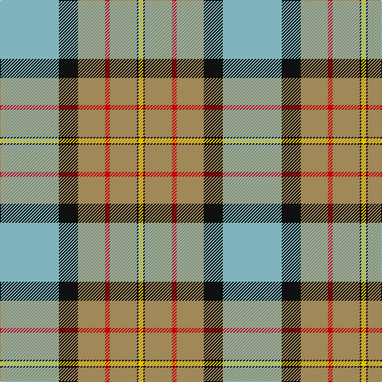

This page is one **sett** — a single exact thread-count. It belongs to the [tartan](/tartans/lg37k12lo17r3lo17k1ly3/)
(the same proportion at any scale), whose colour order is pattern [YKYRYKY](/stripes/ykyryky/).

Sourced from tartans-authority.  It is a [7 stripe tartan](/stripes/stripes7/).

Original link http://www.tartansauthority.com/tartan-ferret/display/10058/

## Register references

External register numbers recorded for this tartan.

- Scottish Tartans Authority (ITI): 10058

## Thread count
B/74 K24 LT34 R6 LT34 K2 Y/6

## Palette

Palette: <strong>Tartan Register</strong> <small style="color:#888">(4 of 5 colours)</small>
<table><thead><tr><th>Colour</th><th>Threads</th><th>Shade</th><th>Base</th><th>OKLCh</th></tr></thead><tbody><tr><td>B/</td><td style="text-align:right;font-variant-numeric:tabular-nums">74</td><td><code style="background-color:#80B4BC;">#80B4BC</code> <small style="color:#888">#80B4BC</small></td><td>Y <code style="background-color:#F2BF00;">#F2BF00</code></td><td><small style="color:#888">oklch(73.6% 0.056 207.9)</small></td></tr><tr><td>K</td><td style="text-align:right;font-variant-numeric:tabular-nums">24</td><td><code style="background-color:#101010;">#101010</code> <small style="color:#888">#101010</small></td><td>K <code style="background-color:#000000;">#000000</code></td><td><small style="color:#888">oklch(17.3% 0.000 89.9)</small></td></tr><tr><td>LT</td><td style="text-align:right;font-variant-numeric:tabular-nums">34</td><td><code style="background-color:#A08858;">#A08858</code> <small style="color:#888">#A08858</small></td><td>Y <code style="background-color:#F2BF00;">#F2BF00</code></td><td><small style="color:#888">oklch(63.7% 0.071 84.0)</small></td></tr><tr><td>R</td><td style="text-align:right;font-variant-numeric:tabular-nums">6</td><td><code style="background-color:#C80000;">#C80000</code> <small style="color:#888">#C80000</small></td><td>R <code style="background-color:#CC0000;">#CC0000</code></td><td><small style="color:#888">oklch(52.3% 0.215 29.2)</small></td></tr><tr><td>LT</td><td style="text-align:right;font-variant-numeric:tabular-nums">34</td><td><code style="background-color:#A08858;">#A08858</code> <small style="color:#888">#A08858</small></td><td>Y <code style="background-color:#F2BF00;">#F2BF00</code></td><td><small style="color:#888">oklch(63.7% 0.071 84.0)</small></td></tr><tr><td>K</td><td style="text-align:right;font-variant-numeric:tabular-nums">2</td><td><code style="background-color:#101010;">#101010</code> <small style="color:#888">#101010</small></td><td>K <code style="background-color:#000000;">#000000</code></td><td><small style="color:#888">oklch(17.3% 0.000 89.9)</small></td></tr><tr><td>Y/</td><td style="text-align:right;font-variant-numeric:tabular-nums">6</td><td><code style="background-color:#E8C000;">#E8C000</code> <small style="color:#888">#E8C000</small></td><td>Y <code style="background-color:#F2BF00;">#F2BF00</code></td><td><small style="color:#888">oklch(81.9% 0.168 93.7)</small></td></tr></tbody></table>

# Sample pattern

## Nearest tartans

The nearest existing variants by ΔTartan distance, with this tartan at the top so the swatches line up against it.

ΔTartan

Tartan

Sett

—

<a href="/ttd/edit/#slug=lg37k12lo17r3lo17k1ly3~x2">Berger-MacLaren (Personal)</a> <a class="nn-out" href="/setts/s7/lg37k12lo17r3lo17k1ly3~x2/" title="open its dictionary page">↗</a>

1.35

<a href="/ttd/edit/#slug=r8lo44k32w2o52k7o7w3">Golden Wedding (Fashion)</a> <a class="nn-out" href="/setts/s8/r8lo44k32w2o52k7o7w3/" title="open its dictionary page">↗</a>

1.35

<a href="/ttd/edit/#slug=r31g19lg27b1w1lo1~x2">Glencross, (Solway) (Personal)</a> <a class="nn-out" href="/setts/s6/r31g19lg27b1w1lo1~x2/" title="open its dictionary page">↗</a>

1.37

<a href="/ttd/edit/#slug=n3m2n30m1w18o14m2o3~x2">Bannockbane Variant</a> <a class="nn-out" href="/setts/s8/n3m2n30m1w18o14m2o3~x2/" title="open its dictionary page">↗</a>

1.38

<a href="/ttd/edit/#slug=w36lt12w1r12g16ly2~x2">MacNappy</a> <a class="nn-out" href="/setts/s6/w36lt12w1r12g16ly2~x2/" title="open its dictionary page">↗</a>

1.39

<a href="/ttd/edit/#slug=y3g32y36o12k2w68g3k2~x2">Kintail Dress</a> <a class="nn-out" href="/setts/s8/y3g32y36o12k2w68g3k2~x2/" title="open its dictionary page">↗</a>

1.46

<a href="/ttd/edit/#slug=b37k12o17r3o17k1ly3~x2">Berger-MacLaren</a> <a class="nn-out" href="/setts/s7/b37k12o17r3o17k1ly3~x2/" title="open its dictionary page">↗</a>

1.48

<a href="/ttd/edit/#slug=oi30ly4dt9lb2dt1o6dt8r8~x4">Norwegian Migration Period</a> <a class="nn-out" href="/setts/s8/oi30ly4dt9lb2dt1o6dt8r8~x4/" title="open its dictionary page">↗</a>

1.53

<a href="/ttd/edit/#slug=g30db2o7r14o7r7w1db14~x2">Harding Personal Tartan Tartan Number: 6796. Earliest known date: 2005 The tartan is part of a personal design project bringing together textile, silver and jewelry design and leatherworking, all inspired by the richness of the Scottish design and craft heritage. See products available Copyright © Blair Urquhart, Comrie, 2015</a> <a class="nn-out" href="/setts/s8/g30db2o7r14o7r7w1db14~x2/" title="open its dictionary page">↗</a>

1.53

<a href="/ttd/edit/#slug=w3k1r4g20k3b30w4r2~x2">Scottish Prison Service (Corporate)</a> <a class="nn-out" href="/setts/s8/w3k1r4g20k3b30w4r2~x2/" title="open its dictionary page">↗</a>

1.53

<a href="/ttd/edit/#slug=lg31k18dg13r3dg13k1ly3~x2">Big Sur MacLaren (Personal)</a> <a class="nn-out" href="/setts/s7/lg31k18dg13r3dg13k1ly3~x2/" title="open its dictionary page">↗</a>

## Neighbour map

Every grey dot is one of 14359 variants placed by the first two principal components of the ΔTartan feature space (44% of its variance). Red is this tartan; blue dots are its nearest — click one to open its page.

<svg viewBox="0 0 640 380" role="img" style="max-width:100%;height:auto;border:1px solid #e0e0e0;border-radius:4px;display:block" xmlns="http://www.w3.org/2000/svg"><image href="/nn/cloud.v1.png" width="640" height="380"/><a href="/setts/s8/r8lo44k32w2o52k7o7w3/"><circle cx="207.6" cy="124.2" r="4" fill="#3465a4"><title>Golden Wedding (Fashion)</title></circle></a><a href="/setts/s6/r31g19lg27b1w1lo1~x2/"><circle cx="235.0" cy="123.3" r="4" fill="#3465a4"><title>Glencross, (Solway) (Personal)</title></circle></a><a href="/setts/s8/n3m2n30m1w18o14m2o3~x2/"><circle cx="290.7" cy="136.5" r="4" fill="#3465a4"><title>Bannockbane Variant</title></circle></a><a href="/setts/s6/w36lt12w1r12g16ly2~x2/"><circle cx="250.2" cy="126.5" r="4" fill="#3465a4"><title>MacNappy</title></circle></a><a href="/setts/s8/y3g32y36o12k2w68g3k2~x2/"><circle cx="226.6" cy="96.4" r="4" fill="#3465a4"><title>Kintail Dress</title></circle></a><a href="/setts/s7/b37k12o17r3o17k1ly3~x2/"><circle cx="232.7" cy="123.8" r="4" fill="#3465a4"><title>Berger-MacLaren</title></circle></a><a href="/setts/s8/oi30ly4dt9lb2dt1o6dt8r8~x4/"><circle cx="227.9" cy="106.2" r="4" fill="#3465a4"><title>Norwegian Migration Period</title></circle></a><a href="/setts/s8/g30db2o7r14o7r7w1db14~x2/"><circle cx="217.3" cy="145.7" r="4" fill="#3465a4"><title>Harding Personal Tartan Tartan Number: 6796. Earliest known date: 2005 The tartan is part of a personal design project bringing together textile, silver and jewelry design and leatherworking, all inspired by the richness of the Scottish design and craft heritage. See products available Copyright © Blair Urquhart, Comrie, 2015</title></circle></a><a href="/setts/s8/w3k1r4g20k3b30w4r2~x2/"><circle cx="251.9" cy="116.3" r="4" fill="#3465a4"><title>Scottish Prison Service (Corporate)</title></circle></a><a href="/setts/s7/lg31k18dg13r3dg13k1ly3~x2/"><circle cx="197.9" cy="140.3" r="4" fill="#3465a4"><title>Big Sur MacLaren (Personal)</title></circle></a><circle cx="250.6" cy="129.6" r="5" fill="#c00000"/></svg>

ID: /setts/s7/lg37k12lo17r3lo17k1ly3~x2/
