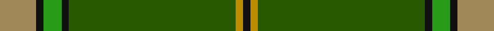
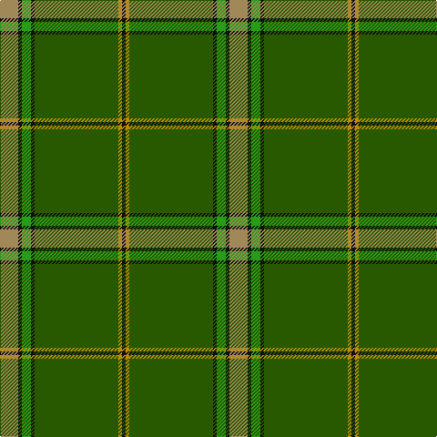

In pattern [KYGKGKY](/stripes/kygkgky/).

This was sourced from tartans-authority.  It is a [7 stripe tartan](/stripes/stripes7/).

Original link http://www.tartansauthority.com/tartan-ferret/display/10829/

## Thread count
LT/20 K4 G10 K4 Ga92 DY4 K/4

## Palette
Each colour and the base-6 reference it is a variant of.

| Colour | Shade | Base |
|---|---|---|
| DY | <code style="background-color:#BC8C00;">#BC8C00</code> `oklch(66.8% 0.137 84.1)` <small>#BC8C00</small> | Y <code style="background-color:#F2BF00;">#F2BF00</code> |
| G | <code style="background-color:#289C18;">#289C18</code> `oklch(60.6% 0.191 141.6)` <small>#289C18</small> | G <code style="background-color:#006100;">#006100</code> |
| Ga | <code style="background-color:#285800;">#285800</code> `oklch(41.0% 0.122 135.8)` <small>#285800</small> | G <code style="background-color:#006100;">#006100</code> |
| K | <code style="background-color:#101010;">#101010</code> `oklch(17.3% 0.000 89.9)` <small>#101010</small> | K <code style="background-color:#000000;">#000000</code> |
| LT | <code style="background-color:#A08858;">#A08858</code> `oklch(63.7% 0.071 84.0)` <small>#A08858</small> | Y <code style="background-color:#F2BF00;">#F2BF00</code> |

# Sample pattern

## Nearest tartans

The nearest existing variants by ΔTartan distance.

1. [Crieff & Strathearn #1](/setts/s7/g55db7r24g12dt4ly3dt4~x2/) — ΔT 1.33
1. [Palmer, Arnold](/setts/s10/dg40r5k2w2k2ly3k2dg10r3k3~x2/) — ΔT 1.48
1. [Shiach (Personal)](/setts/s8/g45k4r2g4r2k4n21r5~x2/) — ΔT 1.51
1. [Leach Htg #2 (Name)](/setts/s9/y32w1k3w1g14y7k3dp3w1~x2/) — ΔT 1.56
1. [Selvon-Bruce (Personal)](/setts/s7/k3g2k3g18r2db2lo1~x4/) — ΔT 1.59
1. [Celtic (New) Corporate Sport Tartan Tartan Number: 2232. Earliest known date: 1842 Should have a white line (?). See products available Copyright © Blair Urquhart, Comrie, 2015](/setts/s8/g44k2g2k2g3k12db10r3~x2/) — ΔT 1.60
1. [Kenspeckle](/setts/s5/g50r1r20k2w1~x2/) — ΔT 1.68
1. [Sheffield, City of (District)](/setts/s8/g62o3g3o31k4g5t5r3~x2/) — ΔT 1.69
1. [Semper](/setts/s8/g16dg1lg4dg41lg1dg6g2dg2~x2/) — ΔT 1.70
1. [St. Christopher (Corporate)](/setts/s8/dg5r3dg3lo2dg1ly8dg24lo2~x2/) — ΔT 1.73

## Neighbour map

Every grey dot is one of 14299 variants placed by the first two principal components of the ΔTartan feature space (44% of its variance). Red is this tartan; blue dots are its nearest — click one to open its page.

<svg viewBox="0 0 640 380" role="img" style="max-width:100%;height:auto;border:1px solid #e0e0e0;border-radius:4px;display:block" xmlns="http://www.w3.org/2000/svg"><image href="/nn/cloud.v1.png" width="640" height="380"/><a href="/setts/s7/g55db7r24g12dt4ly3dt4~x2/"><circle cx="386.8" cy="175.4" r="4" fill="#3465a4"><title>Crieff &amp; Strathearn #1</title></circle></a><a href="/setts/s10/dg40r5k2w2k2ly3k2dg10r3k3~x2/"><circle cx="438.4" cy="127.6" r="4" fill="#3465a4"><title>Palmer, Arnold</title></circle></a><a href="/setts/s8/g45k4r2g4r2k4n21r5~x2/"><circle cx="369.3" cy="154.6" r="4" fill="#3465a4"><title>Shiach (Personal)</title></circle></a><a href="/setts/s9/y32w1k3w1g14y7k3dp3w1~x2/"><circle cx="382.2" cy="121.1" r="4" fill="#3465a4"><title>Leach Htg #2 (Name)</title></circle></a><a href="/setts/s7/k3g2k3g18r2db2lo1~x4/"><circle cx="379.4" cy="154.9" r="4" fill="#3465a4"><title>Selvon-Bruce (Personal)</title></circle></a><a href="/setts/s8/g44k2g2k2g3k12db10r3~x2/"><circle cx="419.8" cy="164.8" r="4" fill="#3465a4"><title>Celtic (New) Corporate Sport Tartan Tartan Number: 2232. Earliest known date: 1842 Should have a white line (?). See products available Copyright © Blair Urquhart, Comrie, 2015</title></circle></a><a href="/setts/s5/g50r1r20k2w1~x2/"><circle cx="498.8" cy="147.5" r="4" fill="#3465a4"><title>Kenspeckle</title></circle></a><a href="/setts/s8/g62o3g3o31k4g5t5r3~x2/"><circle cx="364.5" cy="142.2" r="4" fill="#3465a4"><title>Sheffield, City of (District)</title></circle></a><a href="/setts/s8/g16dg1lg4dg41lg1dg6g2dg2~x2/"><circle cx="503.7" cy="153.1" r="4" fill="#3465a4"><title>Semper</title></circle></a><a href="/setts/s8/dg5r3dg3lo2dg1ly8dg24lo2~x2/"><circle cx="442.4" cy="158.4" r="4" fill="#3465a4"><title>St. Christopher (Corporate)</title></circle></a><circle cx="453.3" cy="153.7" r="5" fill="#c00000"/></svg>

ID: /setts/s7/lo10k2g5k2dg46lo2k2~x2/
