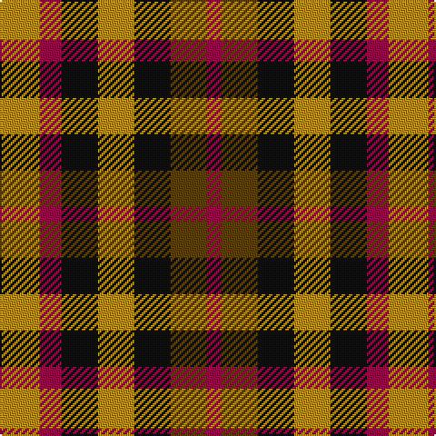

In pattern [RGKYKRY](/stripes/rgkykry/).

This was sourced from register-of-tartans.  It is a [7 stripe tartan](/stripes/stripes7/).

Original link https://www.tartanregister.gov.uk/tartanDetails.aspx?ref=1006

## Register references

External register numbers recorded for this tartan.

- Scottish Register of Tartans: [1006](https://www.tartanregister.gov.uk/tartanDetails.aspx?ref=1006)
- Scottish Tartans Authority (ITI): 1661
- Scottish Tartans World Register: 1661

## Thread count
DY/22 R12 K20 DY20 K20 T20 R/8

## Palette
Each colour and the base-6 reference it is a variant of.

| Colour | Shade | Base |
|---|---|---|
| DY | <code style="background-color:#BC8C00;">#BC8C00</code> `oklch(66.8% 0.137 84.1)` <small>#BC8C00</small> | Y <code style="background-color:#F2BF00;">#F2BF00</code> |
| K | <code style="background-color:#101010;">#101010</code> `oklch(17.3% 0.000 89.9)` <small>#101010</small> | K <code style="background-color:#000000;">#000000</code> |
| R | <code style="background-color:#A00048;">#A00048</code> `oklch(45.4% 0.182 5.3)` <small>#A00048</small> | R <code style="background-color:#CC0000;">#CC0000</code> |
| T | <code style="background-color:#604000;">#604000</code> `oklch(39.8% 0.083 76.8)` <small>#604000</small> | G <code style="background-color:#006100;">#006100</code> |

# Sample pattern

## Nearest tartans

The nearest existing variants by ΔTartan distance, with this tartan at the top so the swatches line up against it.

ΔTartan

Tartan

Sett

—

<a href="/ttd/edit/#slug=lo11m6k10lo10k10dy10m4~x2">Duffus Hose, Lord</a> <a class="nn-out" href="/setts/s7/lo11m6k10lo10k10dy10m4~x2/" title="open its dictionary page">↗</a>

1.07

<a href="/ttd/edit/#slug=r10db6k8g10r6g3r6~x2">MacDuff</a> <a class="nn-out" href="/setts/s7/r10db6k8g10r6g3r6~x2/" title="open its dictionary page">↗</a>

1.20

<a href="/ttd/edit/#slug=ly15r7k12ly12k12dy12r7~x2">Duffus Lord... Portrait Tartan Tartan Number: 1661. Earliest known date: 1705 The hose in the portrait of Lord Duffus (1705). Reconstructed and woven by Scottish Tartans Society. See products available Copyright © Blair Urquhart, Comrie, 2015</a> <a class="nn-out" href="/setts/s7/ly15r7k12ly12k12dy12r7~x2/" title="open its dictionary page">↗</a>

1.23

<a href="/ttd/edit/#slug=r10db6k8dg10r6dg3r6~x2">MacDuff #3</a> <a class="nn-out" href="/setts/s7/r10db6k8dg10r6dg3r6~x2/" title="open its dictionary page">↗</a>

1.25

<a href="/ttd/edit/#slug=k13dy28lo13dy28k18w18k13~x2">Boxer Beauty</a> <a class="nn-out" href="/setts/s7/k13dy28lo13dy28k18w18k13~x2/" title="open its dictionary page">↗</a>

1.33

<a href="/ttd/edit/#slug=ly15r7k12ly12k12o12r7~x2">Duffus, Lord</a> <a class="nn-out" href="/setts/s7/ly15r7k12ly12k12o12r7~x2/" title="open its dictionary page">↗</a>

1.42

<a href="/ttd/edit/#slug=r2k1db2k1g2k1~x28">Burnicle (2015)</a> <a class="nn-out" href="/setts/s6/r2k1db2k1g2k1~x28/" title="open its dictionary page">↗</a>

1.56

<a href="/ttd/edit/#slug=p3k3p3g6r2~x2">Austin / Wilson's No 137</a> <a class="nn-out" href="/setts/s5/p3k3p3g6r2~x2/" title="open its dictionary page">↗</a>

1.62

<a href="/ttd/edit/#slug=r14k3r14g13db8g13~x2">Tulsa</a> <a class="nn-out" href="/setts/s6/r14k3r14g13db8g13~x2/" title="open its dictionary page">↗</a>

1.67

<a href="/ttd/edit/#slug=r6g5k5g5r6t1~x4">Norwich No.028</a> <a class="nn-out" href="/setts/s6/r6g5k5g5r6t1~x4/" title="open its dictionary page">↗</a>

1.68

<a href="/ttd/edit/#slug=p3k3p3g6ly2~x2">Austin / Wilson's No 173</a> <a class="nn-out" href="/setts/s5/p3k3p3g6ly2~x2/" title="open its dictionary page">↗</a>

## Neighbour map

Every grey dot is one of 14299 variants placed by the first two principal components of the ΔTartan feature space (44% of its variance). Red is this tartan; blue dots are its nearest — click one to open its page.

<svg viewBox="0 0 640 380" role="img" style="max-width:100%;height:auto;border:1px solid #e0e0e0;border-radius:4px;display:block" xmlns="http://www.w3.org/2000/svg"><image href="/nn/cloud.v1.png" width="640" height="380"/><a href="/setts/s7/r10db6k8g10r6g3r6~x2/"><circle cx="115.7" cy="283.1" r="4" fill="#3465a4"><title>MacDuff</title></circle></a><a href="/setts/s7/ly15r7k12ly12k12dy12r7~x2/"><circle cx="24.2" cy="300.6" r="4" fill="#3465a4"><title>Duffus Lord... Portrait Tartan Tartan Number: 1661. Earliest known date: 1705 The hose in the portrait of Lord Duffus (1705). Reconstructed and woven by Scottish Tartans Society. See products available Copyright © Blair Urquhart, Comrie, 2015</title></circle></a><a href="/setts/s7/r10db6k8dg10r6dg3r6~x2/"><circle cx="136.2" cy="289.3" r="4" fill="#3465a4"><title>MacDuff #3</title></circle></a><a href="/setts/s7/k13dy28lo13dy28k18w18k13~x2/"><circle cx="83.8" cy="297.5" r="4" fill="#3465a4"><title>Boxer Beauty</title></circle></a><a href="/setts/s7/ly15r7k12ly12k12o12r7~x2/"><circle cx="14.7" cy="297.0" r="4" fill="#3465a4"><title>Duffus, Lord</title></circle></a><a href="/setts/s6/r2k1db2k1g2k1~x28/"><circle cx="59.5" cy="322.7" r="4" fill="#3465a4"><title>Burnicle (2015)</title></circle></a><a href="/setts/s5/p3k3p3g6r2~x2/"><circle cx="85.3" cy="293.4" r="4" fill="#3465a4"><title>Austin / Wilson's No 137</title></circle></a><a href="/setts/s6/r14k3r14g13db8g13~x2/"><circle cx="165.2" cy="281.6" r="4" fill="#3465a4"><title>Tulsa</title></circle></a><a href="/setts/s6/r6g5k5g5r6t1~x4/"><circle cx="150.2" cy="266.2" r="4" fill="#3465a4"><title>Norwich No.028</title></circle></a><a href="/setts/s5/p3k3p3g6ly2~x2/"><circle cx="71.4" cy="288.6" r="4" fill="#3465a4"><title>Austin / Wilson's No 173</title></circle></a><circle cx="62.3" cy="302.6" r="5" fill="#c00000"/></svg>

ID: /setts/s7/lo11m6k10lo10k10dy10m4~x2/
