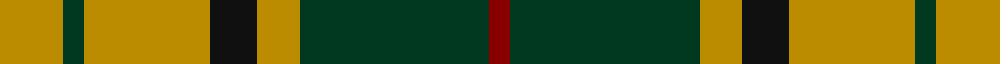
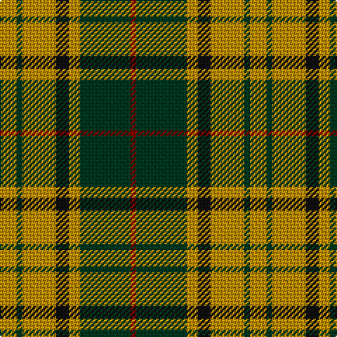

**Bands:** [RGYKYGY](/stripes/rgykygy/) · **Stripes:** [R DG LO K LO DG LO](/stripes/stripes7/) R DG LO K LO DG LO

This was sourced from tartans-authority.  It is a [7 band tartan](/bands/bands7/).

Original link http://www.tartansauthority.com/tartan-ferret/display/2422/

## Thread count
DY/12 DG4 DY24 K9 DY8 DG36 DR/4

## Palette
Each colour and its ΔE from the base-6 reference it is a variant of.

| Colour | Shade | Base | ΔE (OKLab) |
|---|---|---|---|
| DG | <code style="background-color:#003820;">#003820</code> `#003820` | G <code style="background-color:#006100;">#006100</code> | 0.15 |
| DR | <code style="background-color:#880000;">#880000</code> `#880000` | R <code style="background-color:#CC0000;">#CC0000</code> | 0.15 |
| DY | <code style="background-color:#BC8C00;">#BC8C00</code> `#BC8C00` | Y <code style="background-color:#F2BF00;">#F2BF00</code> | 0.16 |
| K | <code style="background-color:#101010;">#101010</code> `#101010` | K <code style="background-color:#000000;">#000000</code> | 0.17 |

# Sample pattern

## Nearest tartans

The nearest existing variants by ΔTartan distance.

1. [Celtic Combat](/setts/s6/k2o20k8dg18o3w2~x2/) — ΔT 0.98
1. [Unidentified #57](/setts/s8/dg20r8lr2r8dg5ly8dg2ly8~x2/) — ΔT 0.98
1. [Blackstock Hunting](/setts/s7/k2r7k6g12ly1g1k2~x4/) — ΔT 1.01
1. [Invertere](/setts/s8/ly5dg14o4db4o27dg3o4ly5~x2/) — ΔT 1.04
1. [Harmer](/setts/s12/dg36lo8k9lo24dg4lo12dg4lo24k9lo8dg36r4/) — ΔT 1.11
1. [Wilson's, No 193](/setts/s5/g6k1r1t2r2~x4/) — ΔT 1.14
1. [Invertere (Daks #2) (Fashion)](/setts/s8/ly5g14dy4db4dy27g3dy4ly5~x2/) — ΔT 1.16
1. [Newfoundland](/setts/s7/r6g4do14w4do7g30lo4~x2/) — ΔT 1.17
1. [MacDuck](/setts/s6/k4dg5k2o21g8k2~x2/) — ΔT 1.17
1. [Crantock](/setts/s8/g24p3g3p3g3p7dg20r3~x2/) — ΔT 1.18

## Neighbour map

Every grey dot is one of 14299 variants placed by the first two principal components of the ΔTartan feature space (44% of its variance). Red is this tartan; blue dots are its nearest — click one to open its page.

<svg viewBox="0 0 640 380" role="img" style="max-width:100%;height:auto;border:1px solid #e0e0e0;border-radius:4px;display:block" xmlns="http://www.w3.org/2000/svg"><image href="/nn/cloud.v1.png" width="640" height="380"/><a href="/setts/s6/k2o20k8dg18o3w2~x2/"><circle cx="237.3" cy="204.2" r="4" fill="#3465a4"><title>Celtic Combat</title></circle></a><a href="/setts/s8/dg20r8lr2r8dg5ly8dg2ly8~x2/"><circle cx="223.9" cy="210.3" r="4" fill="#3465a4"><title>Unidentified #57</title></circle></a><a href="/setts/s7/k2r7k6g12ly1g1k2~x4/"><circle cx="229.5" cy="195.1" r="4" fill="#3465a4"><title>Blackstock Hunting</title></circle></a><a href="/setts/s8/ly5dg14o4db4o27dg3o4ly5~x2/"><circle cx="271.1" cy="188.9" r="4" fill="#3465a4"><title>Invertere</title></circle></a><a href="/setts/s12/dg36lo8k9lo24dg4lo12dg4lo24k9lo8dg36r4/"><circle cx="228.0" cy="188.7" r="4" fill="#3465a4"><title>Harmer</title></circle></a><a href="/setts/s5/g6k1r1t2r2~x4/"><circle cx="225.1" cy="236.6" r="4" fill="#3465a4"><title>Wilson's, No 193</title></circle></a><a href="/setts/s8/ly5g14dy4db4dy27g3dy4ly5~x2/"><circle cx="278.5" cy="194.4" r="4" fill="#3465a4"><title>Invertere (Daks #2) (Fashion)</title></circle></a><a href="/setts/s7/r6g4do14w4do7g30lo4~x2/"><circle cx="233.0" cy="196.9" r="4" fill="#3465a4"><title>Newfoundland</title></circle></a><a href="/setts/s6/k4dg5k2o21g8k2~x2/"><circle cx="245.2" cy="194.8" r="4" fill="#3465a4"><title>MacDuck</title></circle></a><a href="/setts/s8/g24p3g3p3g3p7dg20r3~x2/"><circle cx="219.9" cy="191.9" r="4" fill="#3465a4"><title>Crantock</title></circle></a><circle cx="238.8" cy="207.3" r="5" fill="#c00000"/></svg>

ID: /setts/s7/lo12dg4lo24k9lo8dg36r4/
