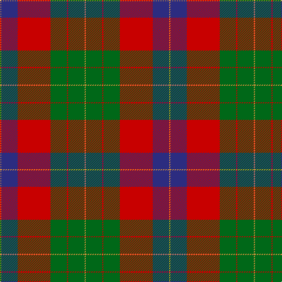

**Bands:** [YBRGRGY](/stripes/ybrgrgy/) · **Stripes:** [LO DB R G R G LO](/stripes/stripes7/) LO DB R G R G LO

This was sourced from tartans-authority.  It is a [7 band tartan](/bands/bands7/).

Original link http://www.tartansauthority.com/tartan-ferret/display/10333/

## Thread count
O/2 DB28 R56 G28 R2 G28 O/2

## Palette
Each colour and its ΔE from the base-6 reference it is a variant of.

| Colour | Shade | Base | ΔE (OKLab) |
|---|---|---|---|
| DB | <code style="background-color:#2C2C80;">#2C2C80</code> `#2C2C80` | B <code style="background-color:#2A418A;">#2A418A</code> | 0.06 |
| G | <code style="background-color:#006818;">#006818</code> `#006818` | G <code style="background-color:#006100;">#006100</code> | 0.02 |
| O | <code style="background-color:#DC943C;">#DC943C</code> `#DC943C` | Y <code style="background-color:#F2BF00;">#F2BF00</code> | 0.12 |
| R | <code style="background-color:#C80000;">#C80000</code> `#C80000` | R <code style="background-color:#CC0000;">#CC0000</code> | 0.01 |

# Sample pattern

## Nearest tartans

The nearest existing variants by ΔTartan distance.

1. [MacKintosh Geddes](/setts/s7/db1r5dg18r4db9r10w1~x4/) — ΔT 0.81
1. [Ruthven](/setts/s6/w3g15db18r30g1r2~x2/) — ΔT 0.82
1. [MacKintosh, Geddes](/setts/s7/db1r5g18r4db9r10w1~x4/) — ΔT 0.85
1. [Unidentified #15](/setts/s6/k6r2dg17r16k1t2~x2/) — ΔT 1.06
1. [Georgia, State of (District)](/setts/s8/y36k2y2k2y3k12t10r20~x2/) — ΔT 1.09
1. [Cook (Name)](/setts/s7/dg12g6dg6r15k1r1k2~x2/) — ΔT 1.10
1. [McCook/Cook (Name)](/setts/s7/g12t6g6r15k1r1k2~x4/) — ΔT 1.10
1. [Plummer Family Personal Tartan Tartan Number: 2778. Earliest known date: 2001 From a D C Dalgliesh swatch in 2001 via Phil Smith June 2004. See products available Copyright © Blair Urquhart, Comrie, 2015](/setts/s6/r30k8dg30b4r3b2~x2/) — ΔT 1.11
1. [Logan with Yellow](/setts/s7/dp8r3ly1r3g14r3ly1~x4/) — ΔT 1.13
1. [Cranston Dress](/setts/s8/r15db2r1db2r3db7g13g3~x2/) — ΔT 1.17

## Neighbour map

Every grey dot is one of 14313 variants placed by the first two principal components of the ΔTartan feature space (44% of its variance). Red is this tartan; blue dots are its nearest — click one to open its page.

<svg viewBox="0 0 640 380" role="img" style="max-width:100%;height:auto;border:1px solid #e0e0e0;border-radius:4px;display:block" xmlns="http://www.w3.org/2000/svg"><image href="/nn/cloud.v1.png" width="640" height="380"/><a href="/setts/s7/db1r5dg18r4db9r10w1~x4/"><circle cx="250.0" cy="180.0" r="4" fill="#3465a4"><title>MacKintosh Geddes</title></circle></a><a href="/setts/s6/w3g15db18r30g1r2~x2/"><circle cx="299.6" cy="156.5" r="4" fill="#3465a4"><title>Ruthven</title></circle></a><a href="/setts/s7/db1r5g18r4db9r10w1~x4/"><circle cx="249.4" cy="182.2" r="4" fill="#3465a4"><title>MacKintosh, Geddes</title></circle></a><a href="/setts/s6/k6r2dg17r16k1t2~x2/"><circle cx="258.9" cy="178.4" r="4" fill="#3465a4"><title>Unidentified #15</title></circle></a><a href="/setts/s8/y36k2y2k2y3k12t10r20~x2/"><circle cx="290.5" cy="166.8" r="4" fill="#3465a4"><title>Georgia, State of (District)</title></circle></a><a href="/setts/s7/dg12g6dg6r15k1r1k2~x2/"><circle cx="253.3" cy="191.0" r="4" fill="#3465a4"><title>Cook (Name)</title></circle></a><a href="/setts/s7/g12t6g6r15k1r1k2~x4/"><circle cx="249.5" cy="188.8" r="4" fill="#3465a4"><title>McCook/Cook (Name)</title></circle></a><a href="/setts/s6/r30k8dg30b4r3b2~x2/"><circle cx="280.8" cy="187.6" r="4" fill="#3465a4"><title>Plummer Family Personal Tartan Tartan Number: 2778. Earliest known date: 2001 From a D C Dalgliesh swatch in 2001 via Phil Smith June 2004. See products available Copyright © Blair Urquhart, Comrie, 2015</title></circle></a><a href="/setts/s7/dp8r3ly1r3g14r3ly1~x4/"><circle cx="247.6" cy="177.9" r="4" fill="#3465a4"><title>Logan with Yellow</title></circle></a><a href="/setts/s8/r15db2r1db2r3db7g13g3~x2/"><circle cx="229.6" cy="169.3" r="4" fill="#3465a4"><title>Cranston Dress</title></circle></a><circle cx="279.1" cy="161.9" r="5" fill="#c00000"/></svg>

ID: /setts/s7/lo1db14r28g14r1g14lo1~x2/
