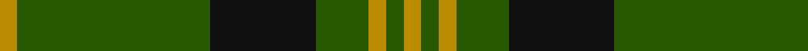

In pattern [YGKGYGY](/stripes/ygkgygy/).

This was sourced from tartans-authority.  It is a [7 stripe tartan](/stripes/stripes7/).

Original link http://www.tartansauthority.com/tartan-ferret/display/3514/

## Also known as

This cloth is also recorded under:

- Angle, Green

## Attestations

This cloth appears in 2 source records; the oldest owns this page.

- 1986 — Angle, Green (Fashion) (tartans-authority, [record](http://www.tartansauthority.com/tartan-ferret/display/3514/))
- undated — Angle Green (register-of-tartans, [record](https://www.tartanregister.gov.uk/tartanDetails.aspx?ref=5264))

## Register references

External register numbers recorded for this tartan.

- Scottish Register of Tartans: [5264](https://www.tartanregister.gov.uk/tartanDetails.aspx?ref=5264)
- Scottish Tartans Authority (ITI): 3514

## Thread count
DY/4 G44 K24 G12 DY4 G4 DY/4

## Palette
Each colour and its ΔE from the base-6 reference it is a variant of.

| Colour | Shade | Base | ΔE (OKLab) |
|---|---|---|---|
| DY | <code style="background-color:#BC8C00;">#BC8C00</code> `#BC8C00` | Y <code style="background-color:#F2BF00;">#F2BF00</code> | 0.16 |
| G | <code style="background-color:#285800;">#285800</code> `#285800` | G <code style="background-color:#006100;">#006100</code> | 0.03 |
| K | <code style="background-color:#101010;">#101010</code> `#101010` | K <code style="background-color:#000000;">#000000</code> | 0.17 |

# Sample pattern

## Nearest tartans

The nearest existing variants by ΔTartan distance.

1. [Maxwell Htg (Clan)](/setts/s7/g3r16g4k6g28r2g3~x2/) — ΔT 0.88
1. [Northcroft (Personal)](/setts/s7/g24r4g3k14g5r2g10~x2/) — ΔT 0.94
1. [Glenbarr](/setts/s8/g3k6r2k6g3k2g16k1~x4/) — ΔT 1.00
1. [Paton (Personal)](/setts/s7/r3g20k20g20lo2g2lo2~x2/) — ΔT 1.05
1. [Connell (Personal?)](/setts/s6/r2g2r1g12r3k1~x4/) — ΔT 1.22
1. [Glen Trool](/setts/s5/dg37o9dg3r9o3~x2/) — ΔT 1.23
1. [Romsdal](/setts/s5/g22dt5r4dt5r3~x2/) — ΔT 1.30
1. [Green Watch](/setts/s7/dg10o1dg1o1lr2dg1o1~x4/) — ΔT 1.30
1. [MacArthur-Fox 1993 (Personal)](/setts/s8/k22g5k2g5k11g33k2r4~x2/) — ΔT 1.31
1. [MacArthur (Highland Society)](/setts/s6/g18ly2g18k4g2k15~x2/) — ΔT 1.32

## Neighbour map

Every grey dot is one of 14299 variants placed by the first two principal components of the ΔTartan feature space (44% of its variance). Red is this tartan; blue dots are its nearest — click one to open its page.

<svg viewBox="0 0 640 380" role="img" style="max-width:100%;height:auto;border:1px solid #e0e0e0;border-radius:4px;display:block" xmlns="http://www.w3.org/2000/svg"><image href="/nn/cloud.v1.png" width="640" height="380"/><a href="/setts/s7/g3r16g4k6g28r2g3~x2/"><circle cx="420.1" cy="223.3" r="4" fill="#3465a4"><title>Maxwell Htg (Clan)</title></circle></a><a href="/setts/s7/g24r4g3k14g5r2g10~x2/"><circle cx="418.0" cy="239.4" r="4" fill="#3465a4"><title>Northcroft (Personal)</title></circle></a><a href="/setts/s8/g3k6r2k6g3k2g16k1~x4/"><circle cx="376.8" cy="215.1" r="4" fill="#3465a4"><title>Glenbarr</title></circle></a><a href="/setts/s7/r3g20k20g20lo2g2lo2~x2/"><circle cx="347.8" cy="221.4" r="4" fill="#3465a4"><title>Paton (Personal)</title></circle></a><a href="/setts/s6/r2g2r1g12r3k1~x4/"><circle cx="445.8" cy="217.8" r="4" fill="#3465a4"><title>Connell (Personal?)</title></circle></a><a href="/setts/s5/dg37o9dg3r9o3~x2/"><circle cx="441.6" cy="238.4" r="4" fill="#3465a4"><title>Glen Trool</title></circle></a><a href="/setts/s5/g22dt5r4dt5r3~x2/"><circle cx="342.0" cy="256.5" r="4" fill="#3465a4"><title>Romsdal</title></circle></a><a href="/setts/s7/dg10o1dg1o1lr2dg1o1~x4/"><circle cx="459.3" cy="214.5" r="4" fill="#3465a4"><title>Green Watch</title></circle></a><a href="/setts/s8/k22g5k2g5k11g33k2r4~x2/"><circle cx="362.7" cy="208.5" r="4" fill="#3465a4"><title>MacArthur-Fox 1993 (Personal)</title></circle></a><a href="/setts/s6/g18ly2g18k4g2k15~x2/"><circle cx="386.4" cy="265.0" r="4" fill="#3465a4"><title>MacArthur (Highland Society)</title></circle></a><circle cx="396.8" cy="226.0" r="5" fill="#c00000"/></svg>

ID: /setts/s7/lo1dg11k6dg3lo1dg1lo1~x4/
