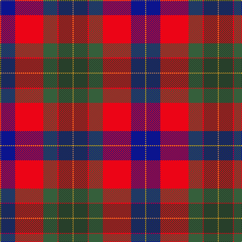

**Bands:** [YGRGRBY](/stripes/ygrgrby/) · **Stripes:** [LO DG R Y R DB LO](/stripes/stripes7/) LO DG R Y R DB LO

This was sourced from register-of-tartans.  It is a [7 band tartan](/bands/bands7/).

Original link https://www.tartanregister.gov.uk/tartanDetails.aspx?ref=10333

## Register references

External register numbers recorded for this tartan.

- Scottish Register of Tartans: [10333](https://www.tartanregister.gov.uk/tartanDetails.aspx?ref=10333)

## Thread count
Y/2 DB28 R56 N28 R2 DN28 Y/2

## Palette
Each colour and its ΔE from the base-6 reference it is a variant of.

| Colour | Shade | Base | ΔE (OKLab) |
|---|---|---|---|
| DB | <code style="background-color:#0B148E;">#0B148E</code> `#0B148E` | B <code style="background-color:#2A418A;">#2A418A</code> | 0.11 |
| DN | <code style="background-color:#273F2A;">#273F2A</code> `#273F2A` | G <code style="background-color:#006100;">#006100</code> | 0.13 |
| N | <code style="background-color:#355F3B;">#355F3B</code> `#355F3B` | G <code style="background-color:#006100;">#006100</code> | 0.07 |
| R | <code style="background-color:#EC0416;">#EC0416</code> `#EC0416` | R <code style="background-color:#CC0000;">#CC0000</code> | 0.07 |
| Y | <code style="background-color:#E0A126;">#E0A126</code> `#E0A126` | Y <code style="background-color:#F2BF00;">#F2BF00</code> | 0.08 |

# Sample pattern

## Nearest tartans

The nearest existing variants by ΔTartan distance.

1. [Clyde Family (Hurleford) (Personal)](/setts/s7/r64k30g30db18w4db2w3/) — ΔT 0.61
1. [Clyde (Personal)](/setts/s7/r64k30g30b18w4b2w3/) — ΔT 0.63
1. [Royal Scottish Assurance](/setts/s9/db26dg11r8k2r2w2r4w1r15~x2/) — ΔT 0.92
1. [Royal Scottish Assurance (Corporate)](/setts/s9/db26g11r8k2r2w2r4w1r15~x2/) — ΔT 0.93
1. [McKnight (Personal)](/setts/s7/db4ly1r28db25k10db5k3~x2/) — ΔT 0.95
1. [Shaw](/setts/s8/lb5k1r30dp15r8dg30r8dp2/) — ΔT 1.05
1. [McKnight #2 (Personal)](/setts/s7/t4ly1r28db24k5t5k3~x4/) — ΔT 1.06
1. [Manson](/setts/s9/dg1r24dg8k8dg8r1k4db16w1~x2/) — ΔT 1.08
1. [Cherry, John S. (Personal)](/setts/s7/o4dt36r35g2r2g8w4~x2/) — ΔT 1.12
1. [Forrester (Clan)](/setts/s9/w3dt4w1dt15r24dg15ly1dg4ly3~x4/) — ΔT 1.13

## Neighbour map

Every grey dot is one of 14299 variants placed by the first two principal components of the ΔTartan feature space (44% of its variance). Red is this tartan; blue dots are its nearest — click one to open its page.

<svg viewBox="0 0 640 380" role="img" style="max-width:100%;height:auto;border:1px solid #e0e0e0;border-radius:4px;display:block" xmlns="http://www.w3.org/2000/svg"><image href="/nn/cloud.v1.png" width="640" height="380"/><a href="/setts/s7/r64k30g30db18w4db2w3/"><circle cx="230.8" cy="117.4" r="4" fill="#3465a4"><title>Clyde Family (Hurleford) (Personal)</title></circle></a><a href="/setts/s7/r64k30g30b18w4b2w3/"><circle cx="230.0" cy="119.5" r="4" fill="#3465a4"><title>Clyde (Personal)</title></circle></a><a href="/setts/s9/db26dg11r8k2r2w2r4w1r15~x2/"><circle cx="252.3" cy="125.7" r="4" fill="#3465a4"><title>Royal Scottish Assurance</title></circle></a><a href="/setts/s9/db26g11r8k2r2w2r4w1r15~x2/"><circle cx="243.0" cy="119.7" r="4" fill="#3465a4"><title>Royal Scottish Assurance (Corporate)</title></circle></a><a href="/setts/s7/db4ly1r28db25k10db5k3~x2/"><circle cx="225.6" cy="135.4" r="4" fill="#3465a4"><title>McKnight (Personal)</title></circle></a><a href="/setts/s8/lb5k1r30dp15r8dg30r8dp2/"><circle cx="275.5" cy="129.9" r="4" fill="#3465a4"><title>Shaw</title></circle></a><a href="/setts/s7/t4ly1r28db24k5t5k3~x4/"><circle cx="249.4" cy="128.7" r="4" fill="#3465a4"><title>McKnight #2 (Personal)</title></circle></a><a href="/setts/s9/dg1r24dg8k8dg8r1k4db16w1~x2/"><circle cx="203.1" cy="135.9" r="4" fill="#3465a4"><title>Manson</title></circle></a><a href="/setts/s7/o4dt36r35g2r2g8w4~x2/"><circle cx="247.0" cy="137.4" r="4" fill="#3465a4"><title>Cherry, John S. (Personal)</title></circle></a><a href="/setts/s9/w3dt4w1dt15r24dg15ly1dg4ly3~x4/"><circle cx="200.1" cy="124.3" r="4" fill="#3465a4"><title>Forrester (Clan)</title></circle></a><circle cx="221.4" cy="133.6" r="5" fill="#c00000"/></svg>

ID: /setts/s7/lo1dg14r1y14r28db14lo1~x2/
