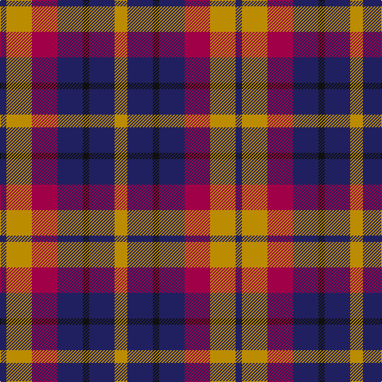

This page is one **sett** — a single exact thread-count. It belongs to the [tartan](/tartans/dy2dba4k1dba4r4dy4db1/)
(the same proportion at any scale), whose colour order is pattern [BYRBKBY](/stripes/byrbkby/).

Sourced from tartans-authority.  It is a [7 stripe tartan](/stripes/stripes7/).

Original link http://www.tartansauthority.com/tartan-ferret/display/3085/

## Thread count
DY/16 DBa32 K8 DBa32 R32 DY32 DB/8

## Palette
Each colour and the base-6 reference it is a variant of.

| Colour | Shade | Base |
|---|---|---|
| DB | <code style="background-color:#202060;">#202060</code> `oklch(28.9% 0.111 276.9)` <small>#202060</small> | B <code style="background-color:#2A418A;">#2A418A</code> |
| DBa | <code style="background-color:#202060;">#202060</code> `oklch(28.9% 0.111 276.9)` <small>#202060</small> | B <code style="background-color:#2A418A;">#2A418A</code> |
| DY | <code style="background-color:#BC8C00;">#BC8C00</code> `oklch(66.8% 0.137 84.1)` <small>#BC8C00</small> | Y <code style="background-color:#F2BF00;">#F2BF00</code> |
| K | <code style="background-color:#101010;">#101010</code> `oklch(17.3% 0.000 89.9)` <small>#101010</small> | K <code style="background-color:#000000;">#000000</code> |
| R | <code style="background-color:#A00048;">#A00048</code> `oklch(45.4% 0.182 5.3)` <small>#A00048</small> | R <code style="background-color:#CC0000;">#CC0000</code> |

# Sample pattern

## Nearest tartans

The nearest existing variants by ΔTartan distance, with this tartan at the top so the swatches line up against it.

ΔTartan

Tartan

Sett

—

<a href="/ttd/edit/#slug=lo2db4k1db4m4lo4db1~x8">Isle of Gigha (District)</a> <a class="nn-out" href="/setts/s7/lo2db4k1db4m4lo4db1~x8/" title="open its dictionary page">↗</a>

0.92

<a href="/ttd/edit/#slug=r3t4k11r11g11do3r3~x4">Stewart /Stuart- Fragment Cf 1452 &amp; 1445</a> <a class="nn-out" href="/setts/s7/r3t4k11r11g11do3r3~x4/" title="open its dictionary page">↗</a>

0.96

<a href="/ttd/edit/#slug=r14w5dt20k10t10dt10~x2">Gandy of Myrton (Name)</a> <a class="nn-out" href="/setts/s6/r14w5dt20k10t10dt10~x2/" title="open its dictionary page">↗</a>

1.16

<a href="/ttd/edit/#slug=m5db1m3db1m5db4g3k3g3lo2~x4">MacGaugh (Name)</a> <a class="nn-out" href="/setts/s10/m5db1m3db1m5db4g3k3g3lo2~x4/" title="open its dictionary page">↗</a>

1.18

<a href="/ttd/edit/#slug=db16r14g16ly3g16r14db16w3~x2">Forrester (James) (Personal)</a> <a class="nn-out" href="/setts/s8/db16r14g16ly3g16r14db16w3~x2/" title="open its dictionary page">↗</a>

1.23

<a href="/ttd/edit/#slug=ly2g2db8r4db8r9lb2~x4">Feis An Eilein (Corporate)</a> <a class="nn-out" href="/setts/s7/ly2g2db8r4db8r9lb2~x4/" title="open its dictionary page">↗</a>

1.24

<a href="/ttd/edit/#slug=dt6lo2r6lb3k2lo6dt10r2dt3r2~x4">Commonwealth</a> <a class="nn-out" href="/setts/s10/dt6lo2r6lb3k2lo6dt10r2dt3r2~x4/" title="open its dictionary page">↗</a>

1.24

<a href="/ttd/edit/#slug=db12w4r12w5k4o12db20r4db5r4~x2">Commonwealth</a> <a class="nn-out" href="/setts/s10/db12w4r12w5k4o12db20r4db5r4~x2/" title="open its dictionary page">↗</a>

1.26

<a href="/ttd/edit/#slug=r2k4r2k4db1lb1db4r1~x4">MacKean Red (Personal)</a> <a class="nn-out" href="/setts/s8/r2k4r2k4db1lb1db4r1~x4/" title="open its dictionary page">↗</a>

1.28

<a href="/ttd/edit/#slug=k4n4lo1n4r4db4w1~x8">Blackdown Hills Corporate Tartan Tartan Number: 6711. Earliest known date: 1991 The Blackdown Hills on the Devon/Somerset border were designated as an Area of Outstanding Natural Beauty (AONB) in 1991 and this tartan was designed to celebrate that occasion. Designed at Coldharbour Mill at Cullompton in Devon. See products available Copyright © Blair Urquhart, Comrie, 2015</a> <a class="nn-out" href="/setts/s7/k4n4lo1n4r4db4w1~x8/" title="open its dictionary page">↗</a>

1.30

<a href="/ttd/edit/#slug=db9r12dg9db5w2~x4">Battle of Prestonpans (1745) Herit</a> <a class="nn-out" href="/setts/s5/db9r12dg9db5w2~x4/" title="open its dictionary page">↗</a>

## Neighbour map

Every grey dot is one of 14299 variants placed by the first two principal components of the ΔTartan feature space (44% of its variance). Red is this tartan; blue dots are its nearest — click one to open its page.

<svg viewBox="0 0 640 380" role="img" style="max-width:100%;height:auto;border:1px solid #e0e0e0;border-radius:4px;display:block" xmlns="http://www.w3.org/2000/svg"><image href="/nn/cloud.v1.png" width="640" height="380"/><a href="/setts/s7/r3t4k11r11g11do3r3~x4/"><circle cx="97.6" cy="233.3" r="4" fill="#3465a4"><title>Stewart /Stuart- Fragment Cf 1452 &amp; 1445</title></circle></a><a href="/setts/s6/r14w5dt20k10t10dt10~x2/"><circle cx="104.1" cy="267.0" r="4" fill="#3465a4"><title>Gandy of Myrton (Name)</title></circle></a><a href="/setts/s10/m5db1m3db1m5db4g3k3g3lo2~x4/"><circle cx="138.1" cy="241.8" r="4" fill="#3465a4"><title>MacGaugh (Name)</title></circle></a><a href="/setts/s8/db16r14g16ly3g16r14db16w3~x2/"><circle cx="93.0" cy="239.6" r="4" fill="#3465a4"><title>Forrester (James) (Personal)</title></circle></a><a href="/setts/s7/ly2g2db8r4db8r9lb2~x4/"><circle cx="137.6" cy="212.8" r="4" fill="#3465a4"><title>Feis An Eilein (Corporate)</title></circle></a><a href="/setts/s10/dt6lo2r6lb3k2lo6dt10r2dt3r2~x4/"><circle cx="149.7" cy="209.7" r="4" fill="#3465a4"><title>Commonwealth</title></circle></a><a href="/setts/s10/db12w4r12w5k4o12db20r4db5r4~x2/"><circle cx="147.1" cy="202.8" r="4" fill="#3465a4"><title>Commonwealth</title></circle></a><a href="/setts/s8/r2k4r2k4db1lb1db4r1~x4/"><circle cx="156.7" cy="253.4" r="4" fill="#3465a4"><title>MacKean Red (Personal)</title></circle></a><a href="/setts/s7/k4n4lo1n4r4db4w1~x8/"><circle cx="59.1" cy="244.9" r="4" fill="#3465a4"><title>Blackdown Hills Corporate Tartan Tartan Number: 6711. Earliest known date: 1991 The Blackdown Hills on the Devon/Somerset border were designated as an Area of Outstanding Natural Beauty (AONB) in 1991 and this tartan was designed to celebrate that occasion. Designed at Coldharbour Mill at Cullompton in Devon. See products available Copyright © Blair Urquhart, Comrie, 2015</title></circle></a><a href="/setts/s5/db9r12dg9db5w2~x4/"><circle cx="150.6" cy="262.8" r="4" fill="#3465a4"><title>Battle of Prestonpans (1745) Herit</title></circle></a><circle cx="115.5" cy="249.7" r="5" fill="#c00000"/></svg>

ID: /setts/s7/lo2db4k1db4m4lo4db1~x8/
