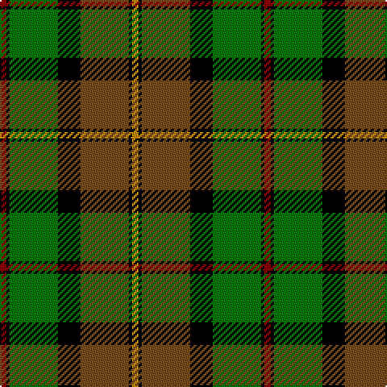

**Bands:** [RKGKGKY](/stripes/rkgkgky/) · **Stripes:** [R K G K Y K LO](/stripes/stripes7/) R K G K Y K LO

This was sourced from register-of-tartans.  It is a [7 band tartan](/bands/bands7/).

Original link https://www.tartanregister.gov.uk/tartanDetails.aspx?ref=4276

## Register references

External register numbers recorded for this tartan.

- Scottish Register of Tartans: [4276](https://www.tartanregister.gov.uk/tartanDetails.aspx?ref=4276)
- Scottish Tartans Authority (ITI): 4395

## Thread count
DR/4 K2 G30 K14 T30 K2 DY/4

## Palette
Each colour and its ΔE from the base-6 reference it is a variant of.

| Colour | Shade | Base | ΔE (OKLab) |
|---|---|---|---|
| DR | <code style="background-color:#8C0000;">#8C0000</code> `#8C0000` | R <code style="background-color:#CC0000;">#CC0000</code> | 0.14 |
| DY | <code style="background-color:#C88C00;">#C88C00</code> `#C88C00` | Y <code style="background-color:#F2BF00;">#F2BF00</code> | 0.15 |
| G | <code style="background-color:#007800;">#007800</code> `#007800` | G <code style="background-color:#006100;">#006100</code> | 0.07 |
| K | <code style="background-color:#000000;">#000000</code> `#000000` | K <code style="background-color:#000000;">#000000</code> | 0.00 |
| T | <code style="background-color:#784C18;">#784C18</code> `#784C18` | G <code style="background-color:#006100;">#006100</code> | 0.15 |

# Sample pattern

## Nearest tartans

The nearest existing variants by ΔTartan distance.

1. [MacLamroc](/setts/s6/ly4k1dg16k16r1w3~x2/) — ΔT 1.02
1. [Hamilton of Brandon](/setts/s10/ly3k1g7w1k7lo16k7w1g7k1~x4/) — ΔT 1.16
1. [Cavan](/setts/s10/k3r9k5dr9o3dr9k5g24k2o3~x2/) — ΔT 1.18
1. [St Lawrence Trade](/setts/s8/dg2dr13dg11ly5dr1o21dg2o1~x2/) — ΔT 1.19
1. [Garvock (2015)](/setts/s8/g28t3g3k10r2k10r20ly4~x2/) — ΔT 1.21
1. [Dalveen (Fashion)](/setts/s8/k3g2k21w11g1y21g2y3~x2/) — ΔT 1.29
1. [Blackstock Hunting](/setts/s7/k2r7k6g12ly1g1k2~x4/) — ΔT 1.29
1. [Kilkenny](/setts/s7/m5dg27o2g25ly7dg3m3~x2/) — ΔT 1.32
1. [Tait #1](/setts/s8/ly5k2g28k19g4db19k2r5~x2/) — ΔT 1.32
1. [McWilliams Wedding (Personal)](/setts/s9/g2n1k1n14ly2n1k12g10r2~x2/) — ΔT 1.35

## Neighbour map

Every grey dot is one of 14313 variants placed by the first two principal components of the ΔTartan feature space (44% of its variance). Red is this tartan; blue dots are its nearest — click one to open its page.

<svg viewBox="0 0 640 380" role="img" style="max-width:100%;height:auto;border:1px solid #e0e0e0;border-radius:4px;display:block" xmlns="http://www.w3.org/2000/svg"><image href="/nn/cloud.v1.png" width="640" height="380"/><a href="/setts/s6/ly4k1dg16k16r1w3~x2/"><circle cx="212.8" cy="162.8" r="4" fill="#3465a4"><title>MacLamroc</title></circle></a><a href="/setts/s10/ly3k1g7w1k7lo16k7w1g7k1~x4/"><circle cx="144.7" cy="143.5" r="4" fill="#3465a4"><title>Hamilton of Brandon</title></circle></a><a href="/setts/s10/k3r9k5dr9o3dr9k5g24k2o3~x2/"><circle cx="132.1" cy="158.7" r="4" fill="#3465a4"><title>Cavan</title></circle></a><a href="/setts/s8/dg2dr13dg11ly5dr1o21dg2o1~x2/"><circle cx="208.4" cy="140.5" r="4" fill="#3465a4"><title>St Lawrence Trade</title></circle></a><a href="/setts/s8/g28t3g3k10r2k10r20ly4~x2/"><circle cx="164.2" cy="148.9" r="4" fill="#3465a4"><title>Garvock (2015)</title></circle></a><a href="/setts/s8/k3g2k21w11g1y21g2y3~x2/"><circle cx="198.4" cy="130.8" r="4" fill="#3465a4"><title>Dalveen (Fashion)</title></circle></a><a href="/setts/s7/k2r7k6g12ly1g1k2~x4/"><circle cx="229.6" cy="195.1" r="4" fill="#3465a4"><title>Blackstock Hunting</title></circle></a><a href="/setts/s7/m5dg27o2g25ly7dg3m3~x2/"><circle cx="202.8" cy="165.0" r="4" fill="#3465a4"><title>Kilkenny</title></circle></a><a href="/setts/s8/ly5k2g28k19g4db19k2r5~x2/"><circle cx="184.4" cy="172.0" r="4" fill="#3465a4"><title>Tait #1</title></circle></a><a href="/setts/s9/g2n1k1n14ly2n1k12g10r2~x2/"><circle cx="191.3" cy="159.9" r="4" fill="#3465a4"><title>McWilliams Wedding (Personal)</title></circle></a><circle cx="183.0" cy="163.0" r="5" fill="#c00000"/></svg>

ID: /setts/s7/lo2k1y15k7g15k1r2~x2/
