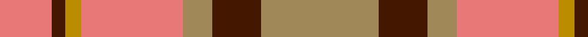
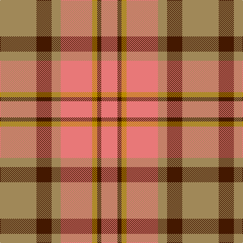

**Bands:** [RBYRYBY](/stripes/rbyryby/) · **Stripes:** [R DO LO R LO DO LO](/stripes/stripes7/) R DO LO R LO DO LO

This was sourced from register-of-tartans.  It is a [7 band tartan](/bands/bands7/).

Original link https://www.tartanregister.gov.uk/tartanDetails.aspx?ref=2803

## Attestations

This cloth appears in 2 source records; the oldest owns this page.

- 01/01/1999 — Manhattan Ethnic (register-of-tartans, [record](https://www.tartanregister.gov.uk/tartanDetails.aspx?ref=2803))
- 1999 — Manhattan Ethnic (Fashion) (tartans-authority, [record](http://www.tartansauthority.com/tartan-ferret/display/2604/))

## Register references

External register numbers recorded for this tartan.

- Scottish Register of Tartans: [2803](https://www.tartanregister.gov.uk/tartanDetails.aspx?ref=2803)
- Scottish Tartans Authority (ITI): 2604
- Scottish Tartans World Register: 2604

## Thread count
LT/72 DR30 LT18 LR62 DY10 DR8 LR/32

## Palette
Each colour and its ΔE from the base-6 reference it is a variant of.

| Colour | Shade | Base | ΔE (OKLab) |
|---|---|---|---|
| DR | <code style="background-color:#441800;">#441800</code> `#441800` | B <code style="background-color:#2A418A;">#2A418A</code> | 0.23 |
| DY | <code style="background-color:#BC8C00;">#BC8C00</code> `#BC8C00` | Y <code style="background-color:#F2BF00;">#F2BF00</code> | 0.16 |
| LR | <code style="background-color:#E87878;">#E87878</code> `#E87878` | R <code style="background-color:#CC0000;">#CC0000</code> | 0.19 |
| LT | <code style="background-color:#A08858;">#A08858</code> `#A08858` | Y <code style="background-color:#F2BF00;">#F2BF00</code> | 0.21 |

# Sample pattern

## Nearest tartans

The nearest existing variants by ΔTartan distance.

1. [Manhattan Ethnic](/setts/s7/o72dr30o18lr62y10dr7lr32/) — ΔT 1.03
1. [Plaid Wine](/setts/s6/r24n5o9n2o9lb9~x4/) — ΔT 1.09
1. [St Andrews](/setts/s8/r11db1r11db1w10o11db1o11~x2/) — ΔT 1.11
1. [Sydney (Nova Scotia) (District)](/setts/s8/o16k4w2k4o6o11o2o16~x2/) — ΔT 1.13
1. [Unidentified Sett](/setts/s9/lr2dy1r10o12dy10lr6r10dy1lr2~x2/) — ΔT 1.23
1. [Moray of Abercairney](/setts/s6/r8r1g4r1g1t2~x2/) — ΔT 1.24
1. [Moray of Abercairney](/setts/s5/r8r1g4r1db4~x2/) — ΔT 1.38
1. [Loch Rannoch #2](/setts/s8/dy24g2dy5o14g2o5lo17dy2~x2/) — ΔT 1.42
1. [Moray of Abercairney](/setts/s6/r8r1dg4r1dg1t2~x2/) — ΔT 1.45
1. [MacNab #2](/setts/s6/g1m1g7m4r7m1~x4/) — ΔT 1.53

## Neighbour map

Every grey dot is one of 14299 variants placed by the first two principal components of the ΔTartan feature space (44% of its variance). Red is this tartan; blue dots are its nearest — click one to open its page.

<svg viewBox="0 0 640 380" role="img" style="max-width:100%;height:auto;border:1px solid #e0e0e0;border-radius:4px;display:block" xmlns="http://www.w3.org/2000/svg"><image href="/nn/cloud.v1.png" width="640" height="380"/><a href="/setts/s7/o72dr30o18lr62y10dr7lr32/"><circle cx="227.1" cy="203.8" r="4" fill="#3465a4"><title>Manhattan Ethnic</title></circle></a><a href="/setts/s6/r24n5o9n2o9lb9~x4/"><circle cx="234.3" cy="206.4" r="4" fill="#3465a4"><title>Plaid Wine</title></circle></a><a href="/setts/s8/r11db1r11db1w10o11db1o11~x2/"><circle cx="217.7" cy="198.1" r="4" fill="#3465a4"><title>St Andrews</title></circle></a><a href="/setts/s8/o16k4w2k4o6o11o2o16~x2/"><circle cx="244.3" cy="213.2" r="4" fill="#3465a4"><title>Sydney (Nova Scotia) (District)</title></circle></a><a href="/setts/s9/lr2dy1r10o12dy10lr6r10dy1lr2~x2/"><circle cx="214.9" cy="191.1" r="4" fill="#3465a4"><title>Unidentified Sett</title></circle></a><a href="/setts/s6/r8r1g4r1g1t2~x2/"><circle cx="278.1" cy="214.5" r="4" fill="#3465a4"><title>Moray of Abercairney</title></circle></a><a href="/setts/s5/r8r1g4r1db4~x2/"><circle cx="242.3" cy="235.1" r="4" fill="#3465a4"><title>Moray of Abercairney</title></circle></a><a href="/setts/s8/dy24g2dy5o14g2o5lo17dy2~x2/"><circle cx="268.8" cy="188.2" r="4" fill="#3465a4"><title>Loch Rannoch #2</title></circle></a><a href="/setts/s6/r8r1dg4r1dg1t2~x2/"><circle cx="271.5" cy="208.2" r="4" fill="#3465a4"><title>Moray of Abercairney</title></circle></a><a href="/setts/s6/g1m1g7m4r7m1~x4/"><circle cx="261.6" cy="251.4" r="4" fill="#3465a4"><title>MacNab #2</title></circle></a><circle cx="245.0" cy="220.1" r="5" fill="#c00000"/></svg>

ID: /setts/s7/lo36do15lo9r31lo5do4r16~x2/
