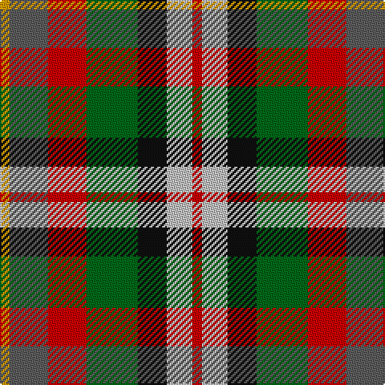

**Bands:** [RWKGRBY](/stripes/rwkgrby/) · **Stripes:** [R LB K G R N LO](/stripes/stripes7/) R LB K G R N LO

This was sourced from tartans-authority.  It is a [7 band tartan](/bands/bands7/).

Original link http://www.tartansauthority.com/tartan-ferret/display/3033/

## Attestations

This cloth appears in 2 source records; the oldest owns this page.

- pre 2002 — Alabama (Fashion) (tartans-authority, [record](http://www.tartansauthority.com/tartan-ferret/display/3033/))
- undated — Alabama Fancy Tartan Tartan Number: 3033. Earliest known date: 2002 No details known possibly a fashion tartan. See products available Copyright © Blair Urquhart, Comrie, 2015 (house-of-tartan, [record](http://www.house-of-tartan.scotland.net/house/TartanViewjs.asp?colr=Def&tnam=3033))

## Thread count
DY/6 N24 R24 G32 K18 Na16 R/6

## Palette
Each colour and its ΔE from the base-6 reference it is a variant of.

| Colour | Shade | Base | ΔE (OKLab) |
|---|---|---|---|
| DY | <code style="background-color:#D09800;">#D09800</code> `#D09800` | Y <code style="background-color:#F2BF00;">#F2BF00</code> | 0.12 |
| G | <code style="background-color:#006818;">#006818</code> `#006818` | G <code style="background-color:#006100;">#006100</code> | 0.02 |
| K | <code style="background-color:#101010;">#101010</code> `#101010` | K <code style="background-color:#000000;">#000000</code> | 0.17 |
| N | <code style="background-color:#5C5C5C;">#5C5C5C</code> `#5C5C5C` | B <code style="background-color:#2A418A;">#2A418A</code> | 0.15 |
| Na | <code style="background-color:#C0C0C0;">#C0C0C0</code> `#C0C0C0` | W <code style="background-color:#F7F7F7;">#F7F7F7</code> | 0.17 |
| R | <code style="background-color:#C80000;">#C80000</code> `#C80000` | R <code style="background-color:#CC0000;">#CC0000</code> | 0.01 |

# Sample pattern

## Nearest tartans

The nearest existing variants by ΔTartan distance.

1. [Kilkenny County Crest (Fashion)](/setts/s8/lo6r8k4w6y16k13lr19k5~x2/) — ΔT 0.88
1. [Mekos, The](/setts/s6/dy19g23ly3db15r11w5~x2/) — ΔT 0.94
1. [Isle of Arran (Personal)](/setts/s9/lr1db3g3lr1dr3r1dr3lo4r1~x4/) — ΔT 1.02
1. [Pride, The Tartan of](/setts/s6/r8lo4ly3g6t6dp1~x5/) — ΔT 1.11
1. [Devon Rural Skills Trust](/setts/s8/w5y4b1y4r4b1dg4ly1~x2/) — ΔT 1.16
1. [Loch Fyne](/setts/s6/r1dy3g5lo5dt5t1~x4/) — ΔT 1.23
1. [Tipperary County Crest (Fashion)](/setts/s9/r10lr36k24r30lo8k16w18db16lo9/) — ΔT 1.26
1. [Glen Chalmadale](/setts/s9/g13w2g10k5r13k3r5dt15o5~x2/) — ΔT 1.28
1. [Somerset](/setts/s9/g8y8t7r5o2k2o2k2o2~x2/) — ΔT 1.32
1. [Wombles 7 (Corporate)](/setts/s9/lb3g6lb1db1r5db2o5db1lb3~x4/) — ΔT 1.32

## Neighbour map

Every grey dot is one of 14313 variants placed by the first two principal components of the ΔTartan feature space (44% of its variance). Red is this tartan; blue dots are its nearest — click one to open its page.

<svg viewBox="0 0 640 380" role="img" style="max-width:100%;height:auto;border:1px solid #e0e0e0;border-radius:4px;display:block" xmlns="http://www.w3.org/2000/svg"><image href="/nn/cloud.v1.png" width="640" height="380"/><a href="/setts/s8/lo6r8k4w6y16k13lr19k5~x2/"><circle cx="20.8" cy="203.1" r="4" fill="#3465a4"><title>Kilkenny County Crest (Fashion)</title></circle></a><a href="/setts/s6/dy19g23ly3db15r11w5~x2/"><circle cx="70.5" cy="205.8" r="4" fill="#3465a4"><title>Mekos, The</title></circle></a><a href="/setts/s9/lr1db3g3lr1dr3r1dr3lo4r1~x4/"><circle cx="16.3" cy="210.5" r="4" fill="#3465a4"><title>Isle of Arran (Personal)</title></circle></a><a href="/setts/s6/r8lo4ly3g6t6dp1~x5/"><circle cx="64.9" cy="208.3" r="4" fill="#3465a4"><title>Pride, The Tartan of</title></circle></a><a href="/setts/s8/w5y4b1y4r4b1dg4ly1~x2/"><circle cx="44.9" cy="202.8" r="4" fill="#3465a4"><title>Devon Rural Skills Trust</title></circle></a><a href="/setts/s6/r1dy3g5lo5dt5t1~x4/"><circle cx="48.1" cy="236.1" r="4" fill="#3465a4"><title>Loch Fyne</title></circle></a><a href="/setts/s9/r10lr36k24r30lo8k16w18db16lo9/"><circle cx="14.0" cy="200.6" r="4" fill="#3465a4"><title>Tipperary County Crest (Fashion)</title></circle></a><a href="/setts/s9/g13w2g10k5r13k3r5dt15o5~x2/"><circle cx="91.2" cy="197.0" r="4" fill="#3465a4"><title>Glen Chalmadale</title></circle></a><a href="/setts/s9/g8y8t7r5o2k2o2k2o2~x2/"><circle cx="14.0" cy="210.3" r="4" fill="#3465a4"><title>Somerset</title></circle></a><a href="/setts/s9/lb3g6lb1db1r5db2o5db1lb3~x4/"><circle cx="51.1" cy="199.1" r="4" fill="#3465a4"><title>Wombles 7 (Corporate)</title></circle></a><circle cx="25.7" cy="217.4" r="5" fill="#c00000"/></svg>

ID: /setts/s7/lo3n12r12g16k9lb8r3~x2/
