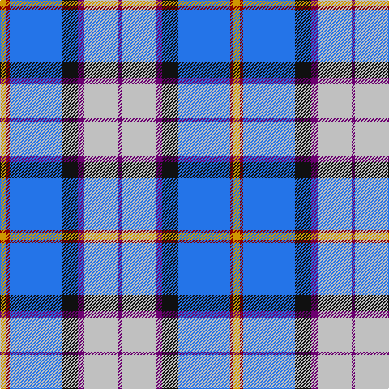

This page is one **sett** — a single exact thread-count. It belongs to the [tartan](/tartans/lo4r2b32k10dp4lb21dp2/)
(the same proportion at any scale), whose colour order is pattern [BWBKBRY](/stripes/bwbkbry/).

Sourced from register-of-tartans.  It is a [7 stripe tartan](/stripes/stripes7/).

Original link https://www.tartanregister.gov.uk/tartanDetails.aspx?ref=938

## Also known as

This cloth is also recorded under:

- Dignan School of Dancing

3 attestations — the source records this cloth was collapsed from (oldest owns this page)

<ul>
<li>01/01/1997 — Dignan School of Dancing (register-of-tartans, <a href="https://www.tartanregister.gov.uk/tartanDetails.aspx?ref=938">record</a>)</li>
<li>1997 — Dignan School of Dancing (Corporate) (tartans-authority, <a href="http://www.tartansauthority.com/tartan-ferret/display/2358/">record</a>)</li>
<li>undated — Dignan Corporate School Tartan Tartan Number: 2358. Earliest known date: 1997 For a Mrs Pam Dignan who owns the Dignan School of Dancing. See products available Copyright © Blair Urquhart, Comrie, 2015 (house-of-tartan, <a href="http://www.house-of-tartan.scotland.net/house/TartanViewjs.asp?colr=Def&tnam=2358">record</a>)</li>
</ul>

## Register references

External register numbers recorded for this tartan.

- Scottish Register of Tartans: [938](https://www.tartanregister.gov.uk/tartanDetails.aspx?ref=938)
- Scottish Tartans Authority (ITI): 2358
- Scottish Tartans World Register: 2358

## Thread count
DY/8 DR4 B64 K20 P8 N42 P/4

## Palette

Palette: <strong>Tartan Register</strong> <small style="color:#888">(5 of 6 colours)</small>
<table><thead><tr><th>Colour</th><th>Threads</th><th>Shade</th><th>Base</th><th>OKLCh</th></tr></thead><tbody><tr><td>DY/</td><td style="text-align:right;font-variant-numeric:tabular-nums">8</td><td><code style="background-color:#D09800;">#D09800</code> <small style="color:#888">#D09800</small></td><td>Y <code style="background-color:#F2BF00;">#F2BF00</code></td><td><small style="color:#888">oklch(71.4% 0.147 82.1)</small></td></tr><tr><td>DR</td><td style="text-align:right;font-variant-numeric:tabular-nums">4</td><td><code style="background-color:#880000;">#880000</code> <small style="color:#888">#880000</small></td><td>R <code style="background-color:#CC0000;">#CC0000</code></td><td><small style="color:#888">oklch(39.4% 0.162 29.2)</small></td></tr><tr><td>B</td><td style="text-align:right;font-variant-numeric:tabular-nums">64</td><td><code style="background-color:#2474E8;">#2474E8</code> <small style="color:#888">#2474E8</small></td><td>B <code style="background-color:#2A418A;">#2A418A</code></td><td><small style="color:#888">oklch(57.8% 0.192 258.7)</small></td></tr><tr><td>K</td><td style="text-align:right;font-variant-numeric:tabular-nums">20</td><td><code style="background-color:#101010;">#101010</code> <small style="color:#888">#101010</small></td><td>K <code style="background-color:#000000;">#000000</code></td><td><small style="color:#888">oklch(17.3% 0.000 89.9)</small></td></tr><tr><td>P</td><td style="text-align:right;font-variant-numeric:tabular-nums">8</td><td><code style="background-color:#6C0070;">#6C0070</code> <small style="color:#888">#6C0070</small></td><td>B <code style="background-color:#2A418A;">#2A418A</code></td><td><small style="color:#888">oklch(37.6% 0.174 326.5)</small></td></tr><tr><td>N</td><td style="text-align:right;font-variant-numeric:tabular-nums">42</td><td><code style="background-color:#C0C0C0;">#C0C0C0</code> <small style="color:#888">#C0C0C0</small></td><td>W <code style="background-color:#F7F7F7;">#F7F7F7</code></td><td><small style="color:#888">oklch(80.8% 0.000 89.9)</small></td></tr><tr><td>P/</td><td style="text-align:right;font-variant-numeric:tabular-nums">4</td><td><code style="background-color:#6C0070;">#6C0070</code> <small style="color:#888">#6C0070</small></td><td>B <code style="background-color:#2A418A;">#2A418A</code></td><td><small style="color:#888">oklch(37.6% 0.174 326.5)</small></td></tr></tbody></table>

# Sample pattern

## Nearest tartans

The nearest existing variants by ΔTartan distance, with this tartan at the top so the swatches line up against it.

ΔTartan

Tartan

Sett

—

<a href="/ttd/edit/#slug=lo4r2b32k10dp4lb21dp2~x2">Dignan School of Dancing</a> <a class="nn-out" href="/setts/s7/lo4r2b32k10dp4lb21dp2~x2/" title="open its dictionary page">↗</a>

0.80

<a href="/ttd/edit/#slug=db4w3db17lb10k1dp5k1lb6dg3~x2">Queen Margaret University</a> <a class="nn-out" href="/setts/s9/db4w3db17lb10k1dp5k1lb6dg3~x2/" title="open its dictionary page">↗</a>

0.87

<a href="/ttd/edit/#slug=lr5lb3lb7lr5lb27b8dt43w3lb3">Queensferry High (School)</a> <a class="nn-out" href="/setts/s9/lr5lb3lb7lr5lb27b8dt43w3lb3/" title="open its dictionary page">↗</a>

0.98

<a href="/ttd/edit/#slug=r3dt25k6lb20ly2lb2w3~x2">Madras College (Corporate)</a> <a class="nn-out" href="/setts/s7/r3dt25k6lb20ly2lb2w3~x2/" title="open its dictionary page">↗</a>

1.01

<a href="/ttd/edit/#slug=r3lr25db6db3r2t5db18w3~x2">Fulbright Foundation</a> <a class="nn-out" href="/setts/s8/r3lr25db6db3r2t5db18w3~x2/" title="open its dictionary page">↗</a>

1.05

<a href="/ttd/edit/#slug=b36db5g5w2r4w2m9w22~x2">Jubilee, South Canterbury Centre Piping &amp; Dancing Association</a> <a class="nn-out" href="/setts/s8/b36db5g5w2r4w2m9w22~x2/" title="open its dictionary page">↗</a>

1.12

<a href="/ttd/edit/#slug=db1lb12p6w1ly3db14b18w1~x2">Ancient Gathering</a> <a class="nn-out" href="/setts/s8/db1lb12p6w1ly3db14b18w1~x2/" title="open its dictionary page">↗</a>

1.14

<a href="/ttd/edit/#slug=g5m2g2m9k9lr9db30w5~x2">Alexander of Menstry</a> <a class="nn-out" href="/setts/s8/g5m2g2m9k9lr9db30w5~x2/" title="open its dictionary page">↗</a>

1.15

<a href="/ttd/edit/#slug=ly2r1t16k5p2w11p1~x4">Dignan</a> <a class="nn-out" href="/setts/s7/ly2r1t16k5p2w11p1~x4/" title="open its dictionary page">↗</a>

1.18

<a href="/ttd/edit/#slug=t5ly5db12g1db1r1db1w2~x4">Hodgkinson</a> <a class="nn-out" href="/setts/s8/t5ly5db12g1db1r1db1w2~x4/" title="open its dictionary page">↗</a>

1.20

<a href="/ttd/edit/#slug=db4r2db31k10g4w21g2~x2">Sinclair Dress (Dance)</a> <a class="nn-out" href="/setts/s7/db4r2db31k10g4w21g2~x2/" title="open its dictionary page">↗</a>

## Neighbour map

Every grey dot is one of 14299 variants placed by the first two principal components of the ΔTartan feature space (44% of its variance). Red is this tartan; blue dots are its nearest — click one to open its page.

<svg viewBox="0 0 640 380" role="img" style="max-width:100%;height:auto;border:1px solid #e0e0e0;border-radius:4px;display:block" xmlns="http://www.w3.org/2000/svg"><image href="/nn/cloud.v1.png" width="640" height="380"/><a href="/setts/s9/db4w3db17lb10k1dp5k1lb6dg3~x2/"><circle cx="169.7" cy="127.5" r="4" fill="#3465a4"><title>Queen Margaret University</title></circle></a><a href="/setts/s9/lr5lb3lb7lr5lb27b8dt43w3lb3/"><circle cx="196.9" cy="122.1" r="4" fill="#3465a4"><title>Queensferry High (School)</title></circle></a><a href="/setts/s7/r3dt25k6lb20ly2lb2w3~x2/"><circle cx="172.0" cy="140.0" r="4" fill="#3465a4"><title>Madras College (Corporate)</title></circle></a><a href="/setts/s8/r3lr25db6db3r2t5db18w3~x2/"><circle cx="153.2" cy="133.5" r="4" fill="#3465a4"><title>Fulbright Foundation</title></circle></a><a href="/setts/s8/b36db5g5w2r4w2m9w22~x2/"><circle cx="189.3" cy="113.5" r="4" fill="#3465a4"><title>Jubilee, South Canterbury Centre Piping &amp; Dancing Association</title></circle></a><a href="/setts/s8/db1lb12p6w1ly3db14b18w1~x2/"><circle cx="125.4" cy="130.4" r="4" fill="#3465a4"><title>Ancient Gathering</title></circle></a><a href="/setts/s8/g5m2g2m9k9lr9db30w5~x2/"><circle cx="164.1" cy="135.0" r="4" fill="#3465a4"><title>Alexander of Menstry</title></circle></a><a href="/setts/s7/ly2r1t16k5p2w11p1~x4/"><circle cx="159.9" cy="115.8" r="4" fill="#3465a4"><title>Dignan</title></circle></a><a href="/setts/s8/t5ly5db12g1db1r1db1w2~x4/"><circle cx="203.2" cy="131.8" r="4" fill="#3465a4"><title>Hodgkinson</title></circle></a><a href="/setts/s7/db4r2db31k10g4w21g2~x2/"><circle cx="213.9" cy="143.1" r="4" fill="#3465a4"><title>Sinclair Dress (Dance)</title></circle></a><circle cx="178.3" cy="128.5" r="5" fill="#c00000"/></svg>

ID: /setts/s7/lo4r2b32k10dp4lb21dp2~x2/
