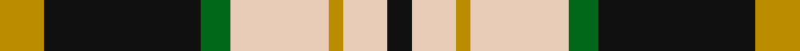

In pattern [KWYWGKY](/stripes/kwywgky/).

This was sourced from tartans-authority.  It is a [7 stripe tartan](/stripes/stripes7/).

Original link http://www.tartansauthority.com/tartan-ferret/display/10782/

## Thread count
DY/18 K64 G12 LR40 DY6 LR18 K/10

## Palette
Each colour and its ΔE from the base-6 reference it is a variant of.

| Colour | Shade | Base | ΔE (OKLab) |
|---|---|---|---|
| DY | <code style="background-color:#BC8C00;">#BC8C00</code> `#BC8C00` | Y <code style="background-color:#F2BF00;">#F2BF00</code> | 0.16 |
| G | <code style="background-color:#006818;">#006818</code> `#006818` | G <code style="background-color:#006100;">#006100</code> | 0.02 |
| K | <code style="background-color:#101010;">#101010</code> `#101010` | K <code style="background-color:#000000;">#000000</code> | 0.17 |
| LR | <code style="background-color:#E8CCB8;">#E8CCB8</code> `#E8CCB8` | W <code style="background-color:#F7F7F7;">#F7F7F7</code> | 0.12 |

# Sample pattern

## Nearest tartans

The nearest existing variants by ΔTartan distance.

1. [Thompson Camel Clan Tartan Tartan Number: 2421. Earliest known date: 1967 Designed by Scotty Thompson. It it a simple colour variation on the usual blue Thompson, but is often confused with the Burberry Check. See products available Copyright © Blair Urquhart, Comrie, 2015](/setts/s6/r2lo20k5w10k10w2~x2/) — ΔT 0.73
1. [Black and White Golf](/setts/s7/ly9k32g6w20ly3w9k5~x2/) — ΔT 0.76
1. [Thomson Camel](/setts/s6/r4lo30k6w13k13w3~x2/) — ΔT 0.77
1. [Thom(p)son camel](/setts/s6/r4o30k6w13k13w3~x2/) — ΔT 0.77
1. [Cape Breton (yellow stripes)](/setts/s7/ly6k6y30k8lb18k6ly3~x2/) — ΔT 0.83
1. [Bannockbane Light Tan](/setts/s8/k4ly2k13ly1w8lo13ly2lo4~x2/) — ΔT 0.88
1. [Thom(p)son, Grey](/setts/s6/r2y20k5w10k10r2~x2/) — ΔT 0.89
1. [Thompson Grey Family Tartan Tartan Number: 1611. Earliest known date: pre 2003 Designed for Lord Thomson of Fleet in 1958 based on a sample in the Moy Hall collection dating from the mid 19th century. The tartan is also suitable for MacTavishs and Thompsons, who claim descent from the Clan MacIntosh. See products available Copyright © Blair Urquhart, Comrie, 2015](/setts/s6/r2o20k5w10k10r2~x2/) — ΔT 0.95
1. [Bannockbane Grey #1](/setts/s8/k4ly2k13ly1w8o13ly2o4~x2/) — ΔT 0.98
1. [Thomson, Camel (Fashion)](/setts/s6/r4ly30k6w13k13w3~x2/) — ΔT 1.00

## Neighbour map

Every grey dot is one of 14299 variants placed by the first two principal components of the ΔTartan feature space (44% of its variance). Red is this tartan; blue dots are its nearest — click one to open its page.

<svg viewBox="0 0 640 380" role="img" style="max-width:100%;height:auto;border:1px solid #e0e0e0;border-radius:4px;display:block" xmlns="http://www.w3.org/2000/svg"><image href="/nn/cloud.v1.png" width="640" height="380"/><a href="/setts/s6/r2lo20k5w10k10w2~x2/"><circle cx="176.4" cy="189.9" r="4" fill="#3465a4"><title>Thompson Camel Clan Tartan Tartan Number: 2421. Earliest known date: 1967 Designed by Scotty Thompson. It it a simple colour variation on the usual blue Thompson, but is often confused with the Burberry Check. See products available Copyright © Blair Urquhart, Comrie, 2015</title></circle></a><a href="/setts/s7/ly9k32g6w20ly3w9k5~x2/"><circle cx="177.9" cy="173.4" r="4" fill="#3465a4"><title>Black and White Golf</title></circle></a><a href="/setts/s6/r4lo30k6w13k13w3~x2/"><circle cx="190.6" cy="186.9" r="4" fill="#3465a4"><title>Thomson Camel</title></circle></a><a href="/setts/s6/r4o30k6w13k13w3~x2/"><circle cx="185.0" cy="187.3" r="4" fill="#3465a4"><title>Thom(p)son camel</title></circle></a><a href="/setts/s7/ly6k6y30k8lb18k6ly3~x2/"><circle cx="148.1" cy="179.5" r="4" fill="#3465a4"><title>Cape Breton (yellow stripes)</title></circle></a><a href="/setts/s8/k4ly2k13ly1w8lo13ly2lo4~x2/"><circle cx="157.3" cy="168.1" r="4" fill="#3465a4"><title>Bannockbane Light Tan</title></circle></a><a href="/setts/s6/r2y20k5w10k10r2~x2/"><circle cx="164.9" cy="190.5" r="4" fill="#3465a4"><title>Thom(p)son, Grey</title></circle></a><a href="/setts/s6/r2o20k5w10k10r2~x2/"><circle cx="174.6" cy="192.3" r="4" fill="#3465a4"><title>Thompson Grey Family Tartan Tartan Number: 1611. Earliest known date: pre 2003 Designed for Lord Thomson of Fleet in 1958 based on a sample in the Moy Hall collection dating from the mid 19th century. The tartan is also suitable for MacTavishs and Thompsons, who claim descent from the Clan MacIntosh. See products available Copyright © Blair Urquhart, Comrie, 2015</title></circle></a><a href="/setts/s8/k4ly2k13ly1w8o13ly2o4~x2/"><circle cx="152.2" cy="166.9" r="4" fill="#3465a4"><title>Bannockbane Grey #1</title></circle></a><a href="/setts/s6/r4ly30k6w13k13w3~x2/"><circle cx="185.9" cy="183.4" r="4" fill="#3465a4"><title>Thomson, Camel (Fashion)</title></circle></a><circle cx="190.2" cy="179.7" r="5" fill="#c00000"/></svg>

ID: /setts/s7/lo9k32g6lb20lo3lb9k5~x2/
