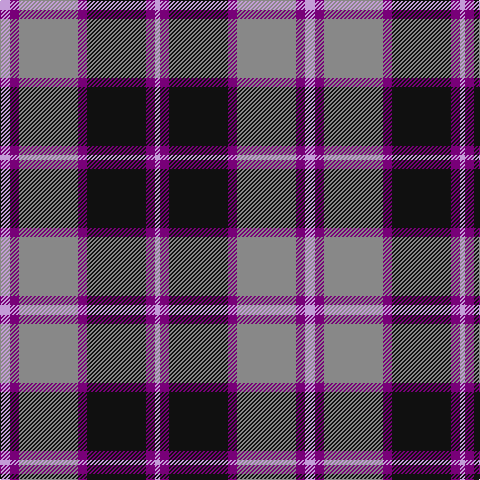

This page is one **sett** — a single exact thread-count. It belongs to the [tartan](/tartans/lp10dp9o59dp9k59dp9lp5/)
(the same proportion at any scale), whose colour order is pattern [WBKBRBW](/stripes/wbkbrbw/).

Sourced from register-of-tartans.  It is a [7 stripe tartan](/stripes/stripes7/).

Original link https://www.tartanregister.gov.uk/tartanDetails.aspx?ref=610

## Also known as

This cloth is also recorded under:

- Central Newcastle School

2 attestations — the source records this cloth was collapsed from (oldest owns this page)

<ul>
<li>01/01/2007 — Central Newcastle School (register-of-tartans, <a href="https://www.tartanregister.gov.uk/tartanDetails.aspx?ref=610">record</a>)</li>
<li>pre 2007 — Central Newcastle High (Corporate) (tartans-authority, <a href="http://www.tartansauthority.com/tartan-ferret/display/7210/">record</a>)</li>
</ul>

## Register references

External register numbers recorded for this tartan.

- Scottish Register of Tartans: [610](https://www.tartanregister.gov.uk/tartanDetails.aspx?ref=610)
- Scottish Tartans Authority (ITI): 7210

## Thread count
LP/10 P9 N59 P9 K59 P9 LP/5

## Palette

Palette: <strong>Tartan Register</strong>
<table><thead><tr><th>Colour</th><th>Threads</th><th>Shade</th><th>Base</th><th>OKLCh</th></tr></thead><tbody><tr><td>LP/</td><td style="text-align:right;font-variant-numeric:tabular-nums">10</td><td><code style="background-color:#C49CD8;">#C49CD8</code> <small style="color:#888">#C49CD8</small></td><td>W <code style="background-color:#F7F7F7;">#F7F7F7</code></td><td><small style="color:#888">oklch(75.0% 0.095 314.2)</small></td></tr><tr><td>P</td><td style="text-align:right;font-variant-numeric:tabular-nums">9</td><td><code style="background-color:#780078;">#780078</code> <small style="color:#888">#780078</small></td><td>B <code style="background-color:#2A418A;">#2A418A</code></td><td><small style="color:#888">oklch(40.2% 0.185 328.4)</small></td></tr><tr><td>N</td><td style="text-align:right;font-variant-numeric:tabular-nums">59</td><td><code style="background-color:#888888;">#888888</code> <small style="color:#888">#888888</small></td><td>R <code style="background-color:#CC0000;">#CC0000</code></td><td><small style="color:#888">oklch(62.7% 0.000 89.9)</small></td></tr><tr><td>P</td><td style="text-align:right;font-variant-numeric:tabular-nums">9</td><td><code style="background-color:#780078;">#780078</code> <small style="color:#888">#780078</small></td><td>B <code style="background-color:#2A418A;">#2A418A</code></td><td><small style="color:#888">oklch(40.2% 0.185 328.4)</small></td></tr><tr><td>K</td><td style="text-align:right;font-variant-numeric:tabular-nums">59</td><td><code style="background-color:#101010;">#101010</code> <small style="color:#888">#101010</small></td><td>K <code style="background-color:#000000;">#000000</code></td><td><small style="color:#888">oklch(17.3% 0.000 89.9)</small></td></tr><tr><td>P</td><td style="text-align:right;font-variant-numeric:tabular-nums">9</td><td><code style="background-color:#780078;">#780078</code> <small style="color:#888">#780078</small></td><td>B <code style="background-color:#2A418A;">#2A418A</code></td><td><small style="color:#888">oklch(40.2% 0.185 328.4)</small></td></tr><tr><td>LP/</td><td style="text-align:right;font-variant-numeric:tabular-nums">5</td><td><code style="background-color:#C49CD8;">#C49CD8</code> <small style="color:#888">#C49CD8</small></td><td>W <code style="background-color:#F7F7F7;">#F7F7F7</code></td><td><small style="color:#888">oklch(75.0% 0.095 314.2)</small></td></tr></tbody></table>

# Sample pattern

## Nearest tartans

The nearest existing variants by ΔTartan distance, with this tartan at the top so the swatches line up against it.

ΔTartan

Tartan

Sett

—

<a href="/ttd/edit/#slug=lp10dp9o59dp9k59dp9lp5">Central Newcastle School</a> <a class="nn-out" href="/setts/s7/lp10dp9o59dp9k59dp9lp5/" title="open its dictionary page">↗</a>

0.92

<a href="/ttd/edit/#slug=r12b18k1r4k1dg6k2~x2">Confederate</a> <a class="nn-out" href="/setts/s7/r12b18k1r4k1dg6k2~x2/" title="open its dictionary page">↗</a>

0.98

<a href="/ttd/edit/#slug=r12b18k1r4k1g6k2~x2">Confederate (Military)</a> <a class="nn-out" href="/setts/s7/r12b18k1r4k1g6k2~x2/" title="open its dictionary page">↗</a>

1.04

<a href="/ttd/edit/#slug=db1r1k8r1db1r1o8r1db1~x4">MacPherson Hunting Clan Tartan Tartan Number: 547. Earliest known date: 1850 This version also appears in Grants 'Tartans of the Clans of Scotland' (1886). D.W.Stewart said (in 1893) &quot;it was the earliest known to have been worn by the clan, and is reputed to have been worn in two forms; as a clan tartan with a white ground and as a hunting tartan with a grey ground&quot;. It appeared first in Smiths work of 1850, 'Authenticated Tartans of the Clans and Families of Scotland'. Originally recorded in the Urquhart Register as MacPherson of Pitmain. See products available Copyright © Blair Urquhart, Comrie, 2015</a> <a class="nn-out" href="/setts/s9/db1r1k8r1db1r1o8r1db1~x4/" title="open its dictionary page">↗</a>

1.05

<a href="/ttd/edit/#slug=b1r1k8r1b1r1o8r1b1~x4">MacPherson Htg</a> <a class="nn-out" href="/setts/s9/b1r1k8r1b1r1o8r1b1~x4/" title="open its dictionary page">↗</a>

1.06

<a href="/ttd/edit/#slug=ly7db32dp4db4dp8db4dp8g32ly3~x2">Children 1st (Corporate)</a> <a class="nn-out" href="/setts/s9/ly7db32dp4db4dp8db4dp8g32ly3~x2/" title="open its dictionary page">↗</a>

1.07

<a href="/ttd/edit/#slug=k2lr6r3lr6r3k20y30r2~x2">Hermitage Academy (Corporate)</a> <a class="nn-out" href="/setts/s8/k2lr6r3lr6r3k20y30r2~x2/" title="open its dictionary page">↗</a>

1.11

<a href="/ttd/edit/#slug=b11r1k8r1b1r1o8r1b1~x4">MacPherson Hunting</a> <a class="nn-out" href="/setts/s9/b11r1k8r1b1r1o8r1b1~x4/" title="open its dictionary page">↗</a>

1.11

<a href="/ttd/edit/#slug=r2b1db8b8o8b1o1~x2">Over Mountain</a> <a class="nn-out" href="/setts/s7/r2b1db8b8o8b1o1~x2/" title="open its dictionary page">↗</a>

1.15

<a href="/ttd/edit/#slug=w4db30g10r25w2~x2">Highland Spring Dress (2004) (Corp)</a> <a class="nn-out" href="/setts/s5/w4db30g10r25w2~x2/" title="open its dictionary page">↗</a>

1.15

<a href="/ttd/edit/#slug=db3dr2db18dr1w10o18dr2o3~x2">Bannockbane Silver</a> <a class="nn-out" href="/setts/s8/db3dr2db18dr1w10o18dr2o3~x2/" title="open its dictionary page">↗</a>

## Neighbour map

Every grey dot is one of 14359 variants placed by the first two principal components of the ΔTartan feature space (44% of its variance). Red is this tartan; blue dots are its nearest — click one to open its page.

<svg viewBox="0 0 640 380" role="img" style="max-width:100%;height:auto;border:1px solid #e0e0e0;border-radius:4px;display:block" xmlns="http://www.w3.org/2000/svg"><image href="/nn/cloud.v1.png" width="640" height="380"/><a href="/setts/s7/r12b18k1r4k1dg6k2~x2/"><circle cx="238.0" cy="163.7" r="4" fill="#3465a4"><title>Confederate</title></circle></a><a href="/setts/s7/r12b18k1r4k1g6k2~x2/"><circle cx="237.4" cy="163.5" r="4" fill="#3465a4"><title>Confederate (Military)</title></circle></a><a href="/setts/s9/db1r1k8r1db1r1o8r1db1~x4/"><circle cx="186.6" cy="171.4" r="4" fill="#3465a4"><title>MacPherson Hunting Clan Tartan Tartan Number: 547. Earliest known date: 1850 This version also appears in Grants 'Tartans of the Clans of Scotland' (1886). D.W.Stewart said (in 1893) &quot;it was the earliest known to have been worn by the clan, and is reputed to have been worn in two forms; as a clan tartan with a white ground and as a hunting tartan with a grey ground&quot;. It appeared first in Smiths work of 1850, 'Authenticated Tartans of the Clans and Families of Scotland'. Originally recorded in the Urquhart Register as MacPherson of Pitmain. See products available Copyright © Blair Urquhart, Comrie, 2015</title></circle></a><a href="/setts/s9/b1r1k8r1b1r1o8r1b1~x4/"><circle cx="184.8" cy="171.1" r="4" fill="#3465a4"><title>MacPherson Htg</title></circle></a><a href="/setts/s9/ly7db32dp4db4dp8db4dp8g32ly3~x2/"><circle cx="207.7" cy="181.2" r="4" fill="#3465a4"><title>Children 1st (Corporate)</title></circle></a><a href="/setts/s8/k2lr6r3lr6r3k20y30r2~x2/"><circle cx="236.5" cy="158.9" r="4" fill="#3465a4"><title>Hermitage Academy (Corporate)</title></circle></a><a href="/setts/s9/b11r1k8r1b1r1o8r1b1~x4/"><circle cx="213.8" cy="175.2" r="4" fill="#3465a4"><title>MacPherson Hunting</title></circle></a><a href="/setts/s7/r2b1db8b8o8b1o1~x2/"><circle cx="170.9" cy="207.7" r="4" fill="#3465a4"><title>Over Mountain</title></circle></a><a href="/setts/s5/w4db30g10r25w2~x2/"><circle cx="227.2" cy="195.3" r="4" fill="#3465a4"><title>Highland Spring Dress (2004) (Corp)</title></circle></a><a href="/setts/s8/db3dr2db18dr1w10o18dr2o3~x2/"><circle cx="201.4" cy="153.2" r="4" fill="#3465a4"><title>Bannockbane Silver</title></circle></a><circle cx="204.0" cy="175.1" r="5" fill="#c00000"/></svg>

ID: /setts/s7/lp10dp9o59dp9k59dp9lp5/
