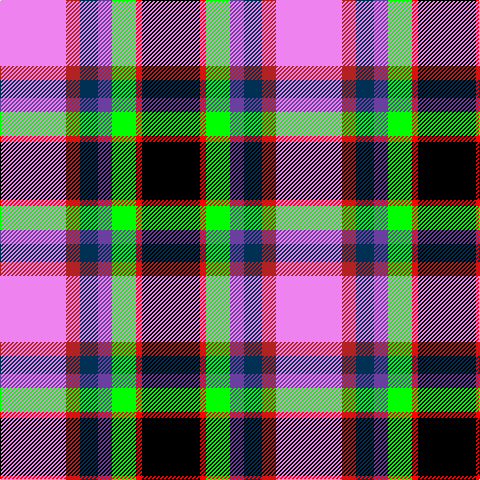

**Bands:** [KRYBBRW](/stripes/krybbrw/) · **Stripes:** [K R LG B DT R LP](/stripes/stripes7/) K R LG B DT R LP

This was sourced from register-of-tartans.  It is a [7 band tartan](/bands/bands7/).

Original link https://www.tartanregister.gov.uk/tartanDetails.aspx?ref=10121

## Register references

External register numbers recorded for this tartan.

- Scottish Register of Tartans: [10121](https://www.tartanregister.gov.uk/tartanDetails.aspx?ref=10121)

## Thread count
LP/66 Ra14 DB18 B14 G24 R6 K/58

## Palette
Each colour and its ΔE from the base-6 reference it is a variant of.

| Colour | Shade | Base | ΔE (OKLab) |
|---|---|---|---|
| B | <code style="background-color:#6B3FA0;">#6B3FA0</code> `#6B3FA0` | B <code style="background-color:#2A418A;">#2A418A</code> | 0.11 |
| DB | <code style="background-color:#003053;">#003053</code> `#003053` | B <code style="background-color:#2A418A;">#2A418A</code> | 0.11 |
| G | <code style="background-color:#00FF00;">#00FF00</code> `#00FF00` | Y <code style="background-color:#F2BF00;">#F2BF00</code> | 0.24 |
| K | <code style="background-color:#000000;">#000000</code> `#000000` | K <code style="background-color:#000000;">#000000</code> | 0.00 |
| LP | <code style="background-color:#EE82EE;">#EE82EE</code> `#EE82EE` | W <code style="background-color:#F7F7F7;">#F7F7F7</code> | 0.28 |
| R | <code style="background-color:#FF0000;">#FF0000</code> `#FF0000` | R <code style="background-color:#CC0000;">#CC0000</code> | 0.11 |
| Ra | <code style="background-color:#B22222;">#B22222</code> `#B22222` | R <code style="background-color:#CC0000;">#CC0000</code> | 0.05 |

# Sample pattern

## Nearest tartans

The nearest existing variants by ΔTartan distance.

1. [Hatcher (Personal)](/setts/s7/lp33r7db9dp7g12r3k29~x2/) — ΔT 0.81
1. [Culloden, Dress](/setts/s8/r6t3p24ly2k23w23k2w6~x2/) — ΔT 1.06
1. [Maryland](/setts/s8/dt8t1db1t1m12ly6k12w2~x4/) — ΔT 1.11
1. [Iowa Dress (District)](/setts/s8/r4ly3w12k16g5db20k4w2~x2/) — ΔT 1.26
1. [Culloden Dress](/setts/s8/r6t3dp24ly2k23w23k2w6~x2/) — ΔT 1.27
1. [Humming Bird (Fashion)](/setts/s8/r6t3m20ly2k20w20k2w5~x2/) — ΔT 1.30
1. [Casey (Personal)](/setts/s7/r5t2p16k13ly13k2w3~x2/) — ΔT 1.31
1. [Culloden, Stirling](/setts/s8/r4o2b15ly2k14w14k2w4~x2/) — ΔT 1.36
1. [Culloden, Gold](/setts/s8/r5t2dp14w2k13y13k2ly3~x2/) — ΔT 1.42
1. [Pengelly, The Cornish](/setts/s7/w5k26ly4lb24dp8k3r4~x2/) — ΔT 1.42

## Neighbour map

Every grey dot is one of 14299 variants placed by the first two principal components of the ΔTartan feature space (44% of its variance). Red is this tartan; blue dots are its nearest — click one to open its page.

<svg viewBox="0 0 640 380" role="img" style="max-width:100%;height:auto;border:1px solid #e0e0e0;border-radius:4px;display:block" xmlns="http://www.w3.org/2000/svg"><image href="/nn/cloud.v1.png" width="640" height="380"/><a href="/setts/s7/lp33r7db9dp7g12r3k29~x2/"><circle cx="80.5" cy="141.6" r="4" fill="#3465a4"><title>Hatcher (Personal)</title></circle></a><a href="/setts/s8/r6t3p24ly2k23w23k2w6~x2/"><circle cx="98.3" cy="125.6" r="4" fill="#3465a4"><title>Culloden, Dress</title></circle></a><a href="/setts/s8/dt8t1db1t1m12ly6k12w2~x4/"><circle cx="68.6" cy="125.4" r="4" fill="#3465a4"><title>Maryland</title></circle></a><a href="/setts/s8/r4ly3w12k16g5db20k4w2~x2/"><circle cx="68.7" cy="148.9" r="4" fill="#3465a4"><title>Iowa Dress (District)</title></circle></a><a href="/setts/s8/r6t3dp24ly2k23w23k2w6~x2/"><circle cx="97.5" cy="122.4" r="4" fill="#3465a4"><title>Culloden Dress</title></circle></a><a href="/setts/s8/r6t3m20ly2k20w20k2w5~x2/"><circle cx="91.0" cy="133.3" r="4" fill="#3465a4"><title>Humming Bird (Fashion)</title></circle></a><a href="/setts/s7/r5t2p16k13ly13k2w3~x2/"><circle cx="62.7" cy="159.1" r="4" fill="#3465a4"><title>Casey (Personal)</title></circle></a><a href="/setts/s8/r4o2b15ly2k14w14k2w4~x2/"><circle cx="62.0" cy="148.2" r="4" fill="#3465a4"><title>Culloden, Stirling</title></circle></a><a href="/setts/s8/r5t2dp14w2k13y13k2ly3~x2/"><circle cx="35.5" cy="144.5" r="4" fill="#3465a4"><title>Culloden, Gold</title></circle></a><a href="/setts/s7/w5k26ly4lb24dp8k3r4~x2/"><circle cx="118.6" cy="146.7" r="4" fill="#3465a4"><title>Pengelly, The Cornish</title></circle></a><circle cx="58.5" cy="127.9" r="5" fill="#c00000"/></svg>

ID: /setts/s7/lp33r7dt9b7lg12r3k29~x2/
