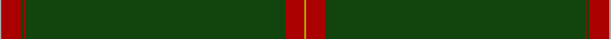

In pattern [YRGRGRY](/stripes/yrgrgry/).

This was sourced from weddslist.  It is a [7 stripe tartan](/stripes/stripes7/).

Original link http://www.weddslist.com/cgi-bin/tartans/pg.pl?source=tinsel

## Thread count
N/2 DR24 DG4 DR2 DG324 DR24 LG/2

## Palette
Each colour and the base-6 reference it is a variant of.

| Colour | Shade | Base |
|---|---|---|
| DG | <code style="background-color:#11450D;">#11450D</code> `oklch(34.4% 0.101 142.1)` <small>#11450D</small> | G <code style="background-color:#006100;">#006100</code> |
| DR | <code style="background-color:#AA0000;">#AA0000</code> `oklch(46.3% 0.190 29.2)` <small>#AA0000</small> | R <code style="background-color:#CC0000;">#CC0000</code> |
| LG | <code style="background-color:#AAAA00;">#AAAA00</code> `oklch(71.4% 0.156 109.8)` <small>#AAAA00</small> | Y <code style="background-color:#F2BF00;">#F2BF00</code> |
| N | <code style="background-color:#AAAAAA;">#AAAAAA</code> `oklch(73.8% 0.000 89.9)` <small>#AAAAAA</small> | Y <code style="background-color:#F2BF00;">#F2BF00</code> |

# Sample pattern

## Nearest tartans

The nearest existing variants by ΔTartan distance.

1. [Lagrande](/setts/s5/dg100lo4dg2lo3ly6~x2/) — ΔT 1.44
1. [Stewart from Cairnie](/setts/s8/dg83k6dg3k9r2k5dg2ly2~x2/) — ΔT 1.58
1. [Braveheart Htg (Fashion)](/setts/s10/g3db2g40db1g2db1g9r4g3r2~x4/) — ΔT 1.65
1. [Unidentified #12](/setts/s11/t2k1dg36k1r2k1r2k1dg36k1ly2~x2/) — ΔT 1.81
1. [Burnett of Leys Hunting Family Tartan Tartan Number: 1657. Earliest known date: 1988 Nothing See products available Copyright © Blair Urquhart, Comrie, 2015](/setts/s8/dy96db8dy8w3dy8g3dy8r3~x2/) — ΔT 1.93
1. [Coeur D'Alene Firefighters (Corporat](/setts/s13/g61g1g1db2g1g1g16g1db4g2db6g1db4~x2/) — ΔT 2.10
1. [St. David's (District)](/setts/s6/dg60r2dg8r1dg5k2/) — ΔT 2.17
1. [Crane of Cluny (Personal)](/setts/s8/g82k6g3k9r2k5g2ly2~x2/) — ΔT 2.18
1. [Eternity, Dedicated 2 Weddings](/setts/s5/do88o3ly2k2lr1~x2/) — ΔT 2.24
1. [Walters (Personal)](/setts/s6/g2dp2g20g2g2dp1~x4/) — ΔT 2.33

## Neighbour map

Every grey dot is one of 14299 variants placed by the first two principal components of the ΔTartan feature space (44% of its variance). Red is this tartan; blue dots are its nearest — click one to open its page.

<svg viewBox="0 0 640 380" role="img" style="max-width:100%;height:auto;border:1px solid #e0e0e0;border-radius:4px;display:block" xmlns="http://www.w3.org/2000/svg"><image href="/nn/cloud.v1.png" width="640" height="380"/><a href="/setts/s5/dg100lo4dg2lo3ly6~x2/"><circle cx="626.0" cy="170.8" r="4" fill="#3465a4"><title>Lagrande</title></circle></a><a href="/setts/s8/dg83k6dg3k9r2k5dg2ly2~x2/"><circle cx="622.7" cy="148.5" r="4" fill="#3465a4"><title>Stewart from Cairnie</title></circle></a><a href="/setts/s10/g3db2g40db1g2db1g9r4g3r2~x4/"><circle cx="626.0" cy="171.3" r="4" fill="#3465a4"><title>Braveheart Htg (Fashion)</title></circle></a><a href="/setts/s11/t2k1dg36k1r2k1r2k1dg36k1ly2~x2/"><circle cx="626.0" cy="124.3" r="4" fill="#3465a4"><title>Unidentified #12</title></circle></a><a href="/setts/s8/dy96db8dy8w3dy8g3dy8r3~x2/"><circle cx="626.0" cy="146.4" r="4" fill="#3465a4"><title>Burnett of Leys Hunting Family Tartan Tartan Number: 1657. Earliest known date: 1988 Nothing See products available Copyright © Blair Urquhart, Comrie, 2015</title></circle></a><a href="/setts/s13/g61g1g1db2g1g1g16g1db4g2db6g1db4~x2/"><circle cx="626.0" cy="129.1" r="4" fill="#3465a4"><title>Coeur D'Alene Firefighters (Corporat</title></circle></a><a href="/setts/s6/dg60r2dg8r1dg5k2/"><circle cx="626.0" cy="200.1" r="4" fill="#3465a4"><title>St. David's (District)</title></circle></a><a href="/setts/s8/g82k6g3k9r2k5g2ly2~x2/"><circle cx="589.7" cy="132.9" r="4" fill="#3465a4"><title>Crane of Cluny (Personal)</title></circle></a><a href="/setts/s5/do88o3ly2k2lr1~x2/"><circle cx="626.0" cy="155.4" r="4" fill="#3465a4"><title>Eternity, Dedicated 2 Weddings</title></circle></a><a href="/setts/s6/g2dp2g20g2g2dp1~x4/"><circle cx="626.0" cy="226.1" r="4" fill="#3465a4"><title>Walters (Personal)</title></circle></a><circle cx="626.0" cy="149.2" r="5" fill="#c00000"/></svg>

ID: /setts/s7/lr1r12dg2r1dg162r12ly1~x2/
