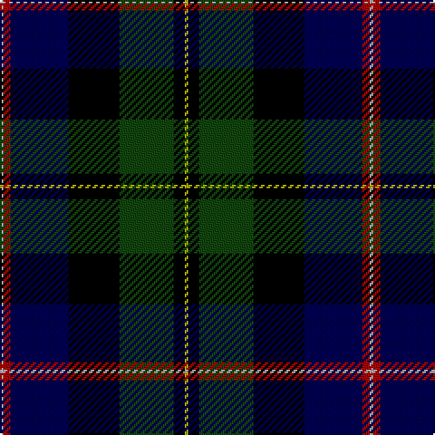

In pattern [YKGKBRY](/stripes/ykgkbry/).

This was sourced from weddslist.  It is a [7 stripe tartan](/stripes/stripes7/).

Original link http://www.weddslist.com/cgi-bin/tartans/pg.pl?source=tinsel

## Attestations

This cloth appears in 2 source records; the oldest owns this page.

- undated — MacNeil (weddslist, [record](http://www.weddslist.com/cgi-bin/tartans/pg.pl?source=tinsel))
- undated — MacNeil (weddslist, [record](http://www.weddslist.com/cgi-bin/tartans/pg.pl?source=x))

## Register references

External register numbers recorded for this tartan.

- Scottish Register of Tartans: [1166](https://www.tartanregister.gov.uk/tartanDetails.aspx?ref=1166)
- Scottish Register of Tartans: [1510](https://www.tartanregister.gov.uk/tartanDetails.aspx?ref=1510)
- Scottish Register of Tartans: [1758](https://www.tartanregister.gov.uk/tartanDetails.aspx?ref=1758)
- Scottish Register of Tartans: [2307](https://www.tartanregister.gov.uk/tartanDetails.aspx?ref=2307)
- Scottish Register of Tartans: [2349](https://www.tartanregister.gov.uk/tartanDetails.aspx?ref=2349)
- Scottish Register of Tartans: [2540](https://www.tartanregister.gov.uk/tartanDetails.aspx?ref=2540)
- Scottish Register of Tartans: [2582](https://www.tartanregister.gov.uk/tartanDetails.aspx?ref=2582)
- Scottish Register of Tartans: [2585](https://www.tartanregister.gov.uk/tartanDetails.aspx?ref=2585)
- Scottish Register of Tartans: [2625](https://www.tartanregister.gov.uk/tartanDetails.aspx?ref=2625)
- Scottish Register of Tartans: [2730](https://www.tartanregister.gov.uk/tartanDetails.aspx?ref=2730)
- Scottish Register of Tartans: [2862](https://www.tartanregister.gov.uk/tartanDetails.aspx?ref=2862)
- Scottish Register of Tartans: [3072](https://www.tartanregister.gov.uk/tartanDetails.aspx?ref=3072)
- Scottish Register of Tartans: [3555](https://www.tartanregister.gov.uk/tartanDetails.aspx?ref=3555)
- Scottish Register of Tartans: [4925](https://www.tartanregister.gov.uk/tartanDetails.aspx?ref=4925)
- Scottish Register of Tartans: [696](https://www.tartanregister.gov.uk/tartanDetails.aspx?ref=696)
- Scottish Register of Tartans: [697](https://www.tartanregister.gov.uk/tartanDetails.aspx?ref=697)
- Scottish Register of Tartans: [982](https://www.tartanregister.gov.uk/tartanDetails.aspx?ref=982)
- Scottish Tartans Authority (ITI): 1277
- Scottish Tartans Authority (ITI): 1429
- Scottish Tartans Authority (ITI): 218
- Scottish Tartans Authority (ITI): 977
- Scottish Tartans World Register: 1042
- Scottish Tartans World Register: 127
- Scottish Tartans World Register: 1277
- Scottish Tartans World Register: 1399
- Scottish Tartans World Register: 1429
- Scottish Tartans World Register: 1593
- Scottish Tartans World Register: 218
- Scottish Tartans World Register: 2218
- Scottish Tartans World Register: 3061
- Scottish Tartans World Register: 441
- Scottish Tartans World Register: 737
- Scottish Tartans World Register: 858
- Scottish Tartans World Register: 864
- Scottish Tartans World Register: 873
- Scottish Tartans World Register: 897
- Scottish Tartans World Register: 977
- Scottish Tartans World Register: 978

## Thread count
N/2 DR4 DB32 K28 DG30 K6 LG/2

## Palette
Each colour and its ΔE from the base-6 reference it is a variant of.

| Colour | Shade | Base | ΔE (OKLab) |
|---|---|---|---|
| DB | <code style="background-color:#000052;">#000052</code> `#000052` | B <code style="background-color:#2A418A;">#2A418A</code> | 0.20 |
| DG | <code style="background-color:#11450D;">#11450D</code> `#11450D` | G <code style="background-color:#006100;">#006100</code> | 0.09 |
| DR | <code style="background-color:#AA0000;">#AA0000</code> `#AA0000` | R <code style="background-color:#CC0000;">#CC0000</code> | 0.07 |
| K | <code style="background-color:#000000;">#000000</code> `#000000` | K <code style="background-color:#000000;">#000000</code> | 0.00 |
| LG | <code style="background-color:#AAAA00;">#AAAA00</code> `#AAAA00` | Y <code style="background-color:#F2BF00;">#F2BF00</code> | 0.13 |
| N | <code style="background-color:#AAAAAA;">#AAAAAA</code> `#AAAAAA` | Y <code style="background-color:#F2BF00;">#F2BF00</code> | 0.19 |

# Sample pattern

## Nearest tartans

The nearest existing variants by ΔTartan distance.

1. [MacNeil](/setts/s7/ly1k3dg15k14db16r2lb1~x2/) — ΔT 0.60
1. [Fettes College](/setts/s7/dr4dg23k22p3db22dr1w2~x2/) — ΔT 0.78
1. [National Wedding](/setts/s9/dg22lo2dg4dp3dg4k20db20k1lb3~x2/) — ΔT 0.97
1. [Mitchell](/setts/s6/k2dg12k12r1db12lr2~x2/) — ΔT 1.11
1. [Mitchell](/setts/s6/k2dg12k12r1db12lr2/) — ΔT 1.11
1. [St Andrews Golf Club](/setts/s9/r1dg3t1dg5k1dg1k9db12w1~x4/) — ΔT 1.13
1. [MacLeod](/setts/s7/r3k2dg15k10db20k2ly2~x2/) — ΔT 1.16
1. [MacLeod](/setts/s7/r3k2dg15k10db20k2ly2/) — ΔT 1.16
1. [Scotch House 2000, original](/setts/s8/db22r3db2r3db2k17dg18o4~x2/) — ΔT 1.18
1. [MacNeil - 1840 (Chief's sett)](/setts/s7/w2r3db33k33g33k6ly2~x2/) — ΔT 1.20

## Neighbour map

Every grey dot is one of 14299 variants placed by the first two principal components of the ΔTartan feature space (44% of its variance). Red is this tartan; blue dots are its nearest — click one to open its page.

<svg viewBox="0 0 640 380" role="img" style="max-width:100%;height:auto;border:1px solid #e0e0e0;border-radius:4px;display:block" xmlns="http://www.w3.org/2000/svg"><image href="/nn/cloud.v1.png" width="640" height="380"/><a href="/setts/s7/ly1k3dg15k14db16r2lb1~x2/"><circle cx="150.7" cy="160.3" r="4" fill="#3465a4"><title>MacNeil</title></circle></a><a href="/setts/s7/dr4dg23k22p3db22dr1w2~x2/"><circle cx="165.5" cy="156.0" r="4" fill="#3465a4"><title>Fettes College</title></circle></a><a href="/setts/s9/dg22lo2dg4dp3dg4k20db20k1lb3~x2/"><circle cx="190.0" cy="139.1" r="4" fill="#3465a4"><title>National Wedding</title></circle></a><a href="/setts/s6/k2dg12k12r1db12lr2~x2/"><circle cx="170.4" cy="211.3" r="4" fill="#3465a4"><title>Mitchell</title></circle></a><a href="/setts/s6/k2dg12k12r1db12lr2/"><circle cx="170.4" cy="211.3" r="4" fill="#3465a4"><title>Mitchell</title></circle></a><a href="/setts/s9/r1dg3t1dg5k1dg1k9db12w1~x4/"><circle cx="158.0" cy="147.4" r="4" fill="#3465a4"><title>St Andrews Golf Club</title></circle></a><a href="/setts/s7/r3k2dg15k10db20k2ly2~x2/"><circle cx="182.3" cy="200.6" r="4" fill="#3465a4"><title>MacLeod</title></circle></a><a href="/setts/s7/r3k2dg15k10db20k2ly2/"><circle cx="182.3" cy="200.6" r="4" fill="#3465a4"><title>MacLeod</title></circle></a><a href="/setts/s8/db22r3db2r3db2k17dg18o4~x2/"><circle cx="178.9" cy="189.8" r="4" fill="#3465a4"><title>Scotch House 2000, original</title></circle></a><a href="/setts/s7/w2r3db33k33g33k6ly2~x2/"><circle cx="182.4" cy="160.5" r="4" fill="#3465a4"><title>MacNeil - 1840 (Chief's sett)</title></circle></a><circle cx="168.6" cy="169.4" r="5" fill="#c00000"/></svg>

ID: /setts/s7/lr1r2db16k14dg15k3ly1~x2/
