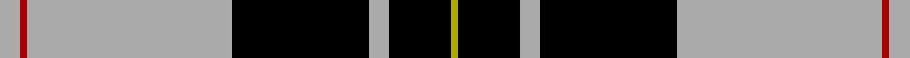
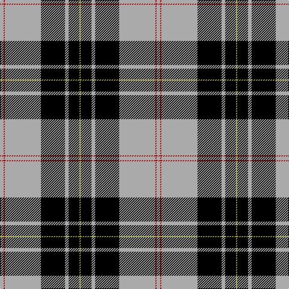

In pattern [YKYKYRY](/stripes/ykykyry/).

This was sourced from weddslist.  It is a [7 stripe tartan](/stripes/stripes7/).

Original link http://www.weddslist.com/cgi-bin/tartans/pg.pl?source=tinsel

## Thread count
N/6 DR2 N60 K40 N6 K18 LG/2

## Palette
Each colour and the base-6 reference it is a variant of.

| Colour | Shade | Base |
|---|---|---|
| DR | <code style="background-color:#AA0000;">#AA0000</code> `oklch(46.3% 0.190 29.2)` <small>#AA0000</small> | R <code style="background-color:#CC0000;">#CC0000</code> |
| K | <code style="background-color:#000000;">#000000</code> `oklch(0.0% 0.000 0.0)` <small>#000000</small> | K <code style="background-color:#000000;">#000000</code> |
| LG | <code style="background-color:#AAAA00;">#AAAA00</code> `oklch(71.4% 0.156 109.8)` <small>#AAAA00</small> | Y <code style="background-color:#F2BF00;">#F2BF00</code> |
| N | <code style="background-color:#AAAAAA;">#AAAAAA</code> `oklch(73.8% 0.000 89.9)` <small>#AAAAAA</small> | Y <code style="background-color:#F2BF00;">#F2BF00</code> |

# Sample pattern

## Nearest tartans

The nearest existing variants by ΔTartan distance.

1. [MacPherson Dress](/setts/s7/lr3r1lr30k20lr3k9ly1/) — ΔT 0.00
1. [MacPherson Dress](/setts/s7/lb3r1lb30k20lb3k9ly1/) — ΔT 0.59
1. [Richecourt, Baron of (Personal)](/setts/s7/w4k30r1k1r3w12ly3~x2/) — ΔT 0.95
1. [Newcastle](/setts/s10/w8k1db2k4ly2k2ly2k24w8k2~x2/) — ΔT 1.03
1. [George Heriots](/setts/s5/w3k35o24k1ly3~x2/) — ΔT 1.05
1. [Colbert Check (Fashion)](/setts/s8/k62w10ly10k4w18k4lo3w4/) — ΔT 1.13
1. [Gleneagles, Hotel](/setts/s7/k4y4w35y1k36y4k2~x2/) — ΔT 1.19
1. [Phantom](/setts/s7/w3o10k38w11o6k2w3~x2/) — ΔT 1.24
1. [Gleneagles](/setts/s7/k4o4w35o1k36o4k2~x2/) — ΔT 1.26
1. [Entrepreneurial Spark](/setts/s8/k14lo3w8lo4k6w9k31g1~x2/) — ΔT 1.28

## Neighbour map

Every grey dot is one of 14299 variants placed by the first two principal components of the ΔTartan feature space (44% of its variance). Red is this tartan; blue dots are its nearest — click one to open its page.

<svg viewBox="0 0 640 380" role="img" style="max-width:100%;height:auto;border:1px solid #e0e0e0;border-radius:4px;display:block" xmlns="http://www.w3.org/2000/svg"><image href="/nn/cloud.v1.png" width="640" height="380"/><a href="/setts/s7/lr3r1lr30k20lr3k9ly1/"><circle cx="329.3" cy="131.5" r="4" fill="#3465a4"><title>MacPherson Dress</title></circle></a><a href="/setts/s7/lb3r1lb30k20lb3k9ly1/"><circle cx="322.7" cy="125.3" r="4" fill="#3465a4"><title>MacPherson Dress</title></circle></a><a href="/setts/s7/w4k30r1k1r3w12ly3~x2/"><circle cx="329.8" cy="112.6" r="4" fill="#3465a4"><title>Richecourt, Baron of (Personal)</title></circle></a><a href="/setts/s10/w8k1db2k4ly2k2ly2k24w8k2~x2/"><circle cx="331.6" cy="115.5" r="4" fill="#3465a4"><title>Newcastle</title></circle></a><a href="/setts/s5/w3k35o24k1ly3~x2/"><circle cx="343.2" cy="150.5" r="4" fill="#3465a4"><title>George Heriots</title></circle></a><a href="/setts/s8/k62w10ly10k4w18k4lo3w4/"><circle cx="339.6" cy="123.5" r="4" fill="#3465a4"><title>Colbert Check (Fashion)</title></circle></a><a href="/setts/s7/k4y4w35y1k36y4k2~x2/"><circle cx="315.1" cy="128.3" r="4" fill="#3465a4"><title>Gleneagles, Hotel</title></circle></a><a href="/setts/s7/w3o10k38w11o6k2w3~x2/"><circle cx="286.7" cy="140.2" r="4" fill="#3465a4"><title>Phantom</title></circle></a><a href="/setts/s7/k4o4w35o1k36o4k2~x2/"><circle cx="312.7" cy="124.9" r="4" fill="#3465a4"><title>Gleneagles</title></circle></a><a href="/setts/s8/k14lo3w8lo4k6w9k31g1~x2/"><circle cx="379.9" cy="138.6" r="4" fill="#3465a4"><title>Entrepreneurial Spark</title></circle></a><circle cx="329.3" cy="131.5" r="5" fill="#c00000"/></svg>

ID: /setts/s7/lr3r1lr30k20lr3k9ly1~x2/
