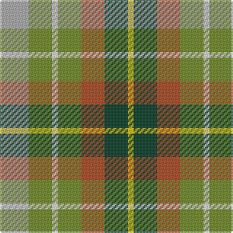

This page is one **sett** — a single exact thread-count. It belongs to the [tartan](/tartans/lr5g4w1g4o4dg4ly1/)
(the same proportion at any scale), whose colour order is pattern [YGRGWGY](/stripes/ygrgwgy/).

Sourced from house-of-tartan.  It is a [7 stripe tartan](/stripes/stripes7/).

Original link http://www.house-of-tartan.scotland.net/house/TartanViewjs.asp?colr=Def&tnam=1284

## Thread count
N/20 G16 LN4 G16 T16 DG16 Y/4

## Palette

Palette: <strong>Tartan Register</strong> <small style="color:#888">(3 of 7 colours)</small>
<table><thead><tr><th>Colour</th><th>Threads</th><th>Shade</th><th>Base</th><th>OKLCh</th></tr></thead><tbody><tr><td>N/</td><td style="text-align:right;font-variant-numeric:tabular-nums">20</td><td><code style="background-color:#A8A8A8;">#A8A8A8</code> <small style="color:#888">#A8A8A8</small></td><td>Y <code style="background-color:#F2BF00;">#F2BF00</code></td><td><small style="color:#888">oklch(73.2% 0.000 89.9)</small></td></tr><tr><td>G</td><td style="text-align:right;font-variant-numeric:tabular-nums">16</td><td><code style="background-color:#6C8820;">#6C8820</code> <small style="color:#888">#6C8820</small></td><td>G <code style="background-color:#006100;">#006100</code></td><td><small style="color:#888">oklch(58.5% 0.131 123.8)</small></td></tr><tr><td>LN</td><td style="text-align:right;font-variant-numeric:tabular-nums">4</td><td><code style="background-color:#E0E0E0;">#E0E0E0</code> <small style="color:#888">#E0E0E0</small></td><td>W <code style="background-color:#F7F7F7;">#F7F7F7</code></td><td><small style="color:#888">oklch(90.7% 0.000 89.9)</small></td></tr><tr><td>G</td><td style="text-align:right;font-variant-numeric:tabular-nums">16</td><td><code style="background-color:#6C8820;">#6C8820</code> <small style="color:#888">#6C8820</small></td><td>G <code style="background-color:#006100;">#006100</code></td><td><small style="color:#888">oklch(58.5% 0.131 123.8)</small></td></tr><tr><td>T</td><td style="text-align:right;font-variant-numeric:tabular-nums">16</td><td><code style="background-color:#A8441C;">#A8441C</code> <small style="color:#888">#A8441C</small></td><td>R <code style="background-color:#CC0000;">#CC0000</code></td><td><small style="color:#888">oklch(51.5% 0.142 40.3)</small></td></tr><tr><td>DG</td><td style="text-align:right;font-variant-numeric:tabular-nums">16</td><td><code style="background-color:#003820;">#003820</code> <small style="color:#888">#003820</small></td><td>G <code style="background-color:#006100;">#006100</code></td><td><small style="color:#888">oklch(30.0% 0.070 158.3)</small></td></tr><tr><td>Y/</td><td style="text-align:right;font-variant-numeric:tabular-nums">4</td><td><code style="background-color:#E8C000;">#E8C000</code> <small style="color:#888">#E8C000</small></td><td>Y <code style="background-color:#F2BF00;">#F2BF00</code></td><td><small style="color:#888">oklch(81.9% 0.168 93.7)</small></td></tr></tbody></table>

# Sample pattern

## Nearest tartans

The nearest existing variants by ΔTartan distance, with this tartan at the top so the swatches line up against it.

ΔTartan

Tartan

Sett

—

<a href="/ttd/edit/#slug=lr5g4w1g4o4dg4ly1~x4">Devon Original District Tartan Tartan Number: 1284. Earliest known date: 1984 The Devon Original and Devon Companion owe their origin to the success of the Cornish St Piran sett, which was woven by Coldharbour Mill in the early 1980's. The accreditation certificate was presented to the Mayor of Barnstaple in 1991. In a poem describing the tartan, Miss M. Miles says, &quot;So, in the mind, Devon's beauty is retrieved By contemplating Devon's tartan's weave.&quot; See products available Copyright © Blair Urquhart, Comrie, 2015</a> <a class="nn-out" href="/setts/s7/lr5g4w1g4o4dg4ly1~x4/" title="open its dictionary page">↗</a>

0.95

<a href="/ttd/edit/#slug=y5g4w1g4o4dg4ly1~x4">Devon, Original</a> <a class="nn-out" href="/setts/s7/y5g4w1g4o4dg4ly1~x4/" title="open its dictionary page">↗</a>

1.18

<a href="/ttd/edit/#slug=w5y4b1y4r4b1dg4ly1~x2">Devon Rural Skills Trust</a> <a class="nn-out" href="/setts/s8/w5y4b1y4r4b1dg4ly1~x2/" title="open its dictionary page">↗</a>

1.24

<a href="/ttd/edit/#slug=r1dy3g5lo5dt5t1~x4">Loch Fyne</a> <a class="nn-out" href="/setts/s6/r1dy3g5lo5dt5t1~x4/" title="open its dictionary page">↗</a>

1.36

<a href="/ttd/edit/#slug=w5y4t1y4r4t1dg4ly1~x6">Devon Rural Skills Trust</a> <a class="nn-out" href="/setts/s8/w5y4t1y4r4t1dg4ly1~x6/" title="open its dictionary page">↗</a>

1.47

<a href="/ttd/edit/#slug=w2k1gi4r2gi2r4g5k1ly2~x6">Ellis (Personal)</a> <a class="nn-out" href="/setts/s9/w2k1gi4r2gi2r4g5k1ly2~x6/" title="open its dictionary page">↗</a>

1.48

<a href="/ttd/edit/#slug=lo17ly17o17g26b5~x2">Wild Mustard Dreams</a> <a class="nn-out" href="/setts/s5/lo17ly17o17g26b5~x2/" title="open its dictionary page">↗</a>

1.48

<a href="/ttd/edit/#slug=r8lo4ly3g6t6dp1~x5">Pride, The Tartan of</a> <a class="nn-out" href="/setts/s6/r8lo4ly3g6t6dp1~x5/" title="open its dictionary page">↗</a>

1.48

<a href="/ttd/edit/#slug=db7o8g15ly6y3~x10">Unidentified, Silk Plaid</a> <a class="nn-out" href="/setts/s5/db7o8g15ly6y3~x10/" title="open its dictionary page">↗</a>

1.52

<a href="/ttd/edit/#slug=r3lb8k9g16r12n12lo3~x2">Alabama (Fashion)</a> <a class="nn-out" href="/setts/s7/r3lb8k9g16r12n12lo3~x2/" title="open its dictionary page">↗</a>

1.63

<a href="/ttd/edit/#slug=k1lr1g5dp1g2dy5lr1y3lr1~x4">Corcoran of Sherbrooke (Personal)</a> <a class="nn-out" href="/setts/s9/k1lr1g5dp1g2dy5lr1y3lr1~x4/" title="open its dictionary page">↗</a>

## Neighbour map

Every grey dot is one of 14359 variants placed by the first two principal components of the ΔTartan feature space (44% of its variance). Red is this tartan; blue dots are its nearest — click one to open its page.

<svg viewBox="0 0 640 380" role="img" style="max-width:100%;height:auto;border:1px solid #e0e0e0;border-radius:4px;display:block" xmlns="http://www.w3.org/2000/svg"><image href="/nn/cloud.v1.png" width="640" height="380"/><a href="/setts/s7/y5g4w1g4o4dg4ly1~x4/"><circle cx="69.2" cy="244.0" r="4" fill="#3465a4"><title>Devon, Original</title></circle></a><a href="/setts/s8/w5y4b1y4r4b1dg4ly1~x2/"><circle cx="44.4" cy="204.1" r="4" fill="#3465a4"><title>Devon Rural Skills Trust</title></circle></a><a href="/setts/s6/r1dy3g5lo5dt5t1~x4/"><circle cx="48.1" cy="237.6" r="4" fill="#3465a4"><title>Loch Fyne</title></circle></a><a href="/setts/s8/w5y4t1y4r4t1dg4ly1~x6/"><circle cx="36.2" cy="200.3" r="4" fill="#3465a4"><title>Devon Rural Skills Trust</title></circle></a><a href="/setts/s9/w2k1gi4r2gi2r4g5k1ly2~x6/"><circle cx="14.0" cy="198.9" r="4" fill="#3465a4"><title>Ellis (Personal)</title></circle></a><a href="/setts/s5/lo17ly17o17g26b5~x2/"><circle cx="66.1" cy="254.7" r="4" fill="#3465a4"><title>Wild Mustard Dreams</title></circle></a><a href="/setts/s6/r8lo4ly3g6t6dp1~x5/"><circle cx="64.3" cy="209.6" r="4" fill="#3465a4"><title>Pride, The Tartan of</title></circle></a><a href="/setts/s5/db7o8g15ly6y3~x10/"><circle cx="97.6" cy="247.1" r="4" fill="#3465a4"><title>Unidentified, Silk Plaid</title></circle></a><a href="/setts/s7/r3lb8k9g16r12n12lo3~x2/"><circle cx="25.5" cy="218.9" r="4" fill="#3465a4"><title>Alabama (Fashion)</title></circle></a><a href="/setts/s9/k1lr1g5dp1g2dy5lr1y3lr1~x4/"><circle cx="109.0" cy="205.8" r="4" fill="#3465a4"><title>Corcoran of Sherbrooke (Personal)</title></circle></a><circle cx="70.9" cy="235.8" r="5" fill="#c00000"/></svg>

ID: /setts/s7/lr5g4w1g4o4dg4ly1~x4/
