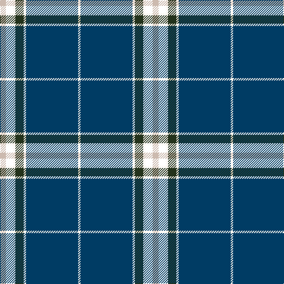

In pattern [WBWGWKY](/stripes/wbwgwky/).

This was sourced from register-of-tartans.  It is a [7 stripe tartan](/stripes/stripes7/).

Original link https://www.tartanregister.gov.uk/tartanDetails.aspx?ref=10609

## Register references

External register numbers recorded for this tartan.

- Scottish Register of Tartans: [10609](https://www.tartanregister.gov.uk/tartanDetails.aspx?ref=10609)

## Thread count
N/10 T12 W4 K14 W4 DB88 W/4

## Palette
Each colour and its ΔE from the base-6 reference it is a variant of.

| Colour | Shade | Base | ΔE (OKLab) |
|---|---|---|---|
| DB | <code style="background-color:#003C64;">#003C64</code> `#003C64` | B <code style="background-color:#2A418A;">#2A418A</code> | 0.08 |
| K | <code style="background-color:#23321B;">#23321B</code> `#23321B` | G <code style="background-color:#006100;">#006100</code> | 0.16 |
| N | <code style="background-color:#CCBAAF;">#CCBAAF</code> `#CCBAAF` | Y <code style="background-color:#F2BF00;">#F2BF00</code> | 0.15 |
| W | <code style="background-color:#F9F5EF;">#F9F5EF</code> `#F9F5EF` | W <code style="background-color:#F7F7F7;">#F7F7F7</code> | 0.01 |

# Sample pattern

## Nearest tartans

The nearest existing variants by ΔTartan distance.

1. [Fife Flyers (Corporate)](/setts/s8/dt2w2dt43b5db4ly8db2w2~x2/) — ΔT 0.63
1. [Fife Flyers](/setts/s8/dt2w2dt43b5db4k8db2w2~x2/) — ΔT 0.99
1. [Indiana #2](/setts/s8/db50ly4db3ly4db8k2db12w5~x2/) — ΔT 1.03
1. [Tartan Day SA (Corporate)](/setts/s8/w2db40g22ly3g2r3g2w2~x2/) — ΔT 1.12
1. [Chestico](/setts/s7/db20dy1db1dy1dg8k1w3~x2/) — ΔT 1.13
1. [MacLaurin, of Brioch](/setts/s7/db36k10g3r3g6k1ly2~x2/) — ΔT 1.14
1. [Chestico](/setts/s7/db20o1db1o1dg8k1w3~x2/) — ΔT 1.17
1. [Round Table of Britain and Ireland, RtbI.](/setts/s6/db47g14dr5o2r3g7~x2/) — ΔT 1.23
1. [Mullikin (2013)](/setts/s8/r5w4lg6db2dg43db2lg4r3~x2/) — ΔT 1.25
1. [East Tennessee State University](/setts/s8/lo2db2w1db6w1ly2db17ly1~x2/) — ΔT 1.34

## Neighbour map

Every grey dot is one of 14299 variants placed by the first two principal components of the ΔTartan feature space (44% of its variance). Red is this tartan; blue dots are its nearest — click one to open its page.

<svg viewBox="0 0 640 380" role="img" style="max-width:100%;height:auto;border:1px solid #e0e0e0;border-radius:4px;display:block" xmlns="http://www.w3.org/2000/svg"><image href="/nn/cloud.v1.png" width="640" height="380"/><a href="/setts/s8/dt2w2dt43b5db4ly8db2w2~x2/"><circle cx="378.4" cy="114.0" r="4" fill="#3465a4"><title>Fife Flyers (Corporate)</title></circle></a><a href="/setts/s8/dt2w2dt43b5db4k8db2w2~x2/"><circle cx="396.0" cy="128.6" r="4" fill="#3465a4"><title>Fife Flyers</title></circle></a><a href="/setts/s8/db50ly4db3ly4db8k2db12w5~x2/"><circle cx="412.6" cy="123.7" r="4" fill="#3465a4"><title>Indiana #2</title></circle></a><a href="/setts/s8/w2db40g22ly3g2r3g2w2~x2/"><circle cx="303.8" cy="124.7" r="4" fill="#3465a4"><title>Tartan Day SA (Corporate)</title></circle></a><a href="/setts/s7/db20dy1db1dy1dg8k1w3~x2/"><circle cx="353.2" cy="144.6" r="4" fill="#3465a4"><title>Chestico</title></circle></a><a href="/setts/s7/db36k10g3r3g6k1ly2~x2/"><circle cx="353.3" cy="115.7" r="4" fill="#3465a4"><title>MacLaurin, of Brioch</title></circle></a><a href="/setts/s7/db20o1db1o1dg8k1w3~x2/"><circle cx="331.9" cy="138.3" r="4" fill="#3465a4"><title>Chestico</title></circle></a><a href="/setts/s6/db47g14dr5o2r3g7~x2/"><circle cx="360.0" cy="155.0" r="4" fill="#3465a4"><title>Round Table of Britain and Ireland, RtbI.</title></circle></a><a href="/setts/s8/r5w4lg6db2dg43db2lg4r3~x2/"><circle cx="354.5" cy="115.3" r="4" fill="#3465a4"><title>Mullikin (2013)</title></circle></a><a href="/setts/s8/lo2db2w1db6w1ly2db17ly1~x2/"><circle cx="301.7" cy="129.9" r="4" fill="#3465a4"><title>East Tennessee State University</title></circle></a><circle cx="364.5" cy="123.4" r="5" fill="#c00000"/></svg>

ID: /setts/s7/lr5k6w2dg7w2dt44w2~x2/
