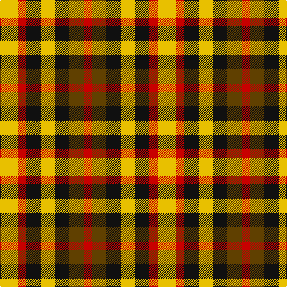

In pattern [RGKYKRY](/stripes/rgkykry/).

This was sourced from house-of-tartan.  It is a [7 stripe tartan](/stripes/stripes7/).

Original link http://www.house-of-tartan.scotland.net/house/TartanViewjs.asp?colr=Def&tnam=1661

## Thread count
Y/30 R14 K24 Y24 K24 T24 R/14

## Palette
Each colour and its ΔE from the base-6 reference it is a variant of.

| Colour | Shade | Base | ΔE (OKLab) |
|---|---|---|---|
| K | <code style="background-color:#101010;">#101010</code> `#101010` | K <code style="background-color:#000000;">#000000</code> | 0.17 |
| R | <code style="background-color:#C80000;">#C80000</code> `#C80000` | R <code style="background-color:#CC0000;">#CC0000</code> | 0.01 |
| T | <code style="background-color:#604000;">#604000</code> `#604000` | G <code style="background-color:#006100;">#006100</code> | 0.14 |
| Y | <code style="background-color:#E8C000;">#E8C000</code> `#E8C000` | Y <code style="background-color:#F2BF00;">#F2BF00</code> | 0.02 |

# Sample pattern

## Nearest tartans

The nearest existing variants by ΔTartan distance.

1. [Duffus, Lord](/setts/s7/ly15r7k12ly12k12o12r7~x2/) — ΔT 0.52
1. [Duffus Hose, Lord](/setts/s7/lo11m6k10lo10k10dy10m4~x2/) — ΔT 1.20
1. [Harazeen](/setts/s8/r2g1w1k1~x20/) — ΔT 1.37
1. [Boxer Beauty](/setts/s7/k13dy28lo13dy28k18w18k13~x2/) — ΔT 1.50
1. [MacDuff](/setts/s7/r10db6k8g10r6g3r6~x2/) — ΔT 1.61
1. [Sturch (Corporate)](/setts/s4/r2db2g3ly2~x5/) — ΔT 1.64
1. [Hage-West (Personal)](/setts/s6/dg8k8dg8ly6k3ly6~x2/) — ΔT 1.87
1. [Akins Red Dress](/setts/s9/g6r4g5r13k13w5k13r13ly6~x2/) — ΔT 2.01
1. [MacDuff #3](/setts/s7/r10db6k8dg10r6dg3r6~x2/) — ΔT 2.03
1. [Mitchell, Martin (Personal)](/setts/s6/lr12lo8r5k6lr7g5~x4/) — ΔT 2.04

## Neighbour map

Every grey dot is one of 14299 variants placed by the first two principal components of the ΔTartan feature space (44% of its variance). Red is this tartan; blue dots are its nearest — click one to open its page.

<svg viewBox="0 0 640 380" role="img" style="max-width:100%;height:auto;border:1px solid #e0e0e0;border-radius:4px;display:block" xmlns="http://www.w3.org/2000/svg"><image href="/nn/cloud.v1.png" width="640" height="380"/><a href="/setts/s7/ly15r7k12ly12k12o12r7~x2/"><circle cx="14.7" cy="297.0" r="4" fill="#3465a4"><title>Duffus, Lord</title></circle></a><a href="/setts/s7/lo11m6k10lo10k10dy10m4~x2/"><circle cx="62.3" cy="302.6" r="4" fill="#3465a4"><title>Duffus Hose, Lord</title></circle></a><a href="/setts/s8/r2g1w1k1~x20/"><circle cx="45.5" cy="269.2" r="4" fill="#3465a4"><title>Harazeen</title></circle></a><a href="/setts/s7/k13dy28lo13dy28k18w18k13~x2/"><circle cx="83.8" cy="297.5" r="4" fill="#3465a4"><title>Boxer Beauty</title></circle></a><a href="/setts/s7/r10db6k8g10r6g3r6~x2/"><circle cx="115.7" cy="283.1" r="4" fill="#3465a4"><title>MacDuff</title></circle></a><a href="/setts/s4/r2db2g3ly2~x5/"><circle cx="14.0" cy="357.2" r="4" fill="#3465a4"><title>Sturch (Corporate)</title></circle></a><a href="/setts/s6/dg8k8dg8ly6k3ly6~x2/"><circle cx="90.8" cy="319.7" r="4" fill="#3465a4"><title>Hage-West (Personal)</title></circle></a><a href="/setts/s9/g6r4g5r13k13w5k13r13ly6~x2/"><circle cx="68.9" cy="230.5" r="4" fill="#3465a4"><title>Akins Red Dress</title></circle></a><a href="/setts/s7/r10db6k8dg10r6dg3r6~x2/"><circle cx="136.2" cy="289.3" r="4" fill="#3465a4"><title>MacDuff #3</title></circle></a><a href="/setts/s6/lr12lo8r5k6lr7g5~x4/"><circle cx="80.1" cy="287.3" r="4" fill="#3465a4"><title>Mitchell, Martin (Personal)</title></circle></a><circle cx="24.2" cy="300.6" r="5" fill="#c00000"/></svg>

ID: /setts/s7/ly15r7k12ly12k12dy12r7~x2/
