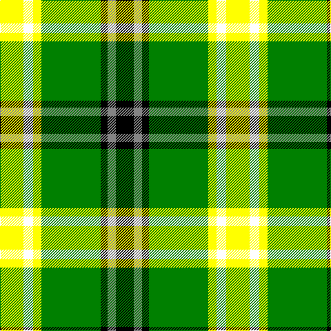

In pattern [KRKGYWY](/stripes/krkgywy/).

This was sourced from register-of-tartans.  It is a [7 stripe tartan](/stripes/stripes7/).

Original link https://www.tartanregister.gov.uk/tartanDetails.aspx?ref=10593

## Attestations

This cloth appears in 2 source records; the oldest owns this page.

- 02/05/2011 — Keeling Dress (register-of-tartans, [record](https://www.tartanregister.gov.uk/tartanDetails.aspx?ref=10593))
- 02/05/2011 — Keeling Dress (Fashion) (tartans-authority, [record](http://www.tartansauthority.com/tartan-ferret/display/10593/))

## Register references

External register numbers recorded for this tartan.

- Scottish Register of Tartans: [10593](https://www.tartanregister.gov.uk/tartanDetails.aspx?ref=10593)

## Thread count
Y/34 W14 Y12 G86 K10 N12 K/26

## Palette
Each colour and its ΔE from the base-6 reference it is a variant of.

| Colour | Shade | Base | ΔE (OKLab) |
|---|---|---|---|
| G | <code style="background-color:#008000;">#008000</code> `#008000` | G <code style="background-color:#006100;">#006100</code> | 0.10 |
| K | <code style="background-color:#000000;">#000000</code> `#000000` | K <code style="background-color:#000000;">#000000</code> | 0.00 |
| N | <code style="background-color:#848484;">#848484</code> `#848484` | R <code style="background-color:#CC0000;">#CC0000</code> | 0.23 |
| W | <code style="background-color:#FFFFFF;">#FFFFFF</code> `#FFFFFF` | W <code style="background-color:#F7F7F7;">#F7F7F7</code> | 0.02 |
| Y | <code style="background-color:#FFFF00;">#FFFF00</code> `#FFFF00` | Y <code style="background-color:#F2BF00;">#F2BF00</code> | 0.16 |

# Sample pattern

## Nearest tartans

The nearest existing variants by ΔTartan distance.

1. [Alberta](/setts/s7/g18k2lr2k2t3k2ly6~x4/) — ΔT 1.17
1. [Forrester / Foster, hunting](/setts/s10/k3ly2g18w3g18k3ly4k3g18w3~x2/) — ΔT 1.33
1. [Forrester/Foster Hunting](/setts/s10/k3ly2g18w3g13k3ly4k3g18w3~x2/) — ΔT 1.40
1. [Driver, RC](/setts/s6/g11w11k3ly3dg36r7~x2/) — ΔT 1.49
1. [Unnamed 9](/setts/s9/w16g2k5r2k10g11ly2g11k2~x2/) — ΔT 1.58
1. [Mellor (Name)](/setts/s6/w8k16g32dt3lo5w5~x2/) — ΔT 1.61
1. [Kilkenny](/setts/s7/m5dg27o2g25ly7dg3m3~x2/) — ΔT 1.66
1. [Drummond of Perth Dress (Dance)](/setts/s9/dg41lo3g7n3w24dg10g7n7w3~x2/) — ΔT 1.71
1. [Parkhead](/setts/s11/g1k1g9k7ly1g5g4w2g1w1g1~x4/) — ΔT 1.71
1. [Spanish shirt](/setts/s10/w7r1w14k6lo2k6g14r2g10lo1~x2/) — ΔT 1.77

## Neighbour map

Every grey dot is one of 14299 variants placed by the first two principal components of the ΔTartan feature space (44% of its variance). Red is this tartan; blue dots are its nearest — click one to open its page.

<svg viewBox="0 0 640 380" role="img" style="max-width:100%;height:auto;border:1px solid #e0e0e0;border-radius:4px;display:block" xmlns="http://www.w3.org/2000/svg"><image href="/nn/cloud.v1.png" width="640" height="380"/><a href="/setts/s7/g18k2lr2k2t3k2ly6~x4/"><circle cx="209.6" cy="159.6" r="4" fill="#3465a4"><title>Alberta</title></circle></a><a href="/setts/s10/k3ly2g18w3g18k3ly4k3g18w3~x2/"><circle cx="179.2" cy="164.8" r="4" fill="#3465a4"><title>Forrester / Foster, hunting</title></circle></a><a href="/setts/s10/k3ly2g18w3g13k3ly4k3g18w3~x2/"><circle cx="165.2" cy="168.0" r="4" fill="#3465a4"><title>Forrester/Foster Hunting</title></circle></a><a href="/setts/s6/g11w11k3ly3dg36r7~x2/"><circle cx="194.5" cy="150.2" r="4" fill="#3465a4"><title>Driver, RC</title></circle></a><a href="/setts/s9/w16g2k5r2k10g11ly2g11k2~x2/"><circle cx="112.9" cy="172.8" r="4" fill="#3465a4"><title>Unnamed 9</title></circle></a><a href="/setts/s6/w8k16g32dt3lo5w5~x2/"><circle cx="187.3" cy="178.6" r="4" fill="#3465a4"><title>Mellor (Name)</title></circle></a><a href="/setts/s7/m5dg27o2g25ly7dg3m3~x2/"><circle cx="202.7" cy="165.0" r="4" fill="#3465a4"><title>Kilkenny</title></circle></a><a href="/setts/s9/dg41lo3g7n3w24dg10g7n7w3~x2/"><circle cx="212.6" cy="136.9" r="4" fill="#3465a4"><title>Drummond of Perth Dress (Dance)</title></circle></a><a href="/setts/s11/g1k1g9k7ly1g5g4w2g1w1g1~x4/"><circle cx="187.1" cy="163.7" r="4" fill="#3465a4"><title>Parkhead</title></circle></a><a href="/setts/s10/w7r1w14k6lo2k6g14r2g10lo1~x2/"><circle cx="127.5" cy="143.3" r="4" fill="#3465a4"><title>Spanish shirt</title></circle></a><circle cx="142.1" cy="163.0" r="5" fill="#c00000"/></svg>

ID: /setts/s7/ly17w7ly6g43k5o6k13~x2/
