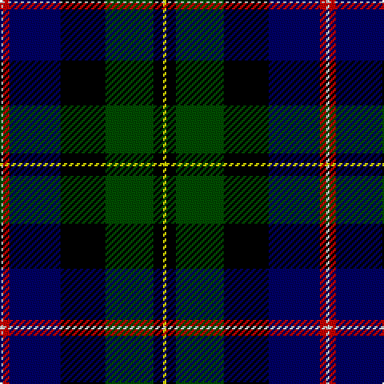

In pattern [WRBKGKY](/stripes/wrbkgky/).

This was sourced from weddslist.  It is a [7 stripe tartan](/stripes/stripes7/).

Original link http://www.weddslist.com/cgi-bin/tartans/pg.pl?source=rb

## Thread count
N/2 R4 DB32 K28 G30 K6 Y/2

## Palette
Each colour and the base-6 reference it is a variant of.

| Colour | Shade | Base |
|---|---|---|
| DB | <code style="background-color:#000064;">#000064</code> `oklch(22.7% 0.158 264.1)` <small>#000064</small> | B <code style="background-color:#2A418A;">#2A418A</code> |
| G | <code style="background-color:#004C00;">#004C00</code> `oklch(36.1% 0.123 142.5)` <small>#004C00</small> | G <code style="background-color:#006100;">#006100</code> |
| K | <code style="background-color:#000000;">#000000</code> `oklch(0.0% 0.000 0.0)` <small>#000000</small> | K <code style="background-color:#000000;">#000000</code> |
| N | <code style="background-color:#D0D0D0;">#D0D0D0</code> `oklch(85.8% 0.000 89.9)` <small>#D0D0D0</small> | W <code style="background-color:#F7F7F7;">#F7F7F7</code> |
| R | <code style="background-color:#C80000;">#C80000</code> `oklch(52.3% 0.215 29.2)` <small>#C80000</small> | R <code style="background-color:#CC0000;">#CC0000</code> |
| Y | <code style="background-color:#FFFF00;">#FFFF00</code> `oklch(96.8% 0.211 109.8)` <small>#FFFF00</small> | Y <code style="background-color:#F2BF00;">#F2BF00</code> |

# Sample pattern

## Nearest tartans

The nearest existing variants by ΔTartan distance.

1. [MacNeil](/setts/s7/lr1r2db16k14dg15k3ly1~x2/) — ΔT 0.60
1. [National Wedding](/setts/s9/dg22lo2dg4dp3dg4k20db20k1lb3~x2/) — ΔT 1.02
1. [MacNeil 7](/setts/s7/w1r2db16k14g15k3ly1~x2/) — ΔT 1.03
1. [St Andrews Golf Club](/setts/s9/r1dg3t1dg5k1dg1k9db12w1~x4/) — ΔT 1.04
1. [Fettes College](/setts/s7/dr4dg23k22p3db22dr1w2~x2/) — ΔT 1.06
1. [MacLeod](/setts/s7/r3k2dg15k10db21k1ly2/) — ΔT 1.07
1. [James](/setts/s7/r5k12ly2dg25ly2db12t5~x2/) — ΔT 1.07
1. [Cusack](/setts/s9/db4k2db16k12w1g13r2g2lo4~x2/) — ΔT 1.08
1. [Mitchell](/setts/s6/k2dg12k12r1db12lb2/) — ΔT 1.12
1. [Cornish Htg (District)](/setts/s7/w5k26ly2dg24db8k4r3~x2/) — ΔT 1.14

## Neighbour map

Every grey dot is one of 14299 variants placed by the first two principal components of the ΔTartan feature space (44% of its variance). Red is this tartan; blue dots are its nearest — click one to open its page.

<svg viewBox="0 0 640 380" role="img" style="max-width:100%;height:auto;border:1px solid #e0e0e0;border-radius:4px;display:block" xmlns="http://www.w3.org/2000/svg"><image href="/nn/cloud.v1.png" width="640" height="380"/><a href="/setts/s7/lr1r2db16k14dg15k3ly1~x2/"><circle cx="168.6" cy="169.4" r="4" fill="#3465a4"><title>MacNeil</title></circle></a><a href="/setts/s9/dg22lo2dg4dp3dg4k20db20k1lb3~x2/"><circle cx="190.0" cy="139.1" r="4" fill="#3465a4"><title>National Wedding</title></circle></a><a href="/setts/s7/w1r2db16k14g15k3ly1~x2/"><circle cx="135.0" cy="148.1" r="4" fill="#3465a4"><title>MacNeil 7</title></circle></a><a href="/setts/s9/r1dg3t1dg5k1dg1k9db12w1~x4/"><circle cx="158.0" cy="147.4" r="4" fill="#3465a4"><title>St Andrews Golf Club</title></circle></a><a href="/setts/s7/dr4dg23k22p3db22dr1w2~x2/"><circle cx="165.5" cy="156.0" r="4" fill="#3465a4"><title>Fettes College</title></circle></a><a href="/setts/s7/r3k2dg15k10db21k1ly2/"><circle cx="203.0" cy="161.7" r="4" fill="#3465a4"><title>MacLeod</title></circle></a><a href="/setts/s7/r5k12ly2dg25ly2db12t5~x2/"><circle cx="143.4" cy="165.2" r="4" fill="#3465a4"><title>James</title></circle></a><a href="/setts/s9/db4k2db16k12w1g13r2g2lo4~x2/"><circle cx="129.8" cy="140.1" r="4" fill="#3465a4"><title>Cusack</title></circle></a><a href="/setts/s6/k2dg12k12r1db12lb2/"><circle cx="158.7" cy="205.5" r="4" fill="#3465a4"><title>Mitchell</title></circle></a><a href="/setts/s7/w5k26ly2dg24db8k4r3~x2/"><circle cx="165.9" cy="155.6" r="4" fill="#3465a4"><title>Cornish Htg (District)</title></circle></a><circle cx="150.7" cy="160.3" r="5" fill="#c00000"/></svg>

ID: /setts/s7/ly1k3dg15k14db16r2lb1~x2/
